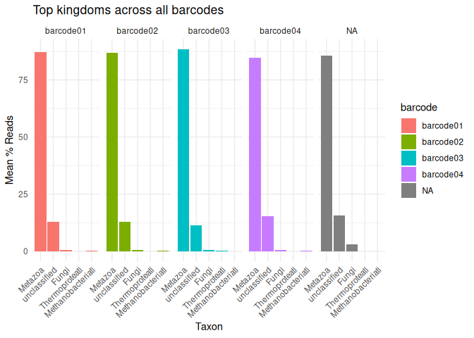
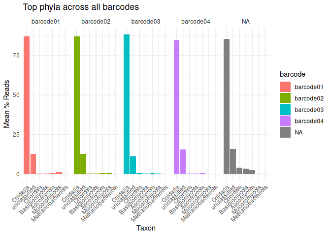

01-G1-Library1-Flongle-kraken2
================
Kathleen Durkin
2025-08-29

- <a href="#1-create-a-bash-variables-file"
  id="toc-1-create-a-bash-variables-file">1 Create a Bash variables
  file</a>
- <a href="#2-download-genome" id="toc-2-download-genome">2 Download
  genome</a>
- <a href="#3-raw-reads" id="toc-3-raw-reads">3 Raw reads</a>
  - <a href="#31-download-raw-rna-seq-reads"
    id="toc-31-download-raw-rna-seq-reads">3.1 Download raw RNA-seq
    reads</a>
  - <a href="#32-verify-raw-read-checksums"
    id="toc-32-verify-raw-read-checksums">3.2 Verify raw read checksums</a>
  - <a href="#33-nanofilt-to-filter-based-on-quality-and-length"
    id="toc-33-nanofilt-to-filter-based-on-quality-and-length">3.3 Nanofilt
    to filter based on quality and length</a>
  - <a href="#34-nanoplot-to-qc-trimmedfiltered-reads"
    id="toc-34-nanoplot-to-qc-trimmedfiltered-reads">3.4 Nanoplot to QC
    trimmed+filtered reads</a>
  - <a href="#35-kraken2" id="toc-35-kraken2">3.5 Kraken2</a>

Code for trimming and QCing single-end Nanopore sequencing data. This
sequencing run was multiplexed (multiple samples sequenced in single
run), and reads have already been demultiplexed – assigned and sorted by
barcode into subfolders (barcode01, barcode02, etc.). Note, however,
that barcode and adapter sequences are still present on the raw reads,
and will need to be trimmed.

Inputs:

- Nanopore gDNA sequencing, single-end gzipped FastQs
  (e.g. `*.fastq.gz`)

Outputs:

------------------------------------------------------------------------

# 1 Create a Bash variables file

This allows usage of Bash variables (e.g. paths to common directories)
across R Markdown chunks.

``` bash
{
echo "#### Assign Variables ####"
echo ""

echo "# Data directories"
echo 'export nanopore_dir=/home/shared/8TB_HDD_02/shedurkin/SIFP-nanopore'
echo 'export output_dir_top=${nanopore_dir}/A-Group1/output/01-G1-Library1-Flongle-kraken2'
echo 'export raw_fastqc_dir=${output_dir_top}/raw-fastqc'
echo 'export raw_reads_dir=${nanopore_dir}/A-Group1/data/01-G1-Library1-Flongle-kraken2/raw-reads'
echo 'export raw_reads_url="https://gannet.fish.washington.edu/kdurkin1/SIFP_2025/Group1_Flongle/Group1/Library1/20250812_1139_MD-101223_AYW935_f9a34344/fastq_pass/"'

echo 'export trimmed_fastqc_dir=${output_dir_top}/trimmed-fastqc'
echo 'export trimmed_reads_dir=${nanopore_dir}/A-Group1/output/01-G1-Library1-Flongle-kraken2/trimmed-reads'
echo 'export trimmed_reads_url=""'
echo ""

echo "# Paths to programs"
echo 'export fastqc=/home/shared/FastQC-0.12.1/fastqc'
echo 'export multiqc=/home/sam/programs/mambaforge/bin/multiqc'
echo 'export flexbar=/home/shared/flexbar-3.5.0-linux/flexbar'
echo ""

echo "# Set FastQ filename patterns"
echo "export fastq_pattern='*.fastq.gz'"
echo ""

echo "# Set number of CPUs to use"
echo 'export threads=20'
echo ""

echo "# Input/output files"
echo 'export raw_checksums=checksums.md5'
echo 'export trimmed_checksums=trimmed_fastq_checksums.md5'
echo ""


echo "## Inititalize arrays"
echo 'export fastq_array=()'
echo 'export raw_fastqs_array=()'
echo 'export names_array=()'
echo 'export trimmed_fastqs_array=()'
echo ""

echo "# Programs associative array"
echo "declare -A programs_array"
echo "programs_array=("
echo '[fastqc]="${fastqc}" \'
echo '[multiqc]="${multiqc}" \'
echo '[flexbar]="${flexbar}"'
echo ")"
} > .bashvars

cat .bashvars
```

    #### Assign Variables ####

    # Data directories
    export nanopore_dir=/home/shared/8TB_HDD_02/shedurkin/SIFP-nanopore
    export output_dir_top=${nanopore_dir}/A-Group1/output/01-G1-Library1-Flongle-kraken2
    export raw_fastqc_dir=${output_dir_top}/raw-fastqc
    export raw_reads_dir=${nanopore_dir}/A-Group1/data/01-G1-Library1-Flongle-kraken2/raw-reads
    export raw_reads_url="https://gannet.fish.washington.edu/kdurkin1/SIFP_2025/Group1_Flongle/Group1/Library1/20250812_1139_MD-101223_AYW935_f9a34344/fastq_pass/"
    export trimmed_fastqc_dir=${output_dir_top}/trimmed-fastqc
    export trimmed_reads_dir=${nanopore_dir}/A-Group1/output/01-G1-Library1-Flongle-kraken2/trimmed-reads
    export trimmed_reads_url=""

    # Paths to programs
    export fastqc=/home/shared/FastQC-0.12.1/fastqc
    export multiqc=/home/sam/programs/mambaforge/bin/multiqc
    export flexbar=/home/shared/flexbar-3.5.0-linux/flexbar

    # Set FastQ filename patterns
    export fastq_pattern='*.fastq.gz'

    # Set number of CPUs to use
    export threads=20

    # Input/output files
    export raw_checksums=checksums.md5
    export trimmed_checksums=trimmed_fastq_checksums.md5

    ## Inititalize arrays
    export fastq_array=()
    export raw_fastqs_array=()
    export names_array=()
    export trimmed_fastqs_array=()

    # Programs associative array
    declare -A programs_array
    programs_array=(
    [fastqc]="${fastqc}" \
    [multiqc]="${multiqc}" \
    [flexbar]="${flexbar}"
    )

# 2 Download genome

Download E. knighti genome from NCBI (if necessary)

``` bash
source .bashvars

cd $nanopore_dir/data

wget -r -np -nH \
  --cut-dirs=6 \
  -e robots=off \
  -R "index.html*" \
  -A "*.fna.gz, *.gff.gz, *.gbff.gz, md5checksums.txt, *.txt" \
  https://ftp.ncbi.nlm.nih.gov/genomes/all/GCA/965/233/905/GCA_965233905.1_jaEunKnig1.1/
  
gunzip $nanopore_dir/data/GCA_965233905.1_jaEunKnig1.1/GCA_965233905.1_jaEunKnig1.1_genomic.fna.gz
```

# 3 Raw reads

## 3.1 Download raw RNA-seq reads

Reads are downloaded from:
<https://gannet.fish.washington.edu/kdurkin1/SIFP_2025/Group1_Flongle/Group1/Library1/20250812_1139_MD-101223_AYW935_f9a34344/fastq_pass/>

Note that this directory contains multiple subdirectories, each
representing one barcode (specimen) and containing the fastq.gz files
associated with that barcode

The `--cut-dirs 7` command cuts the preceding directory structure
(i.e. `nightingales/P_evermanni/30-789513166/`) so that we just end up
with the reads.

``` bash
# Load bash variables into memory
source .bashvars

wget \
--directory-prefix ${raw_reads_dir} \
--recursive \
--no-check-certificate \
--continue \
--cut-dirs 7 \
--no-host-directories \
--no-parent \
--quiet \
--accept ${fastq_pattern} ${raw_reads_url}
```

``` bash
# Load bash variables into memory
source .bashvars

ls -lh "${raw_reads_dir}"
```

    total 92K
    drwxr-xr-x 2 shedurkin labmembers 16K Aug 29 12:43 barcode01
    drwxr-xr-x 2 shedurkin labmembers 16K Aug 29 12:43 barcode02
    drwxr-xr-x 2 shedurkin labmembers 20K Aug 29 12:43 barcode03
    drwxr-xr-x 2 shedurkin labmembers 16K Aug 29 12:43 barcode04
    drwxr-xr-x 2 shedurkin labmembers 20K Aug 29 12:43 unclassified

## 3.2 Verify raw read checksums

``` bash
# Load bash variables into memory
source .bashvars

wget \
--directory-prefix ${raw_reads_dir} \
--recursive \
--no-check-certificate \
--continue \
--cut-dirs 7 \
--no-host-directories \
--no-parent \
--quiet \
--accept checksums.md5 ${raw_reads_url}

cd "${raw_reads_dir}"

# Recursively verify checksums in all subdirectories
find $(pwd) -type d | while read -r DIR; do
    # Check if checksums.md5 exists in this directory
    if [[ -f "$DIR/checksums.md5" ]]; then
        echo "Verifying checksums in $DIR"
        (
            cd "$DIR" || exit 1
            md5sum -c checksums.md5
        )
        echo ""
    fi
done
```

Note: ran conda stuff directly from terminal, since code chunks don’t
let you respond to prompts

``` bash
# Create and activate a conda environment
conda create -n nanopore_env2 python=3.11
conda activate nanopore_env2

# Add channels
conda config --add channels defaults
conda config --add channels bioconda
conda config --add channels conda-forge

# Install tools
conda install -n base -c conda-forge mamba

mamba create -n dorado_env -c hcc -c bioconda -c conda-forge dorado

conda install nanofilt nanoplot pycoqc kraken2 krona
```

Trim adapters and barcodes – Dorado will automatically detect the
Nanopore adapter sequences

``` bash


#for fq in $raw_reads_dir/*/$fastq_pattern; do
#  sample=$(basename "$fq" .fastq.gz)
#  echo "Dorado trim $sample"
#  dorado trim "$fq" --emit-fastq | gzip > "$trimmed_reads_dir/${sample}.trimmed.fastq.gz"
#done

# The above code kept self-terminating without error messages. Ultimately, what worked for getting all files trimmed was parallelization, to avoid a very long sequential loop:

ls $raw_reads_dir/*/$fastq_pattern | xargs -P 4 -I {} sh -c '
sample=$(basename {} .fastq.gz)
echo "Trimming $sample ..."
dorado trim {} --emit-fastq | gzip > "$trimmed_reads_dir/${sample}.trimmed.fastq.gz"
'

# Compile all the log files into a log folder
mkdir -p $trimmed_reads_dir/log_files
mv $trimmed_reads_dir/*.log $trimmed_reads_dir/log_files
```

## 3.3 Nanofilt to filter based on quality and length

## 3.4 Nanoplot to QC trimmed+filtered reads

## 3.5 Kraken2

Kraken2 is a metagenomics classifier that will tell me the taxonomical
sources of my reads – this is a quuick way to check for level of fungal
contamination in my sequencing data

Build kraken2 database if necessary – this is time consuming, so *DON’T*
re-build if you already have a kraken db

``` bash

kraken2-build --standard --threads 12 --db $nanopore_dir/A-Group1/data/kraken_db


# Make db folder
mkdir $nanopore_dir/data/kraken_db_k2

# Download taxonomy structure
k2 download-taxonomy --db $nanopore_dir/data/kraken_db_k2

# Add libraries
## There is a library available for bacteria, but it's *huge*, so will take a long time to download and will occupy a lot of disk space. I've skipped it for now, since I just want to do a quick QC of possible contamination and mostly expect contaminants to be fungal. 
#k2 download-library --library bacteria --db $nanopore_dir/data/kraken_db_k2
k2 download-library --library archaea --db $nanopore_dir/data/kraken_db_k2
k2 download-library --library fungi --db $nanopore_dir/data/kraken_db_k2
k2 download-library --library human --db $nanopore_dir/data/kraken_db_k2
# Kraken2 doesn't have any built-in metazoan libraries, so add custom library for E. knighti
k2 add-to-library --file $nanopore_dir/data/GCA_965233905.1_jaEunKnig1.1/GCA_965233905.1_jaEunKnig1.1_genomic.fna --db $nanopore_dir/data/kraken_db_k2

# Build the db
k2 build --db $nanopore_dir/data/kraken_db_k2 --threads 32 --masker-threads 16
```

run Kraken2

``` bash

# Make output directory if necessary
mkdir -p $output_dir_top/kraken2

for fq in $trimmed_reads_dir/*.trimmed.fastq.gz
do
    base=$(basename "$fq" .trimmed.fastq.gz)
    kraken2 --db $nanopore_dir/data/kraken_db_k2 \
        --threads 12 \
        --report $output_dir_top/kraken2/${base}_report.txt \
        --output $output_dir_top/kraken2/${base}_output.txt \
        "$fq"
done
```

Summarize the kraken output reports

``` r
# Load libraries
library(dplyr)
library(stringr)
library(readr)
library(purrr)
library(tidyr)
library(ggplot2)

# ---- USER SETTINGS ----
input_dir <- "../output/01-G1-Library1-Flongle-kraken2/kraken2"   # change this
output_file <- "kraken2_summary.tsv"

# Get all report files
report_files <- list.files(input_dir, pattern = "_report.txt$", full.names = TRUE)

# Function to read one report
read_kraken_report <- function(file) {
  df <- read_tsv(file,
                 col_names = c("percent", "reads_clade", "reads_direct", "rank", "taxid", "name"),
                 col_types = "dcccc") %>%
    mutate(file = basename(file),
           barcode = str_extract(file, "barcode[0-9]+"))
  return(df)
}

# Read all files
all_reports <- map_dfr(report_files, read_kraken_report)

# Summarize across files, grouped by barcode and taxonomy
summary_by_barcode <- all_reports %>%
  group_by(barcode, name, rank) %>%
  summarise(mean_percent = mean(as.numeric(percent)),
            total_reads = sum(as.numeric(reads_clade)),
            .groups = "drop")

# Summarize across ALL barcodes
summary_all <- all_reports %>%
  group_by(name, rank) %>%
  summarise(mean_percent = mean(as.numeric(percent)),
            total_reads = sum(as.numeric(reads_clade)),
            .groups = "drop")

# Save outputs
write_tsv(summary_by_barcode, file.path(input_dir, "kraken2_summary_by_barcode.tsv"))
write_tsv(summary_all, file.path(input_dir, "kraken2_summary_all.tsv"))


# Plot top taxa by barcode

# Kingdom
top_kingdom_barcode <- summary_by_barcode %>%
  filter(rank == "K" | rank == "U") %>%    # Select IDs at the kingdom (K) level (or "unclassified" (U))
  arrange(desc(total_reads)) %>%
  slice_head(n = 20)

ggplot(top_kingdom_barcode, aes(x = reorder(name, -mean_percent), y = mean_percent)) +
  geom_col(aes(fill = barcode)) +
  facet_grid(~barcode) +
  labs(x = "Taxon", y = "Mean % Reads", title = "Top kingdoms across all barcodes") +
  theme_minimal() +
  theme(axis.text.x = element_text(angle = 45, hjust = 1))
```

<!-- -->

``` r
# Phylum
top_phylum_barcode <- summary_by_barcode %>%
  filter(rank == "P" | rank == "U") %>%    # Select IDs at the phylum (P) level (or "unclassified" (U))
  arrange(desc(total_reads)) %>%
  slice_head(n = 30)

ggplot(top_phylum_barcode, aes(x = reorder(name, -mean_percent), y = mean_percent)) +
  geom_col(aes(fill = barcode)) +
  facet_grid(~barcode) +
  labs(x = "Taxon", y = "Mean % Reads", title = "Top phyla across all barcodes") +
  theme_minimal() +
  theme(axis.text.x = element_text(angle = 45, hjust = 1))
```

<!-- -->
