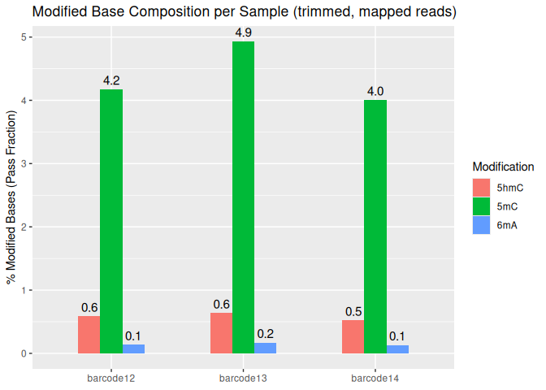

06.01-G1-Library4-MinION-Dorado-recall-GPU
================
Kathleen Durkin
2025-10-29

- [1 Create a Bash variables file](#1-create-a-bash-variables-file)
- [2 Raw reads](#2-raw-reads)
  - [2.1 Download raw pod5 files](#21-download-raw-pod5-files)
  - [2.2 Verify raw read checksums](#22-verify-raw-read-checksums)
- [3 SLURM script](#3-slurm-script)
- [4 BAM processing](#4-bam-processing)
- [5 Summary stats](#5-summary-stats)
  - [5.1 modkit modification
    summaries](#51-modkit-modification-summaries)
  - [5.2 genome coverage summaries](#52-genome-coverage-summaries)

I’ve been trialing Dorado basecalling to get my raw pod5 files to
basecalled, demultiplexed, trimmed, and aligned BAM files, However, this
is very computationally intensive and is taking hours to process
50-200Mb of output using CPUs along. `Dorado` is, however, optemized to
run on GPUs, which would significantly cut run time!

I’m going to try using a Hyak GPU to run Dorado basecalling, using
[Sam’s previous
work](https://robertslab.github.io/sams-notebook/posts/2020/2020-09-04-Data-Wrangling---NanoPore-Fast5-Conversion-to-FastQ-of-C.bairdi-6129_403_26-on-Mox-with-GPU-Node/index.html)
and the [Dorado basecaller
documentation](https://software-docs.nanoporetech.com/dorado/latest/basecaller/basecall_overview/)
as reference.

# 1 Create a Bash variables file

This allows usage of Bash variables (e.g. paths to common directories)
across R Markdown chunks.

``` bash
{
echo "#### Assign Variables ####"
echo ""

echo "# Data directories"
echo 'export nanopore_dir=/gscratch/srlab/kdurkin1/SIFP-nanopore'
echo 'export output_dir_top=${nanopore_dir}/A-Group1/output/06.01-G1-Library4-MinION-Dorado-recall-GPU'
echo 'export data_dir_top=${nanopore_dir}/A-Group1/data/06.01-G1-Library4-MinION-Dorado-recall-GPU'
echo 'export raw_pod5_dir=${data_dir_top}/pod5_pass'
echo 'export raw_pod5_url="https://gannet.fish.washington.edu/kdurkin1/SIFP_2025/Group1_MinION/Library4/20250819_1337_MD-101223_FBD09922_51407a5d/pod5_pass/"'
echo 'export dorado_models_dir=${nanopore_dir}/dorado-models'
echo 'export genome_dir=${nanopore_dir}/data/GCA_965233905.1_jaEunKnig1.1/'

echo "# Paths to programs"
echo 'export modkit=/home/shared/dist_modkit_v0.5.1_8fa79e3/modkit'
echo 'export samtools=/srlab/programs/samtools-1.20/samtools'
echo 'export dorado=/home/shared/dorado-1.2.0-linux-x64/bin/dorado'
echo ""

echo "# Set pod5 filename patterns"
echo "export pod5_pattern='*.pod5'"
echo ""

echo "# Set number of CPUs to use"
echo 'export threads=20'
echo ""

echo "# Input/output files"
echo 'export raw_checksums=checksums.md5'
echo 'export trimmed_checksums=trimmed_fastq_checksums.md5'
echo ""
} > .bashvars

cat .bashvars
```

    #### Assign Variables ####

    # Data directories
    export nanopore_dir=/gscratch/srlab/kdurkin1/SIFP-nanopore
    export output_dir_top=${nanopore_dir}/A-Group1/output/06.01-G1-Library4-MinION-Dorado-recall-GPU
    export data_dir_top=${nanopore_dir}/A-Group1/data/06.01-G1-Library4-MinION-Dorado-recall-GPU
    export raw_pod5_dir=${data_dir_top}/pod5_pass
    export raw_pod5_url="https://gannet.fish.washington.edu/kdurkin1/SIFP_2025/Group1_MinION/Library4/20250819_1337_MD-101223_FBD09922_51407a5d/pod5_pass/"
    export dorado_models_dir=${nanopore_dir}/dorado-models
    export genome_dir=${nanopore_dir}/data/GCA_965233905.1_jaEunKnig1.1/
    # Paths to programs
    export modkit=/home/shared/dist_modkit_v0.5.1_8fa79e3/modkit
    export samtools=/srlab/programs/samtools-1.20/samtools
    export dorado=/home/shared/dorado-1.2.0-linux-x64/bin/dorado

    # Set pod5 filename patterns
    export pod5_pattern='*.pod5'

    # Set number of CPUs to use
    export threads=20

    # Input/output files
    export raw_checksums=checksums.md5
    export trimmed_checksums=trimmed_fastq_checksums.md5

# 2 Raw reads

## 2.1 Download raw pod5 files

Reads are downloaded from:
<https://gannet.fish.washington.edu/kdurkin1/SIFP_2025/Group1_MinION/Library4/20250819_1337_MD-101223_FBD09922_51407a5d/pod5_pass/>

Note that this directory contains multiple subdirectories, each
representing one barcode (specimen) and containing the fastq.gz files
associated with that barcode

The `--cut-dirs 7` command cuts the preceding directory structure
(i.e. `nightingales/P_evermanni/30-789513166/`) so that we just end up
with the reads.

``` bash
# Load bash variables into memory
source .bashvars

wget \
--directory-prefix ${raw_pod5_dir} \
--recursive \
--no-check-certificate \
--continue \
--cut-dirs 6 \
--no-host-directories \
--no-parent \
--quiet \
--accept ${pod5_pattern} ${raw_pod5_url}
```

``` bash
# Load bash variables into memory
source .bashvars

ls -lh "${raw_pod5_dir}"
```

    total 264K
    drwxr-sr-x 2 kdurkin1 nogroup  512 Oct 30 01:34 barcode02
    drwxr-sr-x 2 kdurkin1 nogroup  512 Oct 30 01:34 barcode03
    drwxr-sr-x 2 kdurkin1 nogroup  512 Oct 30 01:34 barcode05
    drwxr-sr-x 2 kdurkin1 nogroup 8.0K Oct 30 01:34 barcode06
    drwxr-sr-x 2 kdurkin1 nogroup 8.0K Oct 30 01:34 barcode07
    drwxr-sr-x 2 kdurkin1 nogroup 8.0K Oct 30 01:34 barcode10
    drwxr-sr-x 2 kdurkin1 nogroup 8.0K Oct 30 01:34 barcode11
    drwxr-sr-x 2 kdurkin1 nogroup 8.0K Oct 30 01:34 barcode12
    drwxr-sr-x 2 kdurkin1 nogroup 8.0K Oct 30 01:34 barcode13
    drwxr-sr-x 2 kdurkin1 nogroup 8.0K Oct 30 01:34 barcode14
    drwxr-sr-x 2 kdurkin1 nogroup 8.0K Oct 30 01:34 barcode15
    drwxr-sr-x 2 kdurkin1 nogroup  512 Oct 30 01:34 barcode21
    drwxr-sr-x 2 kdurkin1 nogroup  512 Oct 30 01:34 barcode22
    drwxr-sr-x 2 kdurkin1 nogroup 8.0K Oct 30 01:34 barcode24
    drwxr-sr-x 2 kdurkin1 nogroup  512 Oct 30 01:34 barcode30
    drwxr-sr-x 2 kdurkin1 nogroup  512 Oct 30 01:34 barcode37
    drwxr-sr-x 2 kdurkin1 nogroup  512 Oct 30 01:34 barcode39
    drwxr-sr-x 2 kdurkin1 nogroup 8.0K Oct 30 01:34 barcode46
    drwxr-sr-x 2 kdurkin1 nogroup  512 Oct 30 01:34 barcode47
    drwxr-sr-x 2 kdurkin1 nogroup  512 Oct 30 01:34 barcode48
    drwxr-sr-x 2 kdurkin1 nogroup 8.0K Oct 30 01:34 barcode49
    drwxr-sr-x 2 kdurkin1 nogroup  512 Oct 30 01:34 barcode55
    drwxr-sr-x 2 kdurkin1 nogroup  512 Oct 30 01:34 barcode58
    drwxr-sr-x 2 kdurkin1 nogroup  512 Oct 30 01:34 barcode60
    drwxr-sr-x 2 kdurkin1 nogroup  512 Oct 30 01:34 barcode62
    drwxr-sr-x 2 kdurkin1 nogroup 8.0K Oct 30 01:34 barcode67
    drwxr-sr-x 2 kdurkin1 nogroup  512 Oct 30 01:34 barcode69
    drwxr-sr-x 2 kdurkin1 nogroup  512 Oct 30 01:34 barcode70
    drwxr-sr-x 2 kdurkin1 nogroup  512 Oct 30 01:34 barcode72
    drwxr-sr-x 2 kdurkin1 nogroup  512 Oct 30 01:34 barcode74
    drwxr-sr-x 2 kdurkin1 nogroup  512 Oct 30 01:34 barcode75
    drwxr-sr-x 2 kdurkin1 nogroup 8.0K Oct 30 01:34 barcode78
    drwxr-sr-x 2 kdurkin1 nogroup  512 Oct 30 01:34 barcode79
    drwxr-sr-x 2 kdurkin1 nogroup  512 Oct 30 01:34 barcode82
    drwxr-sr-x 2 kdurkin1 nogroup  512 Oct 30 01:34 barcode88
    drwxr-sr-x 2 kdurkin1 nogroup  512 Oct 30 01:34 barcode90
    drwxr-sr-x 2 kdurkin1 nogroup  512 Oct 30 01:34 barcode94
    drwxr-sr-x 2 kdurkin1 nogroup 8.0K Oct 30 01:34 mixed
    drwxr-sr-x 2 kdurkin1 nogroup 8.0K Oct 30 01:34 unclassified

## 2.2 Verify raw read checksums

``` bash
# Load bash variables into memory
source .bashvars

wget \
--directory-prefix ${raw_pod5_dir} \
--recursive \
--no-check-certificate \
--continue \
--cut-dirs 6 \
--no-host-directories \
--no-parent \
--quiet \
--accept 'checksums.md5' ${raw_pod5_url}

cd "${raw_pod5_dir}"

# Recursively verify checksums in all subdirectories
find $(pwd) -type d | while read -r DIR; do
    # Check if checksums.md5 exists in this directory
    if [[ -f "$DIR/checksums.md5" ]]; then
        echo "Verifying checksums in $DIR"
        (
            cd "$DIR" || exit 1
            md5sum -c checksums.md5
        )
        echo ""
    fi
done
```

# 3 SLURM script

I’ve taken the SLURM script Sam made to run Guppy using `ckpt` GPU
resources and modified it to use the dorado basecaller (available on
Klone in the contatiner
`/gscratch/srlab/containers/srlab-R4.4-bioinformatics-container-3886a1c.sif`).
The modified script is saved in this directory under the name
`06.01_G1L4_MinION_Dorado.sh`.

To run the script, run the below command from Klone terminal:

``` bash
sbatch 06.01_G1L4_MinION_Dorado.sh
```

Job ID 30552584

Job kept getting bumped from `ckpt` before finishing, requed, and
restarted. Tring again with a more powerful GPU specified (`p100`,
instead of a `2080ti`).

Job ID 30587784 finished in 06:56:29

# 4 BAM processing

Separate out mapped reads, and separate by barcode

``` bash
source .bashvars

cd ${output_dir_top}

# Alignment summary
$samtools flagstat -O tsv FBD09922_pass_recalled.bam > FBD09922_pass_recalled_summary.tsv
```

``` bash
source .bashvars
cd ${output_dir_top}
cat FBD09922_pass_recalled_summary.tsv
```

    25840322    0   total (QC-passed reads + QC-failed reads)
    8955917 0   primary
    15377255    0   secondary
    1507150 0   supplementary
    0   0   duplicates
    0   0   primary duplicates
    23790660    0   mapped
    92.07%  N/A mapped %
    6906255 0   primary mapped
    77.11%  N/A primary mapped %
    0   0   paired in sequencing
    0   0   read1
    0   0   read2
    0   0   properly paired
    N/A N/A properly paired %
    0   0   with itself and mate mapped
    0   0   singletons
    N/A N/A singletons %
    0   0   with mate mapped to a different chr
    0   0   with mate mapped to a different chr (mapQ>=5)

From the samtools `flagstat` summary we see a high alignment rate of
primary reads (77.11%), which is great! The vast majority of reads
confidently come from *Eunicea*. There are, however, a lot of
“secondary” and “supplementary” reads. “Secondary” indicates secondary
alignments, i.e. alternative mapping locations of the same read.
“Supplementary” indicates supplementary alignments, or parts of a read
that align *discontinuously* (possibly chimeric, split, large structural
variants, etc.). The true number of reads present in my sample is just
the *primary* alignments (total - secondary - supplementary =
25840322-15377255-1507150 = 8,955,917 reads). This is a rather annoying
artifact of Dorado using a multimapper under the hood, where a single
read can be mapped to multiple possible loci (one primary and 0 or more
secondary). For downstream work, we only want to be using the “real”
reads, not duplicate records of secondary/supplementary alignments, so
we need to filter those out of the BAM. We also need to sort them

``` bash
source .bashvars

cd ${output_dir_top}

# Remove unmapped reads (bit decimal 4), secondary alignments (bit decimal 256) and supplementary alignments (bit decimal 2048)
$samtools view -b -F 2308 FBD09922_pass_recalled.bam |\
$samtools sort -o FBD09922_pass_recalled_mapped.bam

# Separate by barcode
$samtools view -h FBD09922_pass_recalled_mapped.bam |\
awk '/^@/ || /BC:Z:SQK-NBD114-96_barcode12/' |\
$samtools view -b |\
$samtools sort -o FBD09922_pass_recalled_mapped_barcode12.bam

$samtools view -h FBD09922_pass_recalled_mapped.bam |\
awk '/^@/ || /BC:Z:SQK-NBD114-96_barcode13/' |\
$samtools view -b |\
$samtools sort -o FBD09922_pass_recalled_mapped_barcode13.bam

$samtools view -h FBD09922_pass_recalled_mapped.bam |\
awk '/^@/ || /BC:Z:SQK-NBD114-96_barcode14/' |\
$samtools view -b |\
$samtools sort -o FBD09922_pass_recalled_mapped_barcode14.bam
```

Index

``` bash
source .bashvars
cd ${output_dir_top}

$samtools index FBD09922_pass_recalled_mapped.bam
$samtools index FBD09922_pass_recalled_mapped_barcode12.bam
$samtools index FBD09922_pass_recalled_mapped_barcode13.bam
$samtools index FBD09922_pass_recalled_mapped_barcode14.bam
```

# 5 Summary stats

``` bash
source .bashvars

cd ${output_dir_top}

# Alignment summary
$samtools flagstat -O tsv FBD09922_pass_recalled_mapped.bam > flagstat_summary_FBD09922_pass_recalled_mapped.tsv
cat flagstat_summary_FBD09922_pass_recalled_mapped.tsv

echo ""

# Summarize by barcode
$samtools view FBD09922_pass_recalled_mapped.bam | \
awk '{for(i=12;i<=NF;i++) if($i ~ /^BC:Z:/) {print substr($i,6)}}' | \
sort | uniq -c | sort -nr
```

    6906255 0   total (QC-passed reads + QC-failed reads)
    6906255 0   primary
    0   0   secondary
    0   0   supplementary
    0   0   duplicates
    0   0   primary duplicates
    6906255 0   mapped
    100.00% N/A mapped %
    6906255 0   primary mapped
    100.00% N/A primary mapped %
    0   0   paired in sequencing
    0   0   read1
    0   0   read2
    0   0   properly paired
    N/A N/A properly paired %
    0   0   with itself and mate mapped
    0   0   singletons
    N/A N/A singletons %
    0   0   with mate mapped to a different chr
    0   0   with mate mapped to a different chr (mapQ>=5)

    3244592 SQK-NBD114-96_barcode14
    1856788 SQK-NBD114-96_barcode13
    1579542 SQK-NBD114-96_barcode12
         81 SQK-NBD114-96_barcode11
         24 SQK-NBD114-96_barcode24
         20 SQK-NBD114-96_barcode46
         13 SQK-NBD114-96_barcode49
          9 SQK-NBD114-96_barcode10
          4 SQK-NBD114-96_barcode07
          4 SQK-NBD114-96_barcode06
          3 SQK-NBD114-96_barcode67
          3 SQK-NBD114-96_barcode15
          2 SQK-NBD114-96_barcode78
          2 SQK-NBD114-96_barcode74
          2 SQK-NBD114-96_barcode69
          2 SQK-NBD114-96_barcode61
          2 SQK-NBD114-96_barcode39
          2 SQK-NBD114-96_barcode37
          2 SQK-NBD114-96_barcode31
          2 SQK-NBD114-96_barcode30
          2 SQK-NBD114-96_barcode05
          2 SQK-NBD114-96_barcode03
          1 SQK-NBD114-96_barcode91
          1 SQK-NBD114-96_barcode82
          1 SQK-NBD114-96_barcode76
          1 SQK-NBD114-96_barcode73
          1 SQK-NBD114-96_barcode68
          1 SQK-NBD114-96_barcode58
          1 SQK-NBD114-96_barcode57
          1 SQK-NBD114-96_barcode55
          1 SQK-NBD114-96_barcode51
          1 SQK-NBD114-96_barcode47
          1 SQK-NBD114-96_barcode42
          1 SQK-NBD114-96_barcode22
          1 SQK-NBD114-96_barcode21
          1 SQK-NBD114-96_barcode09
          1 SQK-NBD114-96_barcode02

There’s a bit of a discrepancy among the barcodes. Barcodes 12 and 13
each have ~1.5M reads, while Barcode 14 has more than 3M.

## 5.1 modkit modification summaries

Summarize modifications

``` bash
source .bashvars

$modkit summary ${output_dir_top}/FBD09922_pass_recalled_mapped.bam
```

OR, if doing this from Klone, need to use conda (run from terminal)

``` bash
source .bashvars

conda create -n modkit_env -c bioconda -c conda-forge ont-modkit
conda activate modkit_env

modkit summary -n 100000 ${output_dir_top}/FBD09922_pass_recalled_mapped.bam
```

    > sampling 100000 reads from BAM
    > calculating threshold at 10(th) percentile
    > calculated thresholds: C: 0.84765625 A: 0.9472656
    # bases             A,C 
    # total_reads_used  77572 
    # count_reads_C     75732 
    # count_reads_A     77572 
    # pass_threshold_C  0.84765625 
    # pass_threshold_A  0.9472656 
     base  code  pass_count  pass_frac     all_count  all_frac 
     C     -     1104262     0.9510825     1196376    0.9286514 
     C     h     6679        0.005752512   27498      0.021344507 
     C     m     50117       0.043164942   64420      0.050004113 
     A     -     12843854    0.99865013    14058145   0.9854987 
     A     a     17361       0.0013498724  206861     0.01450129 

We’re primarily interested in the passed read stats (though comparing to
the “all” read stats can be useful). Even though only reads that passed
the Nanopore quality filter were included in the modkit summary, there
is still additional filtering happening in the summary process. That’s
because Nanopore quality filtering is read-level, and the modkit quality
filtering is base-level. In mapped, primary-alignment reads, we observe
negligible 6mA (~0.1%), low/negligible 5hmCG (~0.6%), and moderately-low
5mCG (~4%).

Now let’s check by barcode (individual)

``` bash
source .bashvars

cd ${output_dir_top}

$modkit summary -n 100000 --tsv FBD09922_pass_recalled_mapped_barcode12.bam > modkit_summary_FBD09922_barcode12.tsv

echo ""

$modkit summary -n 100000 --tsv FBD09922_pass_recalled_mapped_barcode13.bam > modkit_summary_FBD09922_barcode13.tsv

echo ""

$modkit summary -n 100000 --tsv FBD09922_pass_recalled_mapped_barcode14.bam > modkit_summary_FBD09922_barcode14.tsv
```

OR, again, run using a conda environment if on Klone

Barplot of above modkit summaries

``` r
files <- c(
  "../output/06.01-G1-Library4-MinION-Dorado-recall-GPU/modkit_summary_FBD09922_barcode12.tsv",
  "../output/06.01-G1-Library4-MinION-Dorado-recall-GPU/modkit_summary_FBD09922_barcode13.tsv",
  "../output/06.01-G1-Library4-MinION-Dorado-recall-GPU/modkit_summary_FBD09922_barcode14.tsv"
)

# Assign sample names (in same order as files)
sample_names <- c("barcode12", "barcode13", "barcode14")

# parse summaries
parse_modkit_summary <- function(file, sample_name) {
  df <- read.table(file, sep = "\t", header = FALSE, stringsAsFactors = FALSE)
  
  # Extract values (use pattern matching on the first column)
  get_val <- function(pattern) {
    as.numeric(df$V2[grep(pattern, df$V1)])
  }
  
  tibble(
    Sample = sample_name,
    `5mC`  = get_val("^C_pass_frac_modified_m") * 100,
    `5hmC` = get_val("^C_pass_frac_modified_h") * 100,
    `6mA`  = get_val("^A_pass_frac_modified_a") * 100
  )
}

# combine and convert to long format (for ggplotting)
mod_data <- map2_dfr(files, sample_names, parse_modkit_summary)

mod_long <- mod_data %>%
  pivot_longer(cols = c(`5mC`, `5hmC`, `6mA`),
               names_to = "Modification",
               values_to = "Percent")

# plot
ggplot(mod_long, aes(x = Sample, y = Percent, fill = Modification)) +
  geom_bar(stat = "identity", width=0.5, position = position_dodge(width = 0.5)) +
  geom_text(aes(label = sprintf("%.1f", Percent)),     # format to one decimal place
            position = position_dodge(width = 0.5), 
            vjust = -0.5, size = 4) +                  # adjust spacing & text size
  labs(
    title = "Modified Base Composition per Sample (trimmed, mapped reads)",
    y = "% Modified Bases (Pass Fraction)",
    x = NULL
  )
```

<!-- -->

## 5.2 genome coverage summaries

``` bash
source .bashvars
cd ${output_dir_top}

# conda create -n myenv
conda activate mosdepth_env
conda config --add channels bioconda
conda config --add channels conda-forge
conda config --add channels defaults
conda install -c bioconda mosdepth
mosdepth --version
```
