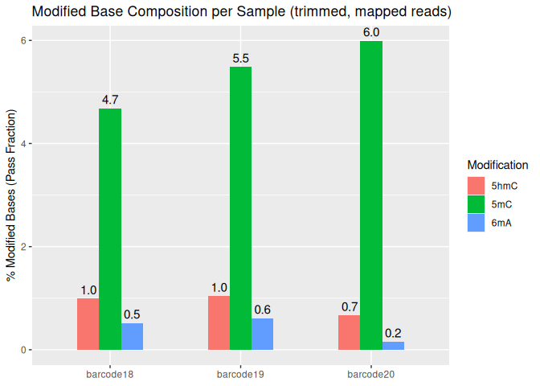

04.01-G2-Library2-MinION-Dorado-recall-GPU
================
Kathleen Durkin
2025-10-29

- [1 Create a Bash variables file](#1-create-a-bash-variables-file)
- [2 Raw reads](#2-raw-reads)
  - [2.1 Download raw pod5 files](#21-download-raw-pod5-files)
  - [2.2 Verify raw read checksums](#22-verify-raw-read-checksums)
- [3 BAM processing](#3-bam-processing)
- [4 Summary stats](#4-summary-stats)
  - [4.1 modkit modification
    summaries](#41-modkit-modification-summaries)
  - [4.2 genome coverage summaries](#42-genome-coverage-summaries)

I’ve been trialing Dorado basecalling to get my raw pod5 files to
basecalled, demultiplexed, trimmed, and aligned BAM files, However, this
is very computationally intensive and is taking hours to process
50-200Mb of output using CPUs along. `Dorado` is, however, optemized to
run on GPUs, which would significantly cut run time!

I’m going to try using a Hyak GPU to run Dorado basecalling, using
[Sam’s previous
work](https://robertslab.github.io/sams-notebook/posts/2020/2020-09-04-Data-Wrangling---NanoPore-Fast5-Conversion-to-FastQ-of-C.bairdi-6129_403_26-on-Mox-with-GPU-Node/index.html)
and the [Dorado basecaller
documentation](https://software-docs.nanoporetech.com/dorado/latest/basecaller/basecall_overview/)
as reference.

# 1 Create a Bash variables file

This allows usage of Bash variables (e.g. paths to common directories)
across R Markdown chunks.

``` bash
{
echo "#### Assign Variables ####"
echo ""

echo "# Data directories"
echo 'export nanopore_dir=/gscratch/srlab/kdurkin1/SIFP-nanopore'
echo 'export output_dir_top=${nanopore_dir}/B-Group2/output/04.01-G2-Library2-MinION-Dorado-recall-GPU'
echo 'export data_dir_top=${nanopore_dir}/B-Group2/data/04.01-G2-Library2-MinION-Dorado-recall-GPU'
echo 'export raw_pod5_dir=${data_dir_top}/pod5_pass'
echo 'export raw_pod5_url1="https://gannet.fish.washington.edu/kdurkin1/SIFP_2025/Group2_MinION/Library2/20250824_2226_MD-101223_FBD39370_195b7d5f/pod5_pass/"'
echo 'export raw_pod5_url2="https://gannet.fish.washington.edu/kdurkin1/SIFP_2025/Group2_MinION/Library2_post_update/20250826_1059_MD-101223_FBD39370_b38d8279/pod5_pass/"'
echo 'export genome_dir=${nanopore_dir}/data/GCA_965233905.1_jaEunKnig1.1/'

echo 'export samtools=/srlab/programs/samtools-1.20/samtools'


echo "# Set FastQ filename patterns"
echo "export pod5_pattern='*.pod5'"
echo ""

echo "# Set number of CPUs to use"
echo 'export threads=20'
echo ""

echo "# Input/output files"
echo 'export raw_checksums=checksums.md5'
echo 'export trimmed_checksums=trimmed_fastq_checksums.md5'
echo ""
} > .bashvars

cat .bashvars
```

    #### Assign Variables ####

    # Data directories
    export nanopore_dir=/gscratch/srlab/kdurkin1/SIFP-nanopore
    export output_dir_top=${nanopore_dir}/B-Group2/output/04.01-G2-Library2-MinION-Dorado-recall-GPU
    export data_dir_top=${nanopore_dir}/B-Group2/data/04.01-G2-Library2-MinION-Dorado-recall-GPU
    export raw_pod5_dir=${data_dir_top}/pod5_pass
    export raw_pod5_url1="https://gannet.fish.washington.edu/kdurkin1/SIFP_2025/Group2_MinION/Library2/20250824_2226_MD-101223_FBD39370_195b7d5f/pod5_pass/"
    export raw_pod5_url2="https://gannet.fish.washington.edu/kdurkin1/SIFP_2025/Group2_MinION/Library2_post_update/20250826_1059_MD-101223_FBD39370_b38d8279/pod5_pass/"
    export genome_dir=${nanopore_dir}/data/GCA_965233905.1_jaEunKnig1.1/
    export samtools=/srlab/programs/samtools-1.20/samtools
    # Set FastQ filename patterns
    export pod5_pattern='*.pod5'

    # Set number of CPUs to use
    export threads=20

    # Input/output files
    export raw_checksums=checksums.md5
    export trimmed_checksums=trimmed_fastq_checksums.md5

# 2 Raw reads

## 2.1 Download raw pod5 files

Reads are downloaded from:
<https://gannet.fish.washington.edu/kdurkin1/SIFP_2025/Group2_MinION/Library2/20250824_2226_MD-101223_FBD39370_195b7d5f/pod5_pass/>
and
<https://gannet.fish.washington.edu/kdurkin1/SIFP_2025/Group2_MinION/Library2_post_update/20250826_1059_MD-101223_FBD39370_b38d8279/pod5_pass/>

Note that there are two directories of data for the Group 4 Library 1
MinION runs. One contains the bulk of the run, the second is everything
after a forced computer update

Note that this directory contains multiple subdirectories, each
representing one barcode (specimen) and containing the pod5 files
associated with that barcode

The `--cut-dirs 7` command cuts the preceding directory structure
(i.e. `nightingales/P_evermanni/30-789513166/`) so that we just end up
with the reads.

``` bash
# Load bash variables into memory
source .bashvars

# pre-update
wget \
--directory-prefix ${raw_pod5_dir}/pre_update \
--recursive \
--no-check-certificate \
--continue \
--cut-dirs 6 \
--no-host-directories \
--no-parent \
--quiet \
--accept ${pod5_pattern} ${raw_pod5_url1}

# post-update
wget \
--directory-prefix ${raw_pod5_dir}/post_update \
--recursive \
--no-check-certificate \
--continue \
--cut-dirs 6 \
--no-host-directories \
--no-parent \
--quiet \
--accept ${pod5_pattern} ${raw_pod5_url2}
```

``` bash
# Load bash variables into memory
source .bashvars

ls -lh "${raw_pod5_dir}"
```

    total 32K
    drwxr-sr-x 12 kdurkin1 nogroup 8.0K Oct 30 01:56 post_update
    drwxr-sr-x 24 kdurkin1 nogroup 8.0K Oct 30 01:53 pre_update

## 2.2 Verify raw read checksums

``` bash
# Load bash variables into memory
source .bashvars

wget \
--directory-prefix ${raw_pod5_dir}/pre_update \
--recursive \
--no-check-certificate \
--continue \
--cut-dirs 6 \
--no-host-directories \
--no-parent \
--quiet \
--accept 'checksums.md5' ${raw_pod5_url1}

cd "${raw_pod5_dir}/pre_update"

# Recursively verify checksums in all subdirectories
find $(pwd) -type d | while read -r DIR; do
    # Check if checksums.md5 exists in this directory
    if [[ -f "$DIR/checksums.md5" ]]; then
        echo "Verifying checksums in $DIR"
        (
            cd "$DIR" || exit 1
            md5sum -c checksums.md5
        )
        echo ""
    fi
done
```

I’ve taken the SLURM script Sam made to run Guppy using `ckpt` GPU
resources and modified it to use the dorado basecaller (available on
Klone in the contatiner
`/gscratch/srlab/containers/srlab-R4.4-bioinformatics-container-3886a1c.sif`).
The modified script is saved in this directory under the name
`04.01_G2L2_MinION_Dorado.sh`.

To run the script, run the below command from Klone terminal:

``` bash
sbatch 04.01_G2L2_MinION_Dorado.sh
```

Job ID 30552393

# 3 BAM processing

Separate out mapped reads, and separate by barcode

``` bash
source .bashvars

cd ${output_dir_top}

# Alignment summary
$samtools flagstat -O tsv FBD39370_pass_recalled.bam > FBD39370_pass_recalled_summary.tsv
```

``` bash
source .bashvars

cd ${output_dir_top}
cat FBD39370_pass_recalled_summary.tsv
```

    9629255 0   total (QC-passed reads + QC-failed reads)
    3914428 0   primary
    5404041 0   secondary
    310786  0   supplementary
    0   0   duplicates
    0   0   primary duplicates
    8126887 0   mapped
    84.40%  N/A mapped %
    2412060 0   primary mapped
    61.62%  N/A primary mapped %
    0   0   paired in sequencing
    0   0   read1
    0   0   read2
    0   0   properly paired
    N/A N/A properly paired %
    0   0   with itself and mate mapped
    0   0   singletons
    N/A N/A singletons %
    0   0   with mate mapped to a different chr
    0   0   with mate mapped to a different chr (mapQ>=5)

From the samtools `flagstat` summary we see a high alignment rate of
primary reads (61.62%), which is great! The vast majority of reads
confidently come from *Eunicea*. There are, however, a lot of
“secondary” and “supplementary” reads. “Secondary” indicates secondary
alignments, i.e. alternative mapping locations of the same read.
“Supplementary” indicates supplementary alignments, or parts of a read
that align *discontinuously* (possibly chimeric, split, large structural
variants, etc.). The true number of reads present in my sample is just
the *primary* alignments (total - secondary - supplementary =
9629255-5404041-310786 = 3,914,428 reads). This is a rather annoying
artifact of Dorado using a multimapper under the hood, where a single
read can be mapped to multiple possible loci (one primary and 0 or more
secondary). For downstream work, we only want to be using the “real”
reads, not duplicate records of secondary/supplementary alignments, so
we need to filter those out of the BAM. We also need to sort them

``` bash
source .bashvars

cd ${output_dir_top}

# Remove unmapped reads (bit decimal 4), secondary alignments (bit decimal 256) and supplementary alignments (bit decimal 2048)
$samtools view -b -F 2308 FBD39370_pass_recalled.bam |\
$samtools sort -o FBD39370_pass_recalled_mapped.bam

# Separate by barcode
$samtools view -h FBD39370_pass_recalled_mapped.bam |\
awk '/^@/ || /BC:Z:SQK-NBD114-96_barcode18/' |\
$samtools view -b |\
$samtools sort -o FBD39370_pass_recalled_mapped_barcode18.bam

$samtools view -h FBD39370_pass_recalled_mapped.bam |\
awk '/^@/ || /BC:Z:SQK-NBD114-96_barcode19/' |\
$samtools view -b |\
$samtools sort -o FBD39370_pass_recalled_mapped_barcode19.bam

$samtools view -h FBD39370_pass_recalled_mapped.bam |\
awk '/^@/ || /BC:Z:SQK-NBD114-96_barcode20/' |\
$samtools view -b |\
$samtools sort -o FBD39370_pass_recalled_mapped_barcode20.bam
```

Index

``` bash
source .bashvars
cd ${output_dir_top}

$samtools index FBD39370_pass_recalled_mapped.bam
$samtools index FBD39370_pass_recalled_mapped_barcode18.bam
$samtools index FBD39370_pass_recalled_mapped_barcode19.bam
$samtools index FBD39370_pass_recalled_mapped_barcode20.bam
```

# 4 Summary stats

``` bash
source .bashvars

cd ${output_dir_top}

# Alignment summary
$samtools flagstat -O tsv FBD39370_pass_recalled_mapped.bam > flagstat_summary_FBD39370_pass_recalled_mapped.tsv
```

``` bash
source .bashvars

cd ${output_dir_top}

cat flagstat_summary_FBD39370_pass_recalled_mapped.tsv

echo ""

# Summarize by barcode
$samtools view FBD39370_pass_recalled_mapped.bam | \
awk '{for(i=12;i<=NF;i++) if($i ~ /^BC:Z:/) {print substr($i,6)}}' | \
sort | uniq -c | sort -nr
```

There’s a bit of a discrepancy among the barcodes, but it’s not
terrible! Barcodes 19 and 20 each have 0.6-0.7M reads, while Barcode 18
has almost 1M.

## 4.1 modkit modification summaries

Summarize modifications

``` bash
source .bashvars

$modkit summary -n 100000 ${output_dir_top}/FBD39370_pass_recalled_mapped.bam
```

OR, if doing this from Klone, need to use conda (run from terminal)

``` bash
source .bashvars

conda create -n modkit_env -c bioconda -c conda-forge ont-modkit
conda activate modkit_env

modkit summary -n 100000 ${output_dir_top}/FBD39370_pass_recalled_mapped.bam
```

    > sampling 100000 reads from BAM
    > calculating threshold at 10(th) percentile
    > calculated thresholds: A: 0.8730469 C: 0.8125
    # bases             A,C 
    # total_reads_used  77481 
    # count_reads_A     77480 
    # count_reads_C     74203 
    # pass_threshold_C  0.8125 
    # pass_threshold_A  0.8730469 
     base  code  pass_count  pass_frac    all_count  all_frac 
     A     -     7270966     0.99379295   7874355    0.97050965 
     A     a     45413       0.006207032  239274     0.02949038 
     C     -     599000      0.9389774    643764     0.90982246 
     C     h     5685        0.008911664  20510      0.028986491 
     C     m     33243       0.052110896  43297      0.061191034

We’re primarily interested in the passed read stats (though comparing to
the “all” read stats can be useful). Even though only reads that passed
the Nanopore quality filter were included in the modkit summary, there
is still additional filtering happening in the summary process. That’s
because Nanopore quality filtering is read-level, and the modkit quality
filtering is base-level. In mapped, primary-alignment reads, we observe
low/negligible 6mA (~0.6%), low/negligible 5hmCG (~0.9%), and
moderately-low 5mCG (~5%).

Now let’s check by barcode (individual)

``` bash
source .bashvars

cd ${output_dir_top}

$modkit summary -n 100000 --tsv FBD39370_pass_recalled_mapped_barcode18.bam > modkit_summary_FBD39370_barcode18.tsv

echo ""

$modkit summary -n 100000 --tsv FBD39370_pass_recalled_mapped_barcode19.bam > modkit_summary_FBD39370_barcode19.tsv

echo ""

$modkit summary -n 100000 --tsv FBD39370_pass_recalled_mapped_barcode20.bam > modkit_summary_FBD39370_barcode20.tsv
```

OR, again, use a conda environment

Barplot of above modkit summaries

``` r
files <- c(
  "../output/04.01-G2-Library2-MinION-Dorado-recall-GPU/modkit_summary_FBD39370_barcode18.tsv",
  "../output/04.01-G2-Library2-MinION-Dorado-recall-GPU/modkit_summary_FBD39370_barcode19.tsv",
  "../output/04.01-G2-Library2-MinION-Dorado-recall-GPU/modkit_summary_FBD39370_barcode20.tsv"
)

# Assign sample names (in same order as files)
sample_names <- c("barcode18", "barcode19", "barcode20")

# parse summaries
parse_modkit_summary <- function(file, sample_name) {
  df <- read.table(file, sep = "\t", header = FALSE, stringsAsFactors = FALSE)
  
  # Extract values (use pattern matching on the first column)
  get_val <- function(pattern) {
    as.numeric(df$V2[grep(pattern, df$V1)])
  }
  
  tibble(
    Sample = sample_name,
    `5mC`  = get_val("^C_pass_frac_modified_m") * 100,
    `5hmC` = get_val("^C_pass_frac_modified_h") * 100,
    `6mA`  = get_val("^A_pass_frac_modified_a") * 100
  )
}

# combine and convert to long format (for ggplotting)
mod_data <- map2_dfr(files, sample_names, parse_modkit_summary)

mod_long <- mod_data %>%
  pivot_longer(cols = c(`5mC`, `5hmC`, `6mA`),
               names_to = "Modification",
               values_to = "Percent")

# plot
ggplot(mod_long, aes(x = Sample, y = Percent, fill = Modification)) +
  geom_bar(stat = "identity", width=0.5, position = position_dodge(width = 0.5)) +
  geom_text(aes(label = sprintf("%.1f", Percent)),     # format to one decimal place
            position = position_dodge(width = 0.5), 
            vjust = -0.5, size = 4) +                  # adjust spacing & text size
  labs(
    title = "Modified Base Composition per Sample (trimmed, mapped reads)",
    y = "% Modified Bases (Pass Fraction)",
    x = NULL
  )
```

<!-- -->

## 4.2 genome coverage summaries

``` bash
source .bashvars
cd ${output_dir_top}

# conda create -n myenv
conda activate mosdepth_env
conda config --add channels bioconda
conda config --add channels conda-forge
conda config --add channels defaults
conda install -c bioconda mosdepth
mosdepth --version
```
