03-nobones-plotting
================
Kathleen Durkin
2025-12-14

- [1 Sequencing runs plots](#1-sequencing-runs-plots)
- [2 Setup and Data Loading](#2-setup-and-data-loading)
- [3 Figure 1: Total Output by Sequencing
  Run](#3-figure-1-total-output-by-sequencing-run)
- [4 Figure 2: Reads Generated vs Bases (Quality
  Assessment)](#4-figure-2-reads-generated-vs-bases-quality-assessment)
- [5 Figure 3: N50 Read Length by
  Run](#5-figure-3-n50-read-length-by-run)
- [6 Figure 4: Pass vs Fail Reads](#6-figure-4-pass-vs-fail-reads)
- [7 Figure 5: Pass Rate Comparison](#7-figure-5-pass-rate-comparison)
- [8 Figure 6: Throughput Rate
  (Gb/hr)](#8-figure-6-throughput-rate-gbhr)
- [9 Figure 7: Summary by Age Group
  (Aggregated)](#9-figure-7-summary-by-age-group-aggregated)
- [10 Figure 8: Run Time vs Output](#10-figure-8-run-time-vs-output)
- [11 Figure 9: Bases Pass vs Fail
  (Stacked)](#11-figure-9-bases-pass-vs-fail-stacked)
- [12 Summary Table](#12-summary-table)
- [13 Statistical Comparisons
  (Optional)](#13-statistical-comparisons-optional)
- [14 Plot modifications by specimen
  age](#14-plot-modifications-by-specimen-age)
  - [14.1 Load and Merge All Metadata](#141-load-and-merge-all-metadata)
  - [14.2 Reshape Data for Plotting](#142-reshape-data-for-plotting)
- [15 Modifications vs. Sample Age](#15-modifications-vs-sample-age)
- [16 Modifications vs. DNA Integrity
  (DIN)](#16-modifications-vs-dna-integrity-din)
- [17 Modifications vs. Sequencing
  N50](#17-modifications-vs-sequencing-n50)
- [18 Combined Comparison Plots](#18-combined-comparison-plots)
  - [18.1 5mC across all three
    variables](#181-5mc-across-all-three-variables)
  - [18.2 5hmC across all three
    variables](#182-5hmc-across-all-three-variables)
  - [18.3 6mA across all three
    variables](#183-6ma-across-all-three-variables)
- [19 Correlation Analysis](#19-correlation-analysis)
  - [19.1 Correlations with Year
    Collected](#191-correlations-with-year-collected)
  - [19.2 Correlations with DIN](#192-correlations-with-din)
  - [19.3 Correlations with N50](#193-correlations-with-n50)
- [20 Summary Statistics by Age
  Category](#20-summary-statistics-by-age-category)
- [21 Interpretation Notes](#21-interpretation-notes)
  - [21.1 Key Findings](#211-key-findings)
  - [21.2 Relationships to consider](#212-relationships-to-consider)

# 1 Sequencing runs plots

# 2 Setup and Data Loading

``` r
library(tidyverse)
library(scales)
library(patchwork)  # for combining plots
library(viridis)    # for color palettes

# Define color scheme
age_colors <- c(
  "Modern (2019)" = "#27ae60",
  "Mid-age (1960)" = "#3498db",
  "Old (1880s)" = "#e74c3c"
)

# Load sequencing summary data
seq_summary <- read_csv("../../data/E_tourneforti_sequencing_summaries.csv")

# Clean up and add derived columns
seq_summary <- seq_summary %>%
  mutate(
    # Create cleaner run labels
    Run_Label = paste0("G", Group, "L", Library),
    
    # Combine pre/post runs for the same library
    Library_ID = paste0("Group", Group, "_Library", Library),
    
    # Calculate pass rate
    Pass_Rate = Reads.Called.Pass.M / Reads.Generated.M * 100,
    
    # Calculate bases pass rate
    Bases_Pass_Rate = Bases.Called.Pass.Gb / Estimated.Bases.Gb * 100,
    
    # Throughput rate (Gb per hour)
    Throughput_Rate = Estimated.Bases.Gb / Run.time.hr,
    
    # Standardize sequencer names
    Sequencer = case_when(
      Sequencer %in% c("MK1D", "Mk1D") ~ "MinION Mk1D",
      Sequencer %in% c("Mk1B", "MK1B") ~ "MinION Mk1B",
      TRUE ~ Sequencer
    ),
    
    # Add age group based on Group number
    Age_Group = case_when(
      Group == 1 ~ "Modern (2019)",
      Group == 2 ~ "Mid-age (1960)",
      Group %in% c(3, 4) ~ "Old (1880s)",
      TRUE ~ "Unknown"
    ),
    Age_Group = factor(
      Age_Group,
      levels = c("Old (1880s)", "Mid-age (1960)", "Modern (2019)")
    )
  )

# ---- Aggregate by Group + Library ----
seq_summary_agg <- seq_summary %>%
  select(-Estimated.N50.b) %>%
  group_by(Group, Library) %>%
  summarise(
    # IDs
    Library_ID = paste0("Group", Group, "_Lib", Library),
    Age_Group = first(Age_Group),
    Sequencer = first(Sequencer),
    
    # Accumulating quantities → SUM
    Estimated.Bases.Gb = sum(Estimated.Bases.Gb, na.rm = TRUE),
    Reads.Generated.M  = sum(Reads.Generated.M, na.rm = TRUE),
    Reads.Called.Pass.M = sum(Reads.Called.Pass.M, na.rm = TRUE),
    Bases.Called.Pass.Gb = sum(Bases.Called.Pass.Gb, na.rm = TRUE),
    Run.time.hr = sum(Run.time.hr, na.rm = TRUE),
    
    .groups = "drop"
  ) %>%
  mutate(
    # Recalculate rates AFTER aggregation
    Pass_Rate = Reads.Called.Pass.M / Reads.Generated.M * 100,
    Bases_Pass_Rate = Bases.Called.Pass.Gb / Estimated.Bases.Gb * 100,
    Throughput_Rate = Estimated.Bases.Gb / Run.time.hr,
    Age_Group = factor(
      Age_Group,
      levels = c("Old (1880s)", "Mid-age (1960)", "Modern (2019)"))
  ) %>%
  distinct()

# Display the cleaned data
seq_summary %>%
  select(Sequencing.Run, Group, Library, Library_ID, Estimated.Bases.Gb, Reads.Generated.M, 
         Estimated.N50.b, Pass_Rate, Sequencer) %>%
  knitr::kable(caption = "Sequencing Run Summary", digits = 2)
```

| Sequencing.Run | Group | Library | Library_ID | Estimated.Bases.Gb | Reads.Generated.M | Estimated.N50.b | Pass_Rate | Sequencer |
|:---|---:|---:|:---|---:|---:|---:|---:|:---|
| Group1_Library4 | 1 | 4 | Group1_Library4 | 7.56 | 10.04 | 687 | 89.34 | MinION Mk1D |
| Group2_Library2_pre_update | 2 | 2 | Group2_Library2 | 3.17 | 3.79 | 409 | 87.60 | MinION Mk1D |
| Group2_Library2_post_update | 2 | 2 | Group2_Library2 | 0.60 | 0.73 | 409 | 85.81 | MinION Mk1D |
| Group2_Library3_pre_wash2 | 2 | 3 | Group2_Library3 | 3.16 | 3.82 | 405 | 89.01 | MinION Mk1B |
| Group2_Library3_post_wash2 | 2 | 3 | Group2_Library3 | 0.00 | 0.00 | 473 | 85.90 | MinION Mk1B |
| Group4_Library1_pre_wash3 | 4 | 1 | Group4_Library1 | 1.80 | 2.12 | 299 | 84.43 | MinION Mk1D |
| Group4_Library1_post_wash3 | 4 | 1 | Group4_Library1 | 0.10 | 0.13 | 299 | 76.52 | MinION Mk1D |
| Group4_Library2 | 4 | 2 | Group4_Library2 | 1.93 | 2.09 | 346 | 82.78 | MinION Mk1B |

Sequencing Run Summary

# 3 Figure 1: Total Output by Sequencing Run

``` r
# Bar plot of total bases by run
p1 <- ggplot(seq_summary_agg, aes(x = reorder(Library_ID, Estimated.Bases.Gb), 
                               y = Estimated.Bases.Gb,
                               fill = Age_Group)) +
geom_col() +
  coord_flip() +
  labs(
    title = "Total Sequencing Output by Run",
    subtitle = "E. tourneforti Nanopore sequencing",
    x = "Sequencing Run",
    y = "Estimated Bases (Gb)",
    fill = "Age Group"
  ) +
  scale_fill_manual(values = c(
    "Modern (2019)" = "#27ae60",
    "Mid-age (1960)" = "#3498db",
    "Old (1880s)" = "#e74c3c"
  )) +
  theme_minimal() +
  theme(
    axis.text.y = element_text(size = 9),
    legend.position = "bottom"
  )

print(p1)
```

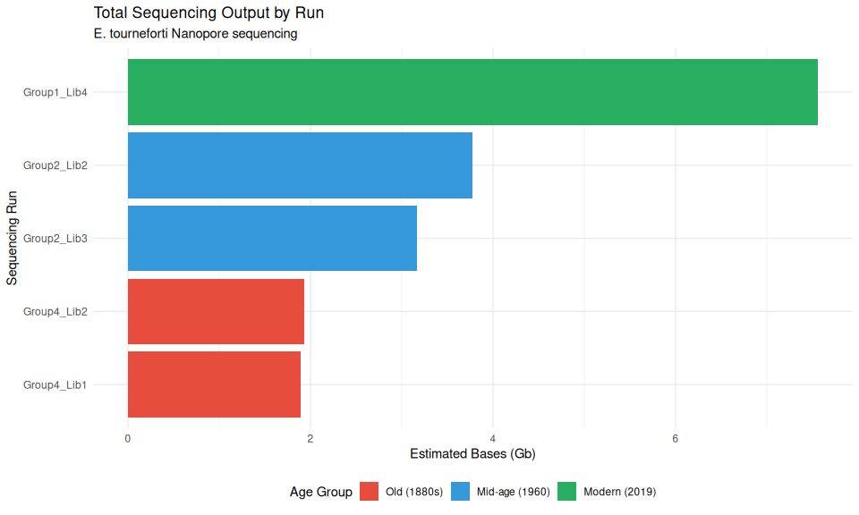<!-- -->

``` r
ggsave("../output/03-nobones-plotting/fig_total_output_by_run.png", 
       p1, width = 10, height = 6, dpi = 150)
```

# 4 Figure 2: Reads Generated vs Bases (Quality Assessment)

``` r
p2 <- ggplot(seq_summary, aes(x = Reads.Generated.M, y = Estimated.Bases.Gb)) +
  geom_point(aes(color = Age_Group, size = Estimated.N50.b), alpha = 0.8) +
  geom_smooth(method = "lm", se = TRUE, color = "gray40", linetype = "dashed") +
  geom_text(aes(label = Run_Label), vjust = -1, hjust = 0.5, size = 3) +
  labs(
    title = "Reads vs Total Bases Output",
    subtitle = "Point size indicates N50 read length",
    x = "Reads Generated (millions)",
    y = "Estimated Bases (Gb)",
    color = "Age Group",
    size = "N50 (bp)"
  ) +
  scale_color_manual(values = c(
    "Modern (2019)" = "#27ae60",
    "Mid-age (1960)" = "#3498db",
    "Old (1880s)" = "#e74c3c"
  )) +
  theme_minimal() +
  theme(legend.position = "right")

print(p2)
```

    ## `geom_smooth()` using formula = 'y ~ x'

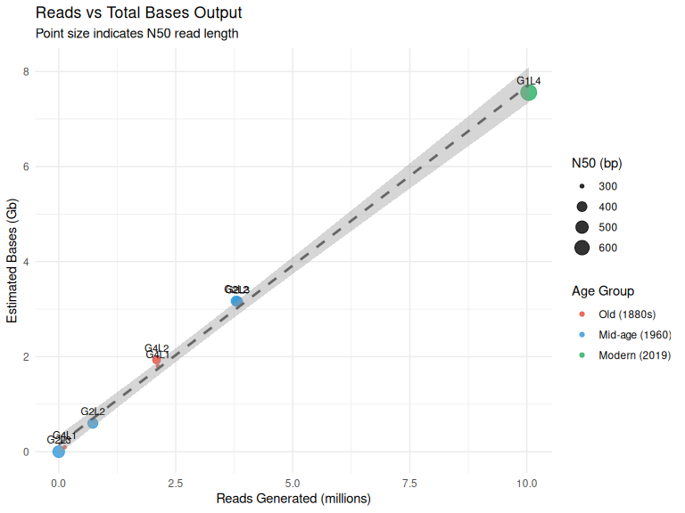<!-- -->

``` r
ggsave("../output/03-nobones-plotting/fig_reads_vs_bases.png", 
       p2, width = 8, height = 6, dpi = 150)
```

    ## `geom_smooth()` using formula = 'y ~ x'

# 5 Figure 3: N50 Read Length by Run

``` r
p3 <- ggplot(seq_summary, aes(x = reorder(Sequencing.Run, Estimated.N50.b), 
                               y = Estimated.N50.b,
                               fill = Age_Group)) +
  geom_col() +
  coord_flip() +
  geom_hline(yintercept = 500, linetype = "dashed", color = "gray50") +
  annotate("text", x = 0.5, y = 520, label = "500 bp", size = 3, hjust = 0) +
  labs(
    title = "N50 Read Length by Sequencing Run",
    subtitle = "Higher N50 indicates longer reads",
    x = "Sequencing Run",
    y = "Estimated N50 (bp)",
    fill = "Age Group"
  ) +
  scale_fill_manual(values = c(
    "Modern (2019)" = "#27ae60",
    "Mid-age (1960)" = "#3498db",
    "Old (1880s)" = "#e74c3c"
  )) +
  theme_minimal() +
  theme(legend.position = "bottom")

print(p3)
```

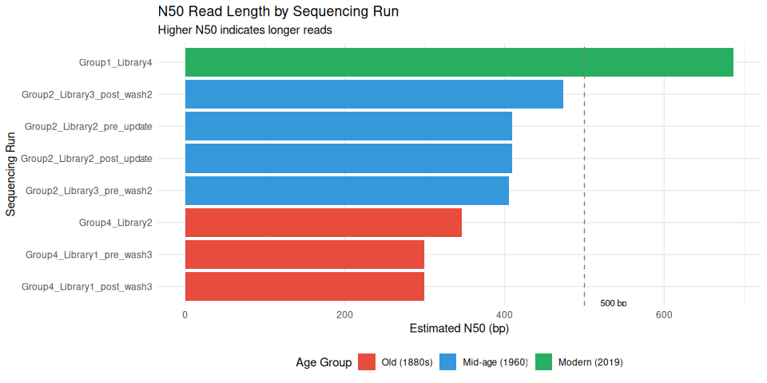<!-- -->

``` r
ggsave("../output/03-nobones-plotting/fig_n50_by_run.png", 
       p3, width = 10, height = 5, dpi = 150)
```

# 6 Figure 4: Pass vs Fail Reads

``` r
# Reshape data for stacked bar
pass_fail_data <- seq_summary %>%
  select(Sequencing.Run, Age_Group, Reads.Called.Pass.M, Reads.Called.Fail.M) %>%
  pivot_longer(
    cols = c(Reads.Called.Pass.M, Reads.Called.Fail.M),
    names_to = "Read_Type",
    values_to = "Reads_M"
  ) %>%
  mutate(
    Read_Type = ifelse(Read_Type == "Reads.Called.Pass.M", "Pass", "Fail")
  )

p4 <- ggplot(pass_fail_data, aes(x = reorder(Sequencing.Run, Reads_M), 
                                  y = Reads_M,
                                  fill = Read_Type)) +
  geom_col(position = "stack") +
  coord_flip() +
  labs(
    title = "Pass vs Fail Reads by Sequencing Run",
    x = "Sequencing Run",
    y = "Reads (millions)",
    fill = "Read Quality"
  ) +
  scale_fill_manual(values = c("Pass" = "#2ecc71", "Fail" = "#e74c3c")) +
  theme_minimal() +
  theme(legend.position = "bottom")

print(p4)
```

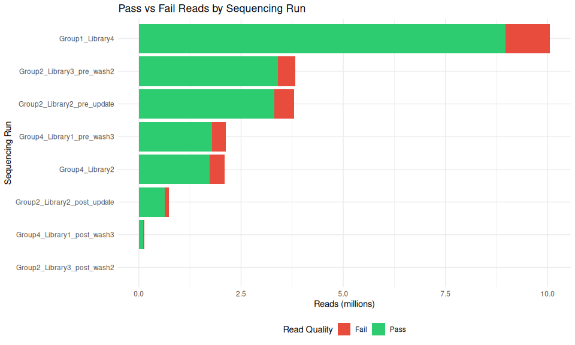<!-- -->

``` r
ggsave("../output/03-nobones-plotting/fig_pass_fail_reads.png", 
       p4, width = 10, height = 6, dpi = 150)
```

# 7 Figure 5: Pass Rate Comparison

``` r
p5 <- ggplot(seq_summary, aes(x = reorder(Sequencing.Run, Pass_Rate), 
                               y = Pass_Rate,
                               fill = Age_Group)) +
  geom_col() +
  coord_flip() +
  geom_hline(yintercept = 90, linetype = "dashed", color = "gray50") +
  labs(
    title = "Read Pass Rate by Sequencing Run",
    subtitle = "Percentage of reads passing quality filters",
    x = "Sequencing Run",
    y = "Pass Rate (%)",
    fill = "Age Group"
  ) +
  scale_fill_manual(values = c(
    "Modern (2019)" = "#27ae60",
    "Mid-age (1960)" = "#3498db",
    "Old (1880s)" = "#e74c3c"
  )) +
  scale_y_continuous(limits = c(0, 100)) +
  theme_minimal() +
  theme(legend.position = "bottom")

print(p5)
```

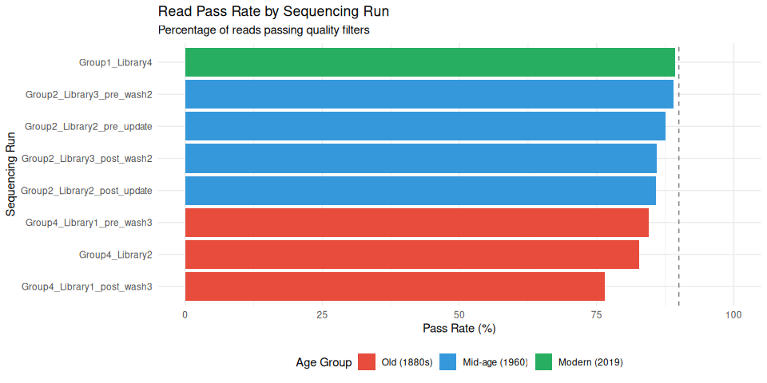<!-- -->

``` r
ggsave("../output/03-nobones-plotting/fig_pass_rate.png", 
       p5, width = 10, height = 5, dpi = 150)
```

# 8 Figure 6: Throughput Rate (Gb/hr)

``` r
p6 <- ggplot(seq_summary, aes(x = reorder(Sequencing.Run, Throughput_Rate), 
                               y = Throughput_Rate,
                               fill = Sequencer)) +
  geom_col() +
  coord_flip() +
  labs(
    title = "Sequencing Throughput Rate",
    subtitle = "Output normalized by run time",
    x = "Sequencing Run",
    y = "Throughput (Gb/hr)",
    fill = "Sequencer"
  ) +
  scale_fill_brewer(palette = "Set2") +
  theme_minimal() +
  theme(legend.position = "bottom")

print(p6)
```

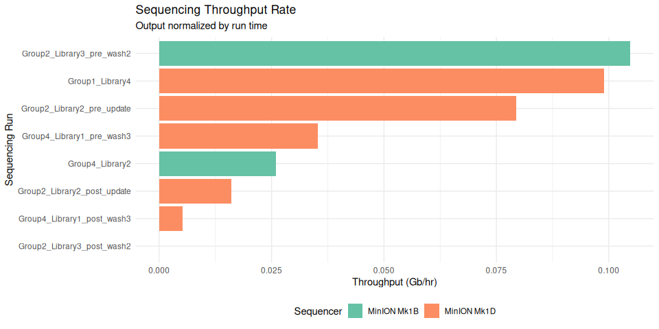<!-- -->

``` r
ggsave("../output/03-nobones-plotting/fig_throughput_rate.png", 
       p6, width = 10, height = 5, dpi = 150)
```

# 9 Figure 7: Summary by Age Group (Aggregated)

``` r
# Calculate totals for age group labels
age_totals <- seq_summary %>%
  group_by(Age_Group) %>%
  summarise(
    Total_Reads_M = sum(Reads.Generated.M),
    Total_Bases_Gb = sum(Estimated.Bases.Gb),
    .groups = "drop"
  )

# Panel A: Total reads by age group (STACKED by Library_ID)
p7a <- ggplot(seq_summary, aes(x = Age_Group, y = Reads.Generated.M, fill = Age_Group)) +
  geom_col(aes(alpha = Library_ID), color = "white", linewidth = 0.3) +
  geom_text(data = age_totals, 
            aes(x = Age_Group, y = Total_Reads_M, label = sprintf("%.1f M", Total_Reads_M)),
            vjust = -0.5, inherit.aes = FALSE, size = 3.5) +
  # Add library labels inside bars
  geom_text(aes(label = Library_ID), 
            position = position_stack(vjust = 0.5), 
            size = 3, color = "white", fontface = "bold") +
  labs(title = "A) Total Reads", x = "", y = "Total Reads (millions)") +
  scale_fill_manual(values = age_colors) +
  scale_alpha_manual(values = seq(0.6, 1, length.out = 5), guide = "none") +
  scale_y_continuous(expand = expansion(mult = c(0, 0.12))) +
  theme_minimal() +
  theme(legend.position = "none",
        axis.text.x = element_text(angle = 15, hjust = 1))

# Panel B: Total bases by age group (STACKED by Library_ID)
p7b <- ggplot(seq_summary, aes(x = Age_Group, y = Estimated.Bases.Gb, fill = Age_Group)) +
  geom_col(aes(alpha = Library_ID), color = "white", linewidth = 0.3) +
  geom_text(data = age_totals, 
            aes(x = Age_Group, y = Total_Bases_Gb, label = sprintf("%.2f Gb", Total_Bases_Gb)),
            vjust = -0.5, inherit.aes = FALSE, size = 3.5) +
  # Add library labels inside bars
  geom_text(aes(label = Library_ID), 
            position = position_stack(vjust = 0.5), 
            size = 3, color = "white", fontface = "bold") +
  labs(title = "B) Total Bases", x = "", y = "Total Bases (Gb)") +
  scale_fill_manual(values = age_colors) +
  scale_alpha_manual(values = seq(0.6, 1, length.out = 5), guide = "none") +
  scale_y_continuous(expand = expansion(mult = c(0, 0.12))) +
  theme_minimal() +
  theme(legend.position = "none",
        axis.text.x = element_text(angle = 15, hjust = 1))

# Panel C: N50 by Library (individual bars, colored by Age Group)
p7c <- ggplot(seq_summary, aes(x = Library_ID, y = Estimated.N50.b, fill = Age_Group)) +
  geom_col() +
  geom_text(aes(label = sprintf("%.0f", Estimated.N50.b)), vjust = -0.5, size = 3) +
  labs(title = "C) N50 Read Length", x = "", y = "N50 (bp)") +
  scale_fill_manual(values = age_colors) +
  scale_y_continuous(expand = expansion(mult = c(0, 0.12))) +
  theme_minimal() +
  theme(legend.position = "none",
        axis.text.x = element_text(angle = 45, hjust = 1))

# Panel D: Pass rate by Library (individual bars, colored by Age Group)
p7d <- ggplot(seq_summary, aes(x = Library_ID, y = Pass_Rate, fill = Age_Group)) +
  geom_col() +
  geom_text(aes(label = sprintf("%.1f%%", Pass_Rate)), vjust = -0.5, size = 3) +
  geom_hline(yintercept = 90, linetype = "dashed", color = "gray50", alpha = 0.7) +
  labs(title = "D) Read Pass Rate", x = "", y = "Pass Rate (%)") +
  scale_fill_manual(values = age_colors) +
  scale_y_continuous(limits = c(0, 105), expand = expansion(mult = c(0, 0))) +
  theme_minimal() +
  theme(legend.position = "none",
        axis.text.x = element_text(angle = 45, hjust = 1))

# Create a shared legend
legend_plot <- ggplot(seq_summary, aes(x = Library_ID, y = Pass_Rate, fill = Age_Group)) +
  geom_col() +
  scale_fill_manual(values = age_colors) +
  theme_minimal() +
  theme(legend.position = "bottom",
        legend.title = element_blank())

# Extract legend
library(cowplot)
```

    ## 
    ## Attaching package: 'cowplot'

    ## The following object is masked from 'package:patchwork':
    ## 
    ##     align_plots

    ## The following object is masked from 'package:lubridate':
    ## 
    ##     stamp

``` r
shared_legend <- get_legend(legend_plot)
```

    ## Warning in get_plot_component(plot, "guide-box"): Multiple components found;
    ## returning the first one. To return all, use `return_all = TRUE`.

``` r
# Combine panels
p7_combined <- (p7a | p7b) / (p7c | p7d) +
  plot_annotation(
    title = "Sequencing Summary by Specimen Age Group",
    subtitle = "E. tourneforti archival coral specimens"
  )

print(p7_combined)
```

    ## Warning: Removed 3 rows containing missing values or values outside the scale range
    ## (`geom_col()`).

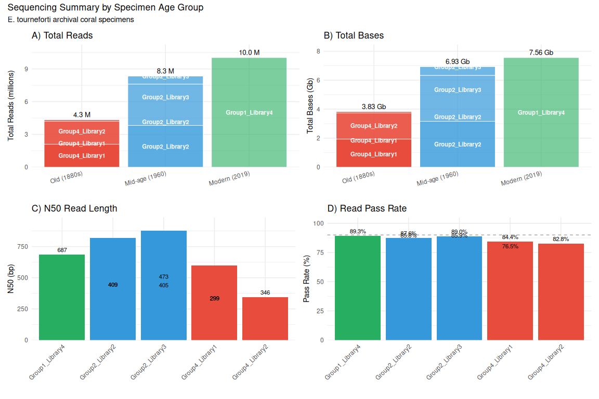<!-- -->

``` r
ggsave("../output/05-specimen-coverage/fig_age_group_summary.png", 
       p7_combined, width = 12, height = 8, dpi = 150)
```

    ## Warning: Removed 3 rows containing missing values or values outside the scale range
    ## (`geom_col()`).

# 10 Figure 8: Run Time vs Output

``` r
p8 <- ggplot(seq_summary, aes(x = Run.time.hr, y = Estimated.Bases.Gb)) +
  geom_point(aes(color = Age_Group, shape = Sequencer), size = 4, alpha = 0.8) +
  geom_text(aes(label = Run_Label), vjust = -1, size = 3) +
  labs(
    title = "Run Time vs Sequencing Output",
    x = "Run Time (hours)",
    y = "Estimated Bases (Gb)",
    color = "Age Group",
    shape = "Sequencer"
  ) +
  scale_color_manual(values = c(
    "Modern (2019)" = "#27ae60",
    "Mid-age (1960)" = "#3498db",
    "Old (1880s)" = "#e74c3c"
  )) +
  theme_minimal() +
  theme(legend.position = "right")

print(p8)
```

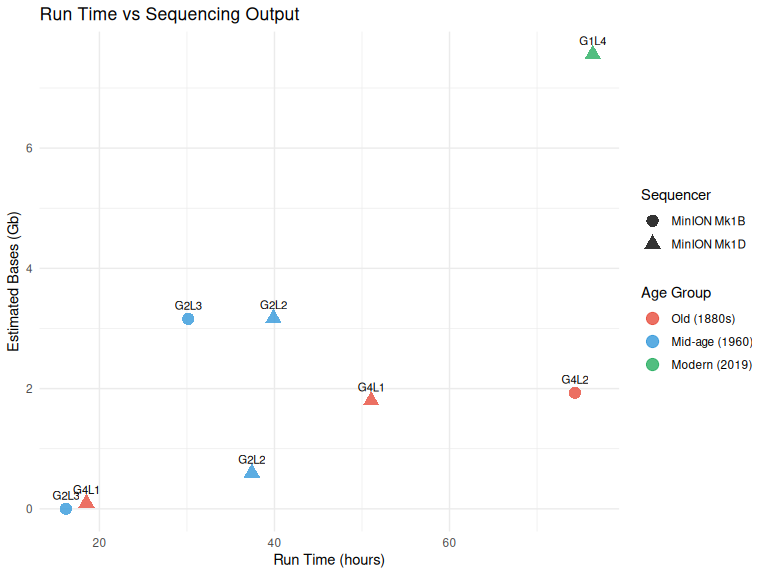<!-- -->

``` r
ggsave("../output/03-nobones-plotting/fig_runtime_vs_output.png", 
       p8, width = 8, height = 6, dpi = 150)
```

# 11 Figure 9: Bases Pass vs Fail (Stacked)

``` r
# Reshape for bases
bases_data <- seq_summary %>%
  select(Sequencing.Run, Age_Group, Bases.Called.Pass.Gb, Bases.Called.Fail.Gb) %>%
  pivot_longer(
    cols = c(Bases.Called.Pass.Gb, Bases.Called.Fail.Gb),
    names_to = "Base_Type",
    values_to = "Bases_Gb"
  ) %>%
  mutate(
    Base_Type = ifelse(Base_Type == "Bases.Called.Pass.Gb", "Pass", "Fail")
  )

p9 <- ggplot(bases_data, aes(x = reorder(Sequencing.Run, Bases_Gb), 
                              y = Bases_Gb,
                              fill = Base_Type)) +
  geom_col(position = "stack") +
  coord_flip() +
  labs(
    title = "Pass vs Fail Bases by Sequencing Run",
    x = "Sequencing Run",
    y = "Bases (Gb)",
    fill = "Base Quality"
  ) +
  scale_fill_manual(values = c("Pass" = "#2ecc71", "Fail" = "#e74c3c")) +
  theme_minimal() +
  theme(legend.position = "bottom")

print(p9)
```

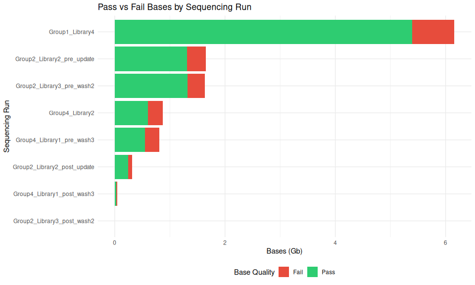<!-- -->

``` r
ggsave("../output/03-nobones-plotting/fig_bases_pass_fail.png", 
       p9, width = 10, height = 6, dpi = 150)
```

# 12 Summary Table

``` r
# Create a nice summary table
summary_table <- seq_summary %>%
  select(
    Run = Sequencing.Run,
    Group = Age_Group,
    `Bases (Gb)` = Estimated.Bases.Gb,
    `Reads (M)` = Reads.Generated.M,
    `N50 (bp)` = Estimated.N50.b,
    `Pass Rate (%)` = Pass_Rate,
    `Run Time (hr)` = Run.time.hr,
    Sequencer
  ) %>%
  arrange(desc(`Bases (Gb)`))

knitr::kable(summary_table, 
             caption = "Sequencing Run Summary Statistics",
             digits = 2)
```

| Run | Group | Bases (Gb) | Reads (M) | N50 (bp) | Pass Rate (%) | Run Time (hr) | Sequencer |
|:---|:---|---:|---:|---:|---:|----|:---|
| Group1_Library4 | Modern (2019) | 7.56 | 10.04 | 687 | 89.34 | 76.37 | MinION Mk1D |
| Group2_Library2_pre_update | Mid-age (1960) | 3.17 | 3.79 | 409 | 87.60 | 39.88 | MinION Mk1D |
| Group2_Library3_pre_wash2 | Mid-age (1960) | 3.16 | 3.82 | 405 | 89.01 | 30.15 | MinION Mk1B |
| Group4_Library2 | Old (1880s) | 1.93 | 2.09 | 346 | 82.78 | 74.33 | MinION Mk1B |
| Group4_Library1_pre_wash3 | Old (1880s) | 1.80 | 2.12 | 299 | 84.43 | 51.05 | MinION Mk1D |
| Group2_Library2_post_update | Mid-age (1960) | 0.60 | 0.73 | 409 | 85.81 | 37.42 | MinION Mk1D |
| Group4_Library1_post_wash3 | Old (1880s) | 0.10 | 0.13 | 299 | 76.52 | 18.52 | MinION Mk1D |
| Group2_Library3_post_wash2 | Mid-age (1960) | 0.00 | 0.00 | 473 | 85.90 | 16.17 | MinION Mk1B |

Sequencing Run Summary Statistics

``` r
# Age group summary table
# age_summary %>%
#   mutate(
#     `Bases (Gb)` = round(Total_Bases_Gb, 2),
#     `Reads (M)` = round(Total_Reads_M, 2),
#     `Mean N50 (bp)` = round(Mean_N50, 0),
#     `Mean Pass Rate (%)` = round(Mean_Pass_Rate, 1),
#     `Total Run Time (hr)` = round(Total_Run_Time_hr, 1)
#   ) %>%
#   select(Age_Group, n_runs, `Bases (Gb)`, `Reads (M)`, 
#          `Mean N50 (bp)`, `Mean Pass Rate (%)`, `Total Run Time (hr)`) %>%
#   knitr::kable(caption = "Summary Statistics by Age Group")
```

# 13 Statistical Comparisons (Optional)

``` r
# Compare N50 between age groups
cat("=== N50 Comparison by Age Group ===\n")
```

    ## === N50 Comparison by Age Group ===

``` r
seq_summary %>%
  group_by(Age_Group) %>%
  summarise(
    mean_N50 = mean(Estimated.N50.b),
    sd_N50 = sd(Estimated.N50.b),
    n = n(),
    .groups = "drop"
  ) %>%
  print()
```

    ## # A tibble: 3 × 4
    ##   Age_Group      mean_N50 sd_N50     n
    ##   <fct>             <dbl>  <dbl> <int>
    ## 1 Old (1880s)        315.   27.1     3
    ## 2 Mid-age (1960)     424    32.7     4
    ## 3 Modern (2019)      687    NA       1

``` r
# Simple correlation between bases and reads
cat("\n=== Correlation: Bases vs Reads ===\n")
```

    ## 
    ## === Correlation: Bases vs Reads ===

``` r
cor_test <- cor.test(seq_summary$Estimated.Bases.Gb, seq_summary$Reads.Generated.M)
cat("Pearson r =", round(cor_test$estimate, 3), "\n")
```

    ## Pearson r = 0.998

``` r
cat("p-value =", format(cor_test$p.value, scientific = TRUE), "\n")
```

    ## p-value = 1.921308e-08

# 14 Plot modifications by specimen age

``` r
library(tidyverse)
library(knitr)
library(kableExtra)
```

    ## 
    ## Attaching package: 'kableExtra'

    ## The following object is masked from 'package:dplyr':
    ## 
    ##     group_rows

``` r
library(patchwork)  # for combining plots
```

``` r
# ===== STEP 1: Find all modkit summary files =====
modkit_files <- list.files(
  path = "../../", 
  pattern = "modkit_summary_.*\\.tsv$",
  recursive = TRUE,
  full.names = TRUE
)

cat("Found", length(modkit_files), "modkit summary files\n")
```

    ## Found 18 modkit summary files

``` r
# ===== STEP 2: Read and parse all files =====
# Read each file and extract modification data
modkit_data <- map_dfr(modkit_files, function(filepath) {
  # Read as tab-delimited key-value pairs
  data <- read_tsv(filepath, col_names = c("key", "value"), show_col_types = FALSE)
  
  # Convert to wide format
  data_wide <- data %>%
    pivot_wider(names_from = key, values_from = value)
  
  # Extract barcode from filename
  barcode <- str_extract(basename(filepath), "\\d+(?=\\.tsv)")
  
  # Extract modification percentages
  data_wide %>%
    mutate(
      barcode = as.numeric(barcode),
      # Cytosine modifications
      C_5mC_pct = as.numeric(C_pass_frac_modified_m) * 100,
      C_5hmC_pct = as.numeric(C_pass_frac_modified_h) * 100,
      C_unmod_pct = as.numeric(C_pass_frac_unmodified) * 100,
      # Adenine modifications
      A_6mA_pct = as.numeric(A_pass_frac_modified_a) * 100,
      A_unmod_pct = as.numeric(A_pass_frac_unmodified) * 100
    ) %>%
    select(barcode, ends_with("_pct"))
})
```

## 14.1 Load and Merge All Metadata

``` r
# 1. Load sequencing composition (barcode -> catalog number, year, group/library)
composition <- read_csv("../../data/E_tourneforti_sequencing_composition.csv", 
                       show_col_types = FALSE)

# 2. Load sample metadata (catalog number -> DIN, other DNA quality metrics)
samples <- read_csv("../../data/E_tourneforti_E_tourneforti_samples.csv",
                   show_col_types = FALSE) %>%
  select(Catalog.Number, Year.Collected, Tapestation.DIN, 
         Tapestation.Conc.ngul, Tapestation.Perc.300up)
samples$Catalog.Number <- as.double(gsub("USNM ", "", samples$Catalog.Number))

# 3. Load sequencing summaries (group/library -> N50)
seq_summaries <- read_csv("../../data/E_tourneforti_sequencing_summaries.csv",
                         show_col_types = FALSE) %>%
  select(Group, Library, Estimated.N50.b, Estimated.Bases.Gb, 
         Reads.Generated.M, Sequencer)
seq_summaries$Group <- paste0("Group_", seq_summaries$Group)
seq_summaries$Library <- paste0("Library_", seq_summaries$Library)

# 4. Join all metadata together
metadata <- composition %>%
  # First join with samples to get DIN
  left_join(samples, by = "Catalog.Number") %>%
  # Then join with sequencing summaries to get N50
  left_join(seq_summaries, by = c("Group", "Library"))
```

    ## Warning in left_join(., seq_summaries, by = c("Group", "Library")): Detected an unexpected many-to-many relationship between `x` and `y`.
    ## ℹ Row 4 of `x` matches multiple rows in `y`.
    ## ℹ Row 1 of `y` matches multiple rows in `x`.
    ## ℹ If a many-to-many relationship is expected, set `relationship =
    ##   "many-to-many"` to silence this warning.

``` r
# 5. Join with modkit data
plot_data <- modkit_data %>%
  left_join(metadata, by = c("barcode" = "Barcode")) %>%
  arrange(Year.Collected.x) %>%
  # Use Year.Collected from composition file (Year.Collected.x)
  mutate(Year.Collected = Year.Collected.x) %>%
  select(-Year.Collected.x, -Year.Collected.y)
```

    ## Warning in left_join(., metadata, by = c(barcode = "Barcode")): Detected an unexpected many-to-many relationship between `x` and `y`.
    ## ℹ Row 7 of `x` matches multiple rows in `y`.
    ## ℹ Row 1 of `y` matches multiple rows in `x`.
    ## ℹ If a many-to-many relationship is expected, set `relationship =
    ##   "many-to-many"` to silence this warning.

``` r
# Display merged data table
plot_data %>%
  select(barcode, Year.Collected, Catalog.Number, 
         C_5mC_pct, C_5hmC_pct, A_6mA_pct, 
         Tapestation.DIN, Estimated.N50.b) %>%
  kable(digits = 2, caption = "Modification percentages with DIN and N50") %>%
  kable_styling(bootstrap_options = c("striped", "hover", "condensed"),
                font_size = 11) %>%
  scroll_box(width = "100%", height = "400px")
```

<div style="border: 1px solid #ddd; padding: 0px; overflow-y: scroll; height:400px; overflow-x: scroll; width:100%; ">

<table class="table table-striped table-hover table-condensed" style="font-size: 11px; margin-left: auto; margin-right: auto;">

<caption style="font-size: initial !important;">

Modification percentages with DIN and N50
</caption>

<thead>

<tr>

<th style="text-align:right;position: sticky; top:0; background-color: #FFFFFF;">

barcode
</th>

<th style="text-align:right;position: sticky; top:0; background-color: #FFFFFF;">

Year.Collected
</th>

<th style="text-align:right;position: sticky; top:0; background-color: #FFFFFF;">

Catalog.Number
</th>

<th style="text-align:right;position: sticky; top:0; background-color: #FFFFFF;">

C_5mC_pct
</th>

<th style="text-align:right;position: sticky; top:0; background-color: #FFFFFF;">

C_5hmC_pct
</th>

<th style="text-align:right;position: sticky; top:0; background-color: #FFFFFF;">

A_6mA_pct
</th>

<th style="text-align:right;position: sticky; top:0; background-color: #FFFFFF;">

Tapestation.DIN
</th>

<th style="text-align:right;position: sticky; top:0; background-color: #FFFFFF;">

Estimated.N50.b
</th>

</tr>

</thead>

<tbody>

<tr>

<td style="text-align:right;">

27
</td>

<td style="text-align:right;">

1880
</td>

<td style="text-align:right;">

50368
</td>

<td style="text-align:right;">

4.64
</td>

<td style="text-align:right;">

1.74
</td>

<td style="text-align:right;">

1.16
</td>

<td style="text-align:right;">

1.7
</td>

<td style="text-align:right;">

299
</td>

</tr>

<tr>

<td style="text-align:right;">

27
</td>

<td style="text-align:right;">

1880
</td>

<td style="text-align:right;">

50368
</td>

<td style="text-align:right;">

4.64
</td>

<td style="text-align:right;">

1.74
</td>

<td style="text-align:right;">

1.16
</td>

<td style="text-align:right;">

1.7
</td>

<td style="text-align:right;">

299
</td>

</tr>

<tr>

<td style="text-align:right;">

30
</td>

<td style="text-align:right;">

1880
</td>

<td style="text-align:right;">

50368
</td>

<td style="text-align:right;">

5.83
</td>

<td style="text-align:right;">

2.64
</td>

<td style="text-align:right;">

1.07
</td>

<td style="text-align:right;">

1.7
</td>

<td style="text-align:right;">

346
</td>

</tr>

<tr>

<td style="text-align:right;">

29
</td>

<td style="text-align:right;">

1886
</td>

<td style="text-align:right;">

14399
</td>

<td style="text-align:right;">

6.28
</td>

<td style="text-align:right;">

3.32
</td>

<td style="text-align:right;">

0.92
</td>

<td style="text-align:right;">

1.2
</td>

<td style="text-align:right;">

299
</td>

</tr>

<tr>

<td style="text-align:right;">

29
</td>

<td style="text-align:right;">

1886
</td>

<td style="text-align:right;">

14399
</td>

<td style="text-align:right;">

6.28
</td>

<td style="text-align:right;">

3.32
</td>

<td style="text-align:right;">

0.92
</td>

<td style="text-align:right;">

1.2
</td>

<td style="text-align:right;">

299
</td>

</tr>

<tr>

<td style="text-align:right;">

32
</td>

<td style="text-align:right;">

1886
</td>

<td style="text-align:right;">

14399
</td>

<td style="text-align:right;">

5.63
</td>

<td style="text-align:right;">

1.29
</td>

<td style="text-align:right;">

0.66
</td>

<td style="text-align:right;">

1.2
</td>

<td style="text-align:right;">

346
</td>

</tr>

<tr>

<td style="text-align:right;">

28
</td>

<td style="text-align:right;">

1898
</td>

<td style="text-align:right;">

42137
</td>

<td style="text-align:right;">

4.78
</td>

<td style="text-align:right;">

2.49
</td>

<td style="text-align:right;">

1.09
</td>

<td style="text-align:right;">

1.1
</td>

<td style="text-align:right;">

299
</td>

</tr>

<tr>

<td style="text-align:right;">

28
</td>

<td style="text-align:right;">

1898
</td>

<td style="text-align:right;">

42137
</td>

<td style="text-align:right;">

4.78
</td>

<td style="text-align:right;">

2.49
</td>

<td style="text-align:right;">

1.09
</td>

<td style="text-align:right;">

1.1
</td>

<td style="text-align:right;">

299
</td>

</tr>

<tr>

<td style="text-align:right;">

31
</td>

<td style="text-align:right;">

1898
</td>

<td style="text-align:right;">

42137
</td>

<td style="text-align:right;">

4.48
</td>

<td style="text-align:right;">

2.22
</td>

<td style="text-align:right;">

1.14
</td>

<td style="text-align:right;">

1.1
</td>

<td style="text-align:right;">

346
</td>

</tr>

<tr>

<td style="text-align:right;">

18
</td>

<td style="text-align:right;">

1960
</td>

<td style="text-align:right;">

51861
</td>

<td style="text-align:right;">

4.68
</td>

<td style="text-align:right;">

0.99
</td>

<td style="text-align:right;">

0.52
</td>

<td style="text-align:right;">

1.7
</td>

<td style="text-align:right;">

409
</td>

</tr>

<tr>

<td style="text-align:right;">

18
</td>

<td style="text-align:right;">

1960
</td>

<td style="text-align:right;">

51861
</td>

<td style="text-align:right;">

4.68
</td>

<td style="text-align:right;">

0.99
</td>

<td style="text-align:right;">

0.52
</td>

<td style="text-align:right;">

1.7
</td>

<td style="text-align:right;">

409
</td>

</tr>

<tr>

<td style="text-align:right;">

19
</td>

<td style="text-align:right;">

1960
</td>

<td style="text-align:right;">

51892
</td>

<td style="text-align:right;">

5.48
</td>

<td style="text-align:right;">

1.04
</td>

<td style="text-align:right;">

0.61
</td>

<td style="text-align:right;">

1.9
</td>

<td style="text-align:right;">

409
</td>

</tr>

<tr>

<td style="text-align:right;">

19
</td>

<td style="text-align:right;">

1960
</td>

<td style="text-align:right;">

51892
</td>

<td style="text-align:right;">

5.48
</td>

<td style="text-align:right;">

1.04
</td>

<td style="text-align:right;">

0.61
</td>

<td style="text-align:right;">

1.9
</td>

<td style="text-align:right;">

409
</td>

</tr>

<tr>

<td style="text-align:right;">

20
</td>

<td style="text-align:right;">

1960
</td>

<td style="text-align:right;">

51732
</td>

<td style="text-align:right;">

5.99
</td>

<td style="text-align:right;">

0.66
</td>

<td style="text-align:right;">

0.15
</td>

<td style="text-align:right;">

2.1
</td>

<td style="text-align:right;">

409
</td>

</tr>

<tr>

<td style="text-align:right;">

20
</td>

<td style="text-align:right;">

1960
</td>

<td style="text-align:right;">

51732
</td>

<td style="text-align:right;">

5.99
</td>

<td style="text-align:right;">

0.66
</td>

<td style="text-align:right;">

0.15
</td>

<td style="text-align:right;">

2.1
</td>

<td style="text-align:right;">

409
</td>

</tr>

<tr>

<td style="text-align:right;">

24
</td>

<td style="text-align:right;">

1960
</td>

<td style="text-align:right;">

51861
</td>

<td style="text-align:right;">

4.37
</td>

<td style="text-align:right;">

0.97
</td>

<td style="text-align:right;">

0.75
</td>

<td style="text-align:right;">

1.7
</td>

<td style="text-align:right;">

405
</td>

</tr>

<tr>

<td style="text-align:right;">

24
</td>

<td style="text-align:right;">

1960
</td>

<td style="text-align:right;">

51861
</td>

<td style="text-align:right;">

4.37
</td>

<td style="text-align:right;">

0.97
</td>

<td style="text-align:right;">

0.75
</td>

<td style="text-align:right;">

1.7
</td>

<td style="text-align:right;">

473
</td>

</tr>

<tr>

<td style="text-align:right;">

25
</td>

<td style="text-align:right;">

1960
</td>

<td style="text-align:right;">

51892
</td>

<td style="text-align:right;">

4.21
</td>

<td style="text-align:right;">

1.07
</td>

<td style="text-align:right;">

0.64
</td>

<td style="text-align:right;">

1.9
</td>

<td style="text-align:right;">

405
</td>

</tr>

<tr>

<td style="text-align:right;">

25
</td>

<td style="text-align:right;">

1960
</td>

<td style="text-align:right;">

51892
</td>

<td style="text-align:right;">

4.21
</td>

<td style="text-align:right;">

1.07
</td>

<td style="text-align:right;">

0.64
</td>

<td style="text-align:right;">

1.9
</td>

<td style="text-align:right;">

473
</td>

</tr>

<tr>

<td style="text-align:right;">

26
</td>

<td style="text-align:right;">

1960
</td>

<td style="text-align:right;">

51732
</td>

<td style="text-align:right;">

5.49
</td>

<td style="text-align:right;">

0.59
</td>

<td style="text-align:right;">

0.16
</td>

<td style="text-align:right;">

2.1
</td>

<td style="text-align:right;">

405
</td>

</tr>

<tr>

<td style="text-align:right;">

26
</td>

<td style="text-align:right;">

1960
</td>

<td style="text-align:right;">

51732
</td>

<td style="text-align:right;">

5.49
</td>

<td style="text-align:right;">

0.59
</td>

<td style="text-align:right;">

0.16
</td>

<td style="text-align:right;">

2.1
</td>

<td style="text-align:right;">

473
</td>

</tr>

<tr>

<td style="text-align:right;">

12
</td>

<td style="text-align:right;">

2019
</td>

<td style="text-align:right;">

1606826
</td>

<td style="text-align:right;">

4.13
</td>

<td style="text-align:right;">

0.94
</td>

<td style="text-align:right;">

0.38
</td>

<td style="text-align:right;">

3.4
</td>

<td style="text-align:right;">

687
</td>

</tr>

<tr>

<td style="text-align:right;">

13
</td>

<td style="text-align:right;">

2019
</td>

<td style="text-align:right;">

1740336
</td>

<td style="text-align:right;">

4.62
</td>

<td style="text-align:right;">

0.96
</td>

<td style="text-align:right;">

0.41
</td>

<td style="text-align:right;">

3.1
</td>

<td style="text-align:right;">

687
</td>

</tr>

<tr>

<td style="text-align:right;">

14
</td>

<td style="text-align:right;">

2019
</td>

<td style="text-align:right;">

1740363
</td>

<td style="text-align:right;">

3.83
</td>

<td style="text-align:right;">

0.78
</td>

<td style="text-align:right;">

0.33
</td>

<td style="text-align:right;">

3.3
</td>

<td style="text-align:right;">

687
</td>

</tr>

<tr>

<td style="text-align:right;">

12
</td>

<td style="text-align:right;">

2019
</td>

<td style="text-align:right;">

1606826
</td>

<td style="text-align:right;">

4.18
</td>

<td style="text-align:right;">

0.59
</td>

<td style="text-align:right;">

0.14
</td>

<td style="text-align:right;">

3.4
</td>

<td style="text-align:right;">

687
</td>

</tr>

<tr>

<td style="text-align:right;">

13
</td>

<td style="text-align:right;">

2019
</td>

<td style="text-align:right;">

1740336
</td>

<td style="text-align:right;">

4.93
</td>

<td style="text-align:right;">

0.64
</td>

<td style="text-align:right;">

0.17
</td>

<td style="text-align:right;">

3.1
</td>

<td style="text-align:right;">

687
</td>

</tr>

<tr>

<td style="text-align:right;">

14
</td>

<td style="text-align:right;">

2019
</td>

<td style="text-align:right;">

1740363
</td>

<td style="text-align:right;">

4.01
</td>

<td style="text-align:right;">

0.52
</td>

<td style="text-align:right;">

0.13
</td>

<td style="text-align:right;">

3.3
</td>

<td style="text-align:right;">

687
</td>

</tr>

</tbody>

</table>

</div>

## 14.2 Reshape Data for Plotting

``` r
plot_data_long <- plot_data %>%
  pivot_longer(
    cols = ends_with("_pct"),
    names_to = "modification",
    values_to = "percentage"
  ) %>%
  filter(!is.na(percentage)) %>%
  separate(modification, into = c("base", "mod_type", "pct"), sep = "_") %>%
  select(-pct) %>%
  mutate(
    mod_label = case_when(
      mod_type == "5mC" ~ "5mC (methylcytosine)",
      mod_type == "5hmC" ~ "5hmC (hydroxymethylcytosine)", 
      mod_type == "6mA" ~ "6mA (methyladenine)",
      mod_type == "unmod" ~ "Unmodified",
      TRUE ~ mod_type
    ),
    full_label = paste0(base, " - ", mod_label),
    # Create age categories
    age_category = case_when(
      Year.Collected >= 2000 ~ "Modern (<25 years)",
      Year.Collected >= 1960 ~ "Mid-age (1960s)",
      TRUE ~ "Historic (>100 years)"
    )
  )
```

# 15 Modifications vs. Sample Age

``` r
plot_mod_data <- plot_data_long %>%
  filter(mod_type %in% c("5mC", "5hmC", "6mA")) %>%
  group_by(Catalog.Number, mod_type) %>%
  summarise(
    percentage = mean(percentage, na.rm = TRUE),
    Year.Collected = first(Year.Collected),
    age_category = first(age_category),
    .groups = "drop"
  ) %>%
  mutate(
    # order specimens by collection year
    Catalog.Number = fct_reorder(
      as.factor(Catalog.Number),
      Year.Collected
    )
  )

age_colors <- c(
  "Historic (>100 years)" = "#e74c3c",
  "Mid-age (1960s)" = "#3498db",
  "Modern (<25 years)" = "#27ae60"
)

plot_mod_bar <- function(mod) {
  
  ggplot(
    plot_mod_data %>% filter(mod_type == mod),
    aes(
      x = Catalog.Number,
      y = percentage,
      fill = age_category
    )
  ) +
    geom_col(width = 0.8) +
    geom_text(
      aes(label = Year.Collected),
      vjust = -0.4,
      size = 3
    ) +
    scale_fill_manual(values = age_colors) +
    labs(
      title = paste0(mod, " Modification per Specimen"),
      x = "Specimen (Catalog Number)",
      y = "% Modified"
    ) +
    theme_minimal() +
    theme(
      axis.text.x = element_text(angle = 45, hjust = 1),
      legend.title = element_blank()
    )
}


p_5mC  <- plot_mod_bar("5mC")
p_5hmC <- plot_mod_bar("5hmC")
p_6mA  <- plot_mod_bar("6mA")

p_5mC
```

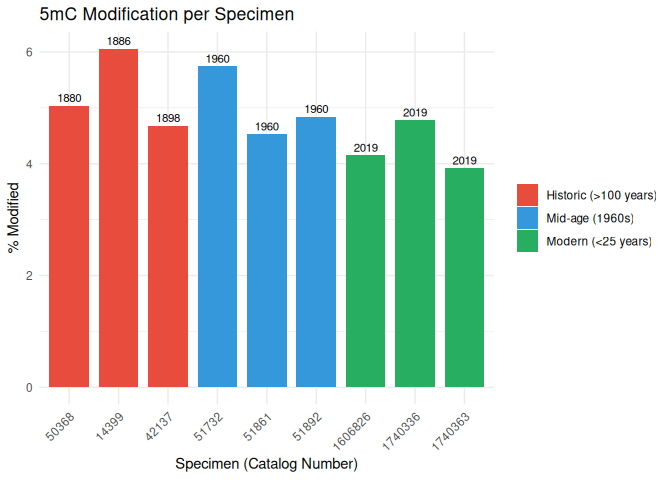<!-- -->

``` r
p_5hmC
```

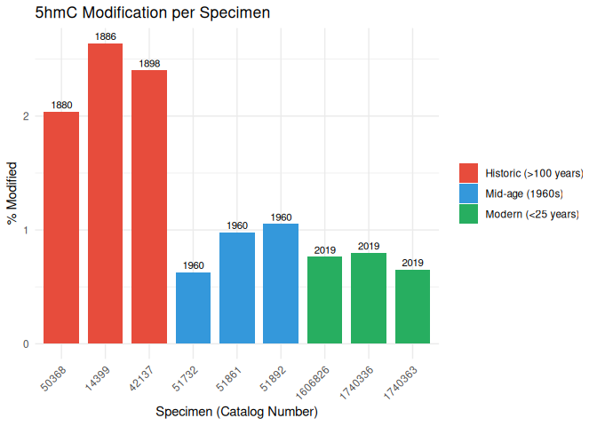<!-- -->

``` r
p_6mA
```

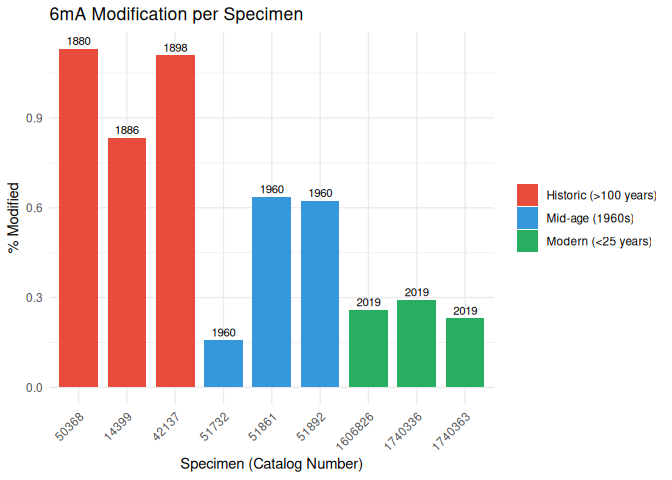<!-- -->

``` r
p_combined <- (p_5mC | p_5hmC | p_6mA) +
  plot_annotation(
    title = "DNA Modification Levels Across Specimens",
    subtitle = "Bars colored by specimen age category; labels indicate year collected"
  ) &
  theme(legend.position = "bottom")

ggsave(
  filename = "../output/03-nobones-plotting/DNA_modification_levels_by_specimen.png",
  plot = p_combined,
  width = 14,
  height = 5,
  dpi = 300
)
```

``` r
p_age <- plot_data_long %>%
  filter(mod_type != "unmod") %>%
  ggplot(aes(x = Year.Collected, y = percentage, color = base)) +
  geom_point(size = 3.5, alpha = 0.8) +
  geom_smooth(method = "lm", se = TRUE, alpha = 0.2, linewidth = 1) +
  facet_wrap(~mod_label, scales = "free_y", ncol = 1) +
  scale_color_manual(
    values = c("C" = "#E41A1C", "A" = "#377EB8"),
    name = "Base"
  ) +
  labs(
    title = "DNA Modifications by Sample Age",
    subtitle = "Linear regression with 95% confidence interval",
    x = "Year Collected",
    y = "Percentage (%)"
  ) +
  theme_bw(base_size = 12) +
  theme(
    legend.position = "bottom",
    strip.text = element_text(face = "bold", size = 11),
    plot.title = element_text(face = "bold", size = 14)
  )

print(p_age)
```

    ## `geom_smooth()` using formula = 'y ~ x'

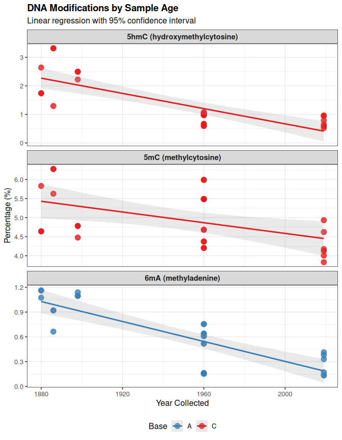<!-- -->

# 16 Modifications vs. DNA Integrity (DIN)

The DNA Integrity Number (DIN) is a measure of DNA quality from
TapeStation analysis. Higher DIN values indicate better DNA integrity.

``` r
p_din <- plot_data_long %>%
  filter(mod_type != "unmod", !is.na(Tapestation.DIN)) %>%
  ggplot(aes(x = Tapestation.DIN, y = percentage, color = age_category)) +
  geom_point(size = 3.5, alpha = 0.8) +
  geom_smooth(method = "lm", se = TRUE, alpha = 0.2, linewidth = 1) +
  facet_wrap(~mod_label, scales = "free_y", ncol = 1) +
  scale_color_brewer(palette = "Set1", name = "Age Category") +
  labs(
    title = "DNA Modifications vs. DNA Integrity (DIN)",
    subtitle = "Linear regression with 95% confidence interval",
    x = "DNA Integrity Number (DIN)",
    y = "Percentage (%)"
  ) +
  theme_bw(base_size = 12) +
  theme(
    legend.position = "bottom",
    strip.text = element_text(face = "bold", size = 11),
    plot.title = element_text(face = "bold", size = 14)
  )

print(p_din)
```

    ## `geom_smooth()` using formula = 'y ~ x'

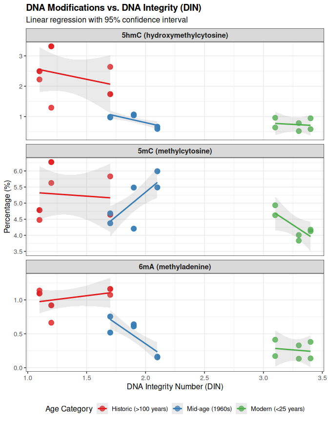<!-- -->

# 17 Modifications vs. Sequencing N50

N50 is a measure of read length quality - the length at which 50% of
bases are in reads of that length or longer.

``` r
p_n50 <- plot_data_long %>%
  filter(mod_type != "unmod", !is.na(Estimated.N50.b)) %>%
  ggplot(aes(x = Estimated.N50.b, y = percentage, color = age_category)) +
  geom_point(size = 3.5, alpha = 0.8) +
  geom_smooth(method = "lm", se = TRUE, alpha = 0.2, linewidth = 1) +
  facet_wrap(~mod_label, scales = "free_y", ncol = 1) +
  scale_color_brewer(palette = "Set1", name = "Age Category") +
  labs(
    title = "DNA Modifications vs. Sequencing N50",
    subtitle = "Linear regression with 95% confidence interval",
    x = "N50 (bases)",
    y = "Percentage (%)"
  ) +
  theme_bw(base_size = 12) +
  theme(
    legend.position = "bottom",
    strip.text = element_text(face = "bold", size = 11),
    plot.title = element_text(face = "bold", size = 14)
  )

print(p_n50)
```

    ## `geom_smooth()` using formula = 'y ~ x'

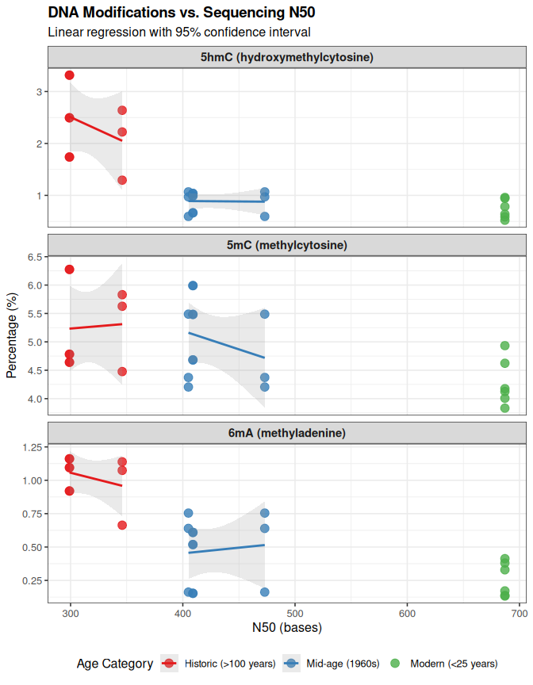<!-- -->

# 18 Combined Comparison Plots

## 18.1 5mC across all three variables

``` r
p_5mc_age <- plot_data_long %>%
  filter(mod_type == "5mC") %>%
  ggplot(aes(x = Year.Collected, y = percentage)) +
  geom_point(size = 3, alpha = 0.7, color = "#E41A1C") +
  geom_smooth(method = "lm", se = TRUE, color = "#E41A1C") +
  labs(title = "5mC vs. Age", x = "Year Collected", y = "5mC (%)") +
  theme_bw()

p_5mc_din <- plot_data_long %>%
  filter(mod_type == "5mC", !is.na(Tapestation.DIN)) %>%
  ggplot(aes(x = Tapestation.DIN, y = percentage)) +
  geom_point(size = 3, alpha = 0.7, color = "#E41A1C") +
  geom_smooth(method = "lm", se = TRUE, color = "#E41A1C") +
  labs(title = "5mC vs. DIN", x = "DIN", y = "5mC (%)") +
  theme_bw()

p_5mc_n50 <- plot_data_long %>%
  filter(mod_type == "5mC", !is.na(Estimated.N50.b)) %>%
  ggplot(aes(x = Estimated.N50.b, y = percentage)) +
  geom_point(size = 3, alpha = 0.7, color = "#E41A1C") +
  geom_smooth(method = "lm", se = TRUE, color = "#E41A1C") +
  labs(title = "5mC vs. N50", x = "N50 (bases)", y = "5mC (%)") +
  theme_bw()

p_5mc_age + p_5mc_din + p_5mc_n50
```

    ## `geom_smooth()` using formula = 'y ~ x'
    ## `geom_smooth()` using formula = 'y ~ x'
    ## `geom_smooth()` using formula = 'y ~ x'

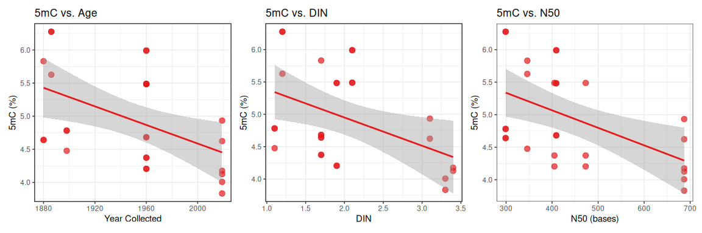<!-- -->

## 18.2 5hmC across all three variables

``` r
p_5hmc_age <- plot_data_long %>%
  filter(mod_type == "5hmC") %>%
  ggplot(aes(x = Year.Collected, y = percentage)) +
  geom_point(size = 3, alpha = 0.7, color = "#E41A1C") +
  geom_smooth(method = "lm", se = TRUE, color = "#E41A1C") +
  labs(title = "5mC vs. Age", x = "Year Collected", y = "5hmC (%)") +
  theme_bw()

p_5hmc_din <- plot_data_long %>%
  filter(mod_type == "5hmC", !is.na(Tapestation.DIN)) %>%
  ggplot(aes(x = Tapestation.DIN, y = percentage)) +
  geom_point(size = 3, alpha = 0.7, color = "#E41A1C") +
  geom_smooth(method = "lm", se = TRUE, color = "#E41A1C") +
  labs(title = "5hmC vs. DIN", x = "DIN", y = "5hmC (%)") +
  theme_bw()

p_5hmc_n50 <- plot_data_long %>%
  filter(mod_type == "5hmC", !is.na(Estimated.N50.b)) %>%
  ggplot(aes(x = Estimated.N50.b, y = percentage)) +
  geom_point(size = 3, alpha = 0.7, color = "#E41A1C") +
  geom_smooth(method = "lm", se = TRUE, color = "#E41A1C") +
  labs(title = "5hmC vs. N50", x = "N50 (bases)", y = "5hmC (%)") +
  theme_bw()

p_5hmc_age + p_5hmc_din + p_5hmc_n50
```

    ## `geom_smooth()` using formula = 'y ~ x'
    ## `geom_smooth()` using formula = 'y ~ x'
    ## `geom_smooth()` using formula = 'y ~ x'

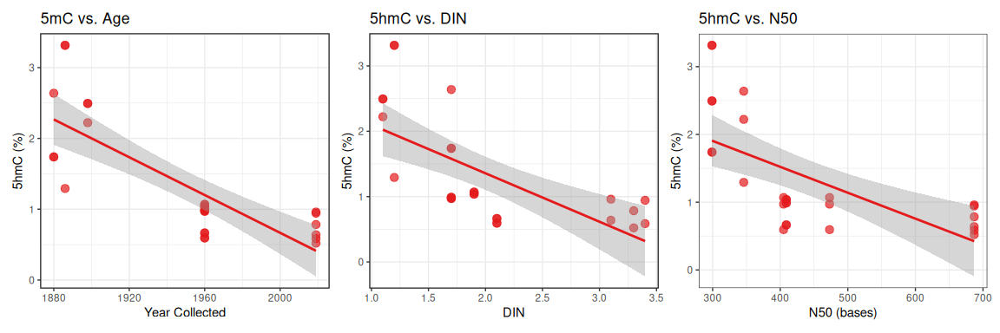<!-- -->

## 18.3 6mA across all three variables

``` r
p_6ma_age <- plot_data_long %>%
  filter(mod_type == "6mA") %>%
  ggplot(aes(x = Year.Collected, y = percentage)) +
  geom_point(size = 3, alpha = 0.7, color = "#377EB8") +
  geom_smooth(method = "lm", se = TRUE, color = "#377EB8") +
  labs(title = "6mA vs. Age", x = "Year Collected", y = "6mA (%)") +
  theme_bw()

p_6ma_din <- plot_data_long %>%
  filter(mod_type == "6mA", !is.na(Tapestation.DIN)) %>%
  ggplot(aes(x = Tapestation.DIN, y = percentage)) +
  geom_point(size = 3, alpha = 0.7, color = "#377EB8") +
  geom_smooth(method = "lm", se = TRUE, color = "#377EB8") +
  labs(title = "6mA vs. DIN", x = "DIN", y = "6mA (%)") +
  theme_bw()

p_6ma_n50 <- plot_data_long %>%
  filter(mod_type == "6mA", !is.na(Estimated.N50.b)) %>%
  ggplot(aes(x = Estimated.N50.b, y = percentage)) +
  geom_point(size = 3, alpha = 0.7, color = "#377EB8") +
  geom_smooth(method = "lm", se = TRUE, color = "#377EB8") +
  labs(title = "6mA vs. N50", x = "N50 (bases)", y = "6mA (%)") +
  theme_bw()

p_6ma_age + p_6ma_din + p_6ma_n50
```

    ## `geom_smooth()` using formula = 'y ~ x'
    ## `geom_smooth()` using formula = 'y ~ x'
    ## `geom_smooth()` using formula = 'y ~ x'

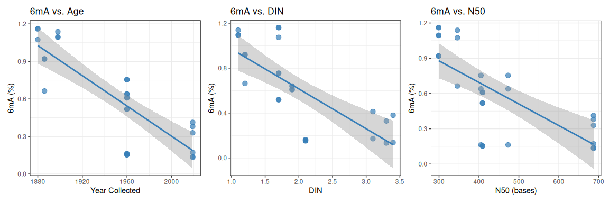<!-- -->

# 19 Correlation Analysis

## 19.1 Correlations with Year Collected

``` r
cor_age <- plot_data_long %>%
  filter(mod_type != "unmod") %>%
  group_by(mod_label) %>%
  summarise(
    r = cor(Year.Collected, percentage, use = "complete.obs"),
    p_value = cor.test(Year.Collected, percentage)$p.value,
    n = n(),
    .groups = "drop"
  ) %>%
  mutate(
    significance = case_when(
      p_value < 0.0001 ~ "****",
      p_value < 0.001 ~ "***",
      p_value < 0.01 ~ "**",
      p_value < 0.05 ~ "*",
      TRUE ~ "ns"
    )
  )

cor_age %>%
  kable(digits = 4, caption = "Correlation with Year Collected",
        col.names = c("Modification", "r", "P-value", "N", "Sig.")) %>%
  kable_styling(bootstrap_options = c("striped", "hover"))
```

<table class="table table-striped table-hover" style="margin-left: auto; margin-right: auto;">

<caption>

Correlation with Year Collected
</caption>

<thead>

<tr>

<th style="text-align:left;">

Modification
</th>

<th style="text-align:right;">

r
</th>

<th style="text-align:right;">

P-value
</th>

<th style="text-align:right;">

N
</th>

<th style="text-align:left;">

Sig.
</th>

</tr>

</thead>

<tbody>

<tr>

<td style="text-align:left;">

5hmC (hydroxymethylcytosine)
</td>

<td style="text-align:right;">

-0.7909
</td>

<td style="text-align:right;">

0.0000
</td>

<td style="text-align:right;">

27
</td>

<td style="text-align:left;">

\*\*\*\*
</td>

</tr>

<tr>

<td style="text-align:left;">

5mC (methylcytosine)
</td>

<td style="text-align:right;">

-0.4782
</td>

<td style="text-align:right;">

0.0116
</td>

<td style="text-align:right;">

27
</td>

<td style="text-align:left;">

- </td>

  </tr>

  <tr>

  <td style="text-align:left;">

  6mA (methyladenine)
  </td>

  <td style="text-align:right;">

  -0.8271
  </td>

  <td style="text-align:right;">

  0.0000
  </td>

  <td style="text-align:right;">

  27
  </td>

  <td style="text-align:left;">

  \*\*\*\*
  </td>

  </tr>

  </tbody>

  </table>

## 19.2 Correlations with DIN

``` r
cor_din <- plot_data_long %>%
  filter(mod_type != "unmod", !is.na(Tapestation.DIN)) %>%
  group_by(mod_label) %>%
  summarise(
    r = cor(Tapestation.DIN, percentage, use = "complete.obs"),
    p_value = cor.test(Tapestation.DIN, percentage)$p.value,
    n = n(),
    .groups = "drop"
  ) %>%
  mutate(
    significance = case_when(
      p_value < 0.0001 ~ "****",
      p_value < 0.001 ~ "***",
      p_value < 0.01 ~ "**",
      p_value < 0.05 ~ "*",
      TRUE ~ "ns"
    )
  )

cor_din %>%
  kable(digits = 4, caption = "Correlation with DIN",
        col.names = c("Modification", "r", "P-value", "N", "Sig.")) %>%
  kable_styling(bootstrap_options = c("striped", "hover"))
```

<table class="table table-striped table-hover" style="margin-left: auto; margin-right: auto;">

<caption>

Correlation with DIN
</caption>

<thead>

<tr>

<th style="text-align:left;">

Modification
</th>

<th style="text-align:right;">

r
</th>

<th style="text-align:right;">

P-value
</th>

<th style="text-align:right;">

N
</th>

<th style="text-align:left;">

Sig.
</th>

</tr>

</thead>

<tbody>

<tr>

<td style="text-align:left;">

5hmC (hydroxymethylcytosine)
</td>

<td style="text-align:right;">

-0.6630
</td>

<td style="text-align:right;">

0.0002
</td>

<td style="text-align:right;">

27
</td>

<td style="text-align:left;">

\*\*\*
</td>

</tr>

<tr>

<td style="text-align:left;">

5mC (methylcytosine)
</td>

<td style="text-align:right;">

-0.4482
</td>

<td style="text-align:right;">

0.0190
</td>

<td style="text-align:right;">

27
</td>

<td style="text-align:left;">

- </td>

  </tr>

  <tr>

  <td style="text-align:left;">

  6mA (methyladenine)
  </td>

  <td style="text-align:right;">

  -0.7334
  </td>

  <td style="text-align:right;">

  0.0000
  </td>

  <td style="text-align:right;">

  27
  </td>

  <td style="text-align:left;">

  \*\*\*\*
  </td>

  </tr>

  </tbody>

  </table>

## 19.3 Correlations with N50

``` r
cor_n50 <- plot_data_long %>%
  filter(mod_type != "unmod", !is.na(Estimated.N50.b)) %>%
  group_by(mod_label) %>%
  summarise(
    r = cor(Estimated.N50.b, percentage, use = "complete.obs"),
    p_value = cor.test(Estimated.N50.b, percentage)$p.value,
    n = n(),
    .groups = "drop"
  ) %>%
  mutate(
    significance = case_when(
      p_value < 0.0001 ~ "****",
      p_value < 0.001 ~ "***",
      p_value < 0.01 ~ "**",
      p_value < 0.05 ~ "*",
      TRUE ~ "ns"
    )
  )

cor_n50 %>%
  kable(digits = 4, caption = "Correlation with N50",
        col.names = c("Modification", "r", "P-value", "N", "Sig.")) %>%
  kable_styling(bootstrap_options = c("striped", "hover"))
```

<table class="table table-striped table-hover" style="margin-left: auto; margin-right: auto;">

<caption>

Correlation with N50
</caption>

<thead>

<tr>

<th style="text-align:left;">

Modification
</th>

<th style="text-align:right;">

r
</th>

<th style="text-align:right;">

P-value
</th>

<th style="text-align:right;">

N
</th>

<th style="text-align:left;">

Sig.
</th>

</tr>

</thead>

<tbody>

<tr>

<td style="text-align:left;">

5hmC (hydroxymethylcytosine)
</td>

<td style="text-align:right;">

-0.6439
</td>

<td style="text-align:right;">

0.0003
</td>

<td style="text-align:right;">

27
</td>

<td style="text-align:left;">

\*\*\*
</td>

</tr>

<tr>

<td style="text-align:left;">

5mC (methylcytosine)
</td>

<td style="text-align:right;">

-0.5206
</td>

<td style="text-align:right;">

0.0054
</td>

<td style="text-align:right;">

27
</td>

<td style="text-align:left;">

\*\*
</td>

</tr>

<tr>

<td style="text-align:left;">

6mA (methyladenine)
</td>

<td style="text-align:right;">

-0.7140
</td>

<td style="text-align:right;">

0.0000
</td>

<td style="text-align:right;">

27
</td>

<td style="text-align:left;">

\*\*\*\*
</td>

</tr>

</tbody>

</table>

# 20 Summary Statistics by Age Category

``` r
summary_by_age <- plot_data_long %>%
  filter(mod_type != "unmod") %>%
  group_by(age_category, mod_label) %>%
  summarise(
    n = n(),
    mean_pct = mean(percentage, na.rm = TRUE),
    sd_pct = sd(percentage, na.rm = TRUE),
    mean_din = mean(Tapestation.DIN, na.rm = TRUE),
    mean_n50 = mean(Estimated.N50.b, na.rm = TRUE),
    .groups = "drop"
  ) %>%
  arrange(age_category, desc(mean_pct))

summary_by_age %>%
  kable(digits = 2, 
        caption = "Summary statistics by age category",
        col.names = c("Age Category", "Modification", "N", 
                      "Mean %", "SD %", "Mean DIN", "Mean N50")) %>%
  kable_styling(bootstrap_options = c("striped", "hover")) %>%
  collapse_rows(columns = 1, valign = "top")
```

<table class="table table-striped table-hover" style="margin-left: auto; margin-right: auto;">

<caption>

Summary statistics by age category
</caption>

<thead>

<tr>

<th style="text-align:left;">

Age Category
</th>

<th style="text-align:left;">

Modification
</th>

<th style="text-align:right;">

N
</th>

<th style="text-align:right;">

Mean %
</th>

<th style="text-align:right;">

SD %
</th>

<th style="text-align:right;">

Mean DIN
</th>

<th style="text-align:right;">

Mean N50
</th>

</tr>

</thead>

<tbody>

<tr>

<td style="text-align:left;vertical-align: top !important;" rowspan="3">

Historic (\>100 years)
</td>

<td style="text-align:left;">

5mC (methylcytosine)
</td>

<td style="text-align:right;">

9
</td>

<td style="text-align:right;">

5.26
</td>

<td style="text-align:right;">

0.74
</td>

<td style="text-align:right;">

1.33
</td>

<td style="text-align:right;">

314.67
</td>

</tr>

<tr>

<td style="text-align:left;">

5hmC (hydroxymethylcytosine)
</td>

<td style="text-align:right;">

9
</td>

<td style="text-align:right;">

2.36
</td>

<td style="text-align:right;">

0.70
</td>

<td style="text-align:right;">

1.33
</td>

<td style="text-align:right;">

314.67
</td>

</tr>

<tr>

<td style="text-align:left;">

6mA (methyladenine)
</td>

<td style="text-align:right;">

9
</td>

<td style="text-align:right;">

1.03
</td>

<td style="text-align:right;">

0.16
</td>

<td style="text-align:right;">

1.33
</td>

<td style="text-align:right;">

314.67
</td>

</tr>

<tr>

<td style="text-align:left;vertical-align: top !important;" rowspan="3">

Mid-age (1960s)
</td>

<td style="text-align:left;">

5mC (methylcytosine)
</td>

<td style="text-align:right;">

12
</td>

<td style="text-align:right;">

5.04
</td>

<td style="text-align:right;">

0.68
</td>

<td style="text-align:right;">

1.90
</td>

<td style="text-align:right;">

424.00
</td>

</tr>

<tr>

<td style="text-align:left;">

5hmC (hydroxymethylcytosine)
</td>

<td style="text-align:right;">

12
</td>

<td style="text-align:right;">

0.89
</td>

<td style="text-align:right;">

0.19
</td>

<td style="text-align:right;">

1.90
</td>

<td style="text-align:right;">

424.00
</td>

</tr>

<tr>

<td style="text-align:left;">

6mA (methyladenine)
</td>

<td style="text-align:right;">

12
</td>

<td style="text-align:right;">

0.47
</td>

<td style="text-align:right;">

0.24
</td>

<td style="text-align:right;">

1.90
</td>

<td style="text-align:right;">

424.00
</td>

</tr>

<tr>

<td style="text-align:left;vertical-align: top !important;" rowspan="3">

Modern (\<25 years)
</td>

<td style="text-align:left;">

5mC (methylcytosine)
</td>

<td style="text-align:right;">

6
</td>

<td style="text-align:right;">

4.28
</td>

<td style="text-align:right;">

0.41
</td>

<td style="text-align:right;">

3.27
</td>

<td style="text-align:right;">

687.00
</td>

</tr>

<tr>

<td style="text-align:left;">

5hmC (hydroxymethylcytosine)
</td>

<td style="text-align:right;">

6
</td>

<td style="text-align:right;">

0.74
</td>

<td style="text-align:right;">

0.19
</td>

<td style="text-align:right;">

3.27
</td>

<td style="text-align:right;">

687.00
</td>

</tr>

<tr>

<td style="text-align:left;">

6mA (methyladenine)
</td>

<td style="text-align:right;">

6
</td>

<td style="text-align:right;">

0.26
</td>

<td style="text-align:right;">

0.13
</td>

<td style="text-align:right;">

3.27
</td>

<td style="text-align:right;">

687.00
</td>

</tr>

</tbody>

</table>

# 21 Interpretation Notes

## 21.1 Key Findings

- **5mC (methylcytosine)**: Standard DNA methylation mark in eukaryotes
- **5hmC (hydroxymethylcytosine)**: Oxidation product of 5mC,
  potentially unstable in old samples
- **6mA (N6-methyladenine)**: Uncommon in eukaryotes, may indicate:
  - Contamination (bacterial/fungal DNA)
  - Age-related degradation artifacts
  - Sequencing/basecalling artifacts in degraded DNA

## 21.2 Relationships to consider

- **Age effects**: Are modifications changing with sample age?
- **DIN effects**: Does DNA integrity affect apparent modification
  levels?
- **N50 effects**: Does sequencing quality correlate with modification
  detection?

High 6mA levels in older, lower-quality samples warrant careful
interpretation.
