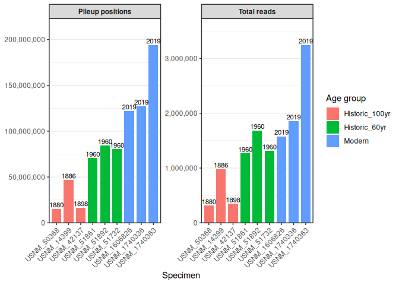

04-specimen-pileup
================
Kathleen Durkin
2025-12-15

- [1 Download GFF annotation (if
  necessary)](#1-download-gff-annotation-if-necessary)
- [2 Create output directories](#2-create-output-directories)
- [3 View metadata to confirm
  structure](#3-view-metadata-to-confirm-structure)
- [4 Combine BAMs by specimen ID](#4-combine-bams-by-specimen-id)
- [5 Check bam file integrity](#5-check-bam-file-integrity)
- [6 Main script: Merge BAMs by specimen and run
  pileup](#6-main-script-merge-bams-by-specimen-and-run-pileup)
- [7 Create summary of merged
  specimens](#7-create-summary-of-merged-specimens)
- [8 Modkit Pileup Summary Statistics and Data
  Exploration](#8-modkit-pileup-summary-statistics-and-data-exploration)
  - [8.1 Output Structure](#81-output-structure)

Workflow Overview

Step 1: Generate per-position methylation calls with `modkit` `pileup`
This creates a BED file with methylation frequencies at each CpG (or
other modified base) position.

Step 2: Intersect with genomic features using `bedtools` This associates
methylation calls with genes, exons, etc.

Step 3: Summarize methylation by feature in R

``` r
library(dplyr)
```

    ## 
    ## Attaching package: 'dplyr'

    ## The following objects are masked from 'package:stats':
    ## 
    ##     filter, lag

    ## The following objects are masked from 'package:base':
    ## 
    ##     intersect, setdiff, setequal, union

``` r
library(tidyverse)
```

    ## ── Attaching core tidyverse packages ──────────────────────── tidyverse 2.0.0 ──
    ## ✔ forcats   1.0.0     ✔ readr     2.1.5
    ## ✔ ggplot2   3.5.1     ✔ stringr   1.5.1
    ## ✔ lubridate 1.9.4     ✔ tibble    3.2.1
    ## ✔ purrr     1.0.2     ✔ tidyr     1.3.1

    ## ── Conflicts ────────────────────────────────────────── tidyverse_conflicts() ──
    ## ✖ dplyr::filter() masks stats::filter()
    ## ✖ dplyr::lag()    masks stats::lag()
    ## ℹ Use the conflicted package (<http://conflicted.r-lib.org/>) to force all conflicts to become errors

``` r
library(scales)
```

    ## 
    ## Attaching package: 'scales'
    ## 
    ## The following object is masked from 'package:purrr':
    ## 
    ##     discard
    ## 
    ## The following object is masked from 'package:readr':
    ## 
    ##     col_factor

``` r
library(patchwork)
```

``` bash
{
echo "#### Assign Variables ####"
echo ""

echo "# Data directories"
echo 'export nanopore_dir=/gscratch/srlab/kdurkin1/SIFP-nanopore'
echo 'export genome_dir=${nanopore_dir}/data/GCA_965233905.1_jaEunKnig1.1'
echo 'export reference=${genome_dir}/GCA_965233905.1_jaEunKnig1.1_genomic.fna'
echo 'export gff=${genome_dir}/GCA_965233905.1_jaEunKnig1.1_genomic.gff'
echo 'export output_dir_top=${nanopore_dir}/M-multi-group/output/04-specimen-pileup'
echo 'export merged_bam_dir=${output_dir_top}/merged_bams'
echo 'export pileup_dir=${output_dir_top}/pileup'
echo 'export metadata_csv=${nanopore_dir}/data/E_tourneforti_sequencing_composition.csv'

echo ""

echo "# Input BAM directories (one per sequencing run)"
echo 'export G1L4_bam_dir=${nanopore_dir}/A-Group1/output/06.01-G1-Library4-MinION-Dorado-recall-GPU'
echo 'export G2L2_bam_dir=${nanopore_dir}/B-Group2/output/04.01-G2-Library2-MinION-Dorado-recall-GPU'
echo 'export G2L3_bam_dir=${nanopore_dir}/B-Group2/output/05.01-G2-Library3-MinION-Dorado-recall-GPU'
echo 'export G4L1_bam_dir=${nanopore_dir}/D-Group4/output/03.01-G4-Library1-MinION-Dorado-recall-GPU'
echo 'export G4L2_bam_dir=${nanopore_dir}/D-Group4/output/04.01-G4-Library2-MinION-Dorado-recall-GPU'

echo ""

echo 'export samtools=/srlab/programs/samtools-1.20/samtools'
echo 'export bedtools=/srlab/programs/bedtools'

echo 'export flowcell_id=FBD08455'

echo "# Set number of CPUs to use"
echo 'export threads=20'
echo ""

} > .bashvars

cat .bashvars
```

    ## #### Assign Variables ####
    ## 
    ## # Data directories
    ## export nanopore_dir=/gscratch/srlab/kdurkin1/SIFP-nanopore
    ## export genome_dir=${nanopore_dir}/data/GCA_965233905.1_jaEunKnig1.1
    ## export reference=${genome_dir}/GCA_965233905.1_jaEunKnig1.1_genomic.fna
    ## export gff=${genome_dir}/GCA_965233905.1_jaEunKnig1.1_genomic.gff
    ## export output_dir_top=${nanopore_dir}/M-multi-group/output/04-specimen-pileup
    ## export merged_bam_dir=${output_dir_top}/merged_bams
    ## export pileup_dir=${output_dir_top}/pileup
    ## export metadata_csv=${nanopore_dir}/data/E_tourneforti_sequencing_composition.csv
    ## 
    ## # Input BAM directories (one per sequencing run)
    ## export G1L4_bam_dir=${nanopore_dir}/A-Group1/output/06.01-G1-Library4-MinION-Dorado-recall-GPU
    ## export G2L2_bam_dir=${nanopore_dir}/B-Group2/output/04.01-G2-Library2-MinION-Dorado-recall-GPU
    ## export G2L3_bam_dir=${nanopore_dir}/B-Group2/output/05.01-G2-Library3-MinION-Dorado-recall-GPU
    ## export G4L1_bam_dir=${nanopore_dir}/D-Group4/output/03.01-G4-Library1-MinION-Dorado-recall-GPU
    ## export G4L2_bam_dir=${nanopore_dir}/D-Group4/output/04.01-G4-Library2-MinION-Dorado-recall-GPU
    ## 
    ## export samtools=/srlab/programs/samtools-1.20/samtools
    ## export bedtools=/srlab/programs/bedtools
    ## export flowcell_id=FBD08455
    ## # Set number of CPUs to use
    ## export threads=20

# 1 Download GFF annotation (if necessary)

Can’t actually find a `gff` file on NCBI, just a `gbff` file (which
includes both sequence and annotation information). Download that for
now.

``` bash
source .bashvars
cd ${genome_dir}

wget https://ftp.ncbi.nlm.nih.gov/genomes/all/GCA/965/233/905/GCA_965233905.1_jaEunKnig1.1/GCA_965233905.1_jaEunKnig1.1_genomic.gbff.gz
gunzip GCA_965233905.1_jaEunKnig1.1_genomic.gbff.gz
```

open conda environment (in terminal) and install `bioperl` and
associated script to convert `gbff` -\> `gff`

``` bash
source .bashvars
cd ${genome_dir}
cd ../
wget https://raw.githubusercontent.com/ncbi/genome-tools/master/genbank2gff3.pl
chmod +x genbank2gff3.pl

conda create -n bioperl_env perl=5.32 -y
conda activate bioperl_env
conda install -c bioconda bioperl
conda install -c bioconda perl-yaml

# Convert gbff to gff
$CONDA_PREFIX/bin/perl ../bp_genbank2gff3 GCA_965233905.1_jaEunKnig1.1_genomic.gbff > GCA_965233905.1_jaEunKnig1.1_genomic.gff3
```

Ok, well unfortunately it looks like the gbff doesn’t contain any useful
annotation information. That means the *E. knighti* genome is actually
unannotated, despite being chromosome-level. I think I can manually
annotate using a transcriptome, and I found a transcriptome from the
same genus, *E. calyculata*, on Zenodo:
<https://zenodo.org/records/10797860>. For now, I’ll need to ignore
feature-level summaries, since I don’t know where the genes, introns,
exons etc. are.

# 2 Create output directories

``` bash
source .bashvars

mkdir -p ${merged_bam_dir}
mkdir -p ${pileup_dir}
```

# 3 View metadata to confirm structure

``` bash
source .bashvars

echo "=== Specimen Metadata ==="
cat ${metadata_csv}
```

    ## === Specimen Metadata ===
    ## Group,Library,Barcode,Catalog.Number,Year.Collected,Precise.Locality
    ## Group_1,Library_4,12,1606826,2019,"Stag Party East, east of Tennessee Reef, outer Hawk's Channel patch reefs, Middle Keys, Florida Keys"
    ## Group_1,Library_4,13,1740336,2019,"Stag Party East, east of Tennessee Reef, outer Hawk's Channel patch reefs, Middle Keys, Florida Keys"
    ## Group_1,Library_4,14,1740363,2019,"Eleven-Foot Mound, west of Tennessee Reef, outer Hawk's Channel patch reefs, Middle Keys, Florida Keys"
    ## Group_2,Library_2,18,51861,1960,"Miami, Biscayne Bay, Soldier Key"
    ## Group_2,Library_2,19,51892,1960,"Miami, Biscayne Bay, Soldier Key"
    ## Group_2,Library_2,20,51732,1960,"St. George's Island, Fort St. Catherine"
    ## Group_2,Library_3,24,51861,1960,"Miami, Biscayne Bay, Soldier Key"
    ## Group_2,Library_3,25,51892,1960,"Miami, Biscayne Bay, Soldier Key"
    ## Group_2,Library_3,26,51732,1960,"St. George's Island, Fort St. Catherine"
    ## Group_4,Library_1,27,50368,1880,Curacao
    ## Group_4,Library_1,28,42137,1898,Playa De Ponce Reef
    ## Group_4,Library_1,29,14399,1886,"Little Bahama Bank, Grand Cay, North of"
    ## Group_4,Library_2,30,50368,1880,Curacao
    ## Group_4,Library_2,31,42137,1898,Playa De Ponce Reef
    ## Group_4,Library_2,32,14399,1886,"Little Bahama Bank, Grand Cay, North of"

# 4 Combine BAMs by specimen ID

This script reads the metadata CSV, identifies all BAM files for each
specimen (which may span multiple sequencing runs), and merges them into
a single BAM per specimen.

``` bash
source .bashvars

# Create an associative array to collect BAM files per specimen
declare -A specimen_bams

echo "=== Reading metadata and identifying BAM files ==="

# Skip header line and read metadata
tail -n +2 ${metadata_csv} | while IFS=',' read -r group library barcode catalog_num year locality; do
    
    # Clean up variables (remove quotes and whitespace)
    group=$(echo "$group" | tr -d '"' | xargs)
    library=$(echo "$library" | tr -d '"' | xargs)
    barcode=$(echo "$barcode" | tr -d '"' | xargs)
    catalog_num=$(echo "$catalog_num" | tr -d '"' | xargs)
    
    # Create specimen ID from catalog number (remove spaces)
    specimen_id="USNM_${catalog_num// /_}"
    
    # Determine which BAM directory to look in based on group/library
    bam_file=""
    if [[ "$group" == "Group_1" && "$library" == "Library_4" ]]; then
        # Look for BAM file matching this barcode
        bam_pattern="${G1L4_bam_dir}/*barcode${barcode}*.bam"
    elif [[ "$group" == "Group_2" && "$library" == "Library_2" ]]; then
        bam_pattern="${G2L2_bam_dir}/*barcode${barcode}*.bam"
    elif [[ "$group" == "Group_2" && "$library" == "Library_3" ]]; then
        bam_pattern="${G2L3_bam_dir}/*barcode${barcode}*.bam"
    elif [[ "$group" == "Group_4" && "$library" == "Library_1" ]]; then
        bam_pattern="${G4L1_bam_dir}/*barcode${barcode}*.bam"
    elif [[ "$group" == "Group_4" && "$library" == "Library_2" ]]; then
        bam_pattern="${G4L2_bam_dir}/*barcode${barcode}*.bam"
    fi
    
    echo "Specimen: ${specimen_id}, Group: ${group}, Library: ${library}, Barcode: ${barcode}"
    echo "  Looking for: ${bam_pattern}"
    
done

echo ""
echo "=== Done scanning metadata ==="
```

# 5 Check bam file integrity

``` bash
source .bashvars

echo "=== Checking BAM file integrity ==="

# Check all input BAM files
for bam_dir in \
    "${G1L4_bam_dir}" \
    "${G2L2_bam_dir}" \
    "${G2L3_bam_dir}" \
    "${G4L1_bam_dir}" \
    "${G4L2_bam_dir}"; do
    
    echo ""
    echo "Checking directory: ${bam_dir}"
    
    if [[ -d "${bam_dir}" ]]; then
        for bam in ${bam_dir}/*.bam; do
            if [[ -f "${bam}" ]]; then
                # samtools quickcheck returns non-zero if file is truncated/corrupt
                if samtools quickcheck "${bam}"; then
                    echo "  OK: $(basename ${bam})"
                else
                    echo "  CORRUPTED: $(basename ${bam})"
                    # Also show file size for context
                    ls -lh "${bam}"
                fi
            fi
        done
    else
        echo "  Directory not found!"
    fi
done
```

    ## === Checking BAM file integrity ===
    ## 
    ## Checking directory: /gscratch/srlab/kdurkin1/SIFP-nanopore/A-Group1/output/06.01-G1-Library4-MinION-Dorado-recall-GPU
    ##   OK: FBD09922_pass_recalled.bam
    ##   OK: FBD09922_pass_recalled_mapped.bam
    ##   OK: FBD09922_pass_recalled_mapped_barcode12.bam
    ##   OK: FBD09922_pass_recalled_mapped_barcode13.bam
    ##   OK: FBD09922_pass_recalled_mapped_barcode14.bam
    ## 
    ## Checking directory: /gscratch/srlab/kdurkin1/SIFP-nanopore/B-Group2/output/04.01-G2-Library2-MinION-Dorado-recall-GPU
    ##   OK: FBD39370_pass_recalled.bam
    ##   OK: FBD39370_pass_recalled_mapped.bam
    ##   OK: FBD39370_pass_recalled_mapped_barcode18.bam
    ##   OK: FBD39370_pass_recalled_mapped_barcode19.bam
    ##   OK: FBD39370_pass_recalled_mapped_barcode20.bam
    ## 
    ## Checking directory: /gscratch/srlab/kdurkin1/SIFP-nanopore/B-Group2/output/05.01-G2-Library3-MinION-Dorado-recall-GPU
    ##   OK: FBD42232_pass_recalled.bam
    ##   OK: FBD42232_pass_recalled_mapped.bam
    ##   OK: FBD42232_pass_recalled_mapped_barcode24.bam
    ##   OK: FBD42232_pass_recalled_mapped_barcode25.bam
    ##   OK: FBD42232_pass_recalled_mapped_barcode26.bam
    ## 
    ## Checking directory: /gscratch/srlab/kdurkin1/SIFP-nanopore/D-Group4/output/03.01-G4-Library1-MinION-Dorado-recall-GPU
    ##   OK: FBD08455_pass_recalled.bam
    ##   OK: FBD08455_pass_recalled_mapped.bam
    ##   OK: FBD08455_pass_recalled_mapped_barcode27.bam
    ##   OK: FBD08455_pass_recalled_mapped_barcode28.bam
    ##   OK: FBD08455_pass_recalled_mapped_barcode29.bam
    ## 
    ## Checking directory: /gscratch/srlab/kdurkin1/SIFP-nanopore/D-Group4/output/04.01-G4-Library2-MinION-Dorado-recall-GPU
    ##   OK: FBD36396_pass_recalled.bam
    ##   OK: FBD36396_pass_recalled_mapped.bam
    ##   OK: FBD36396_pass_recalled_mapped_barcode30.bam
    ##   OK: FBD36396_pass_recalled_mapped_barcode31.bam
    ##   OK: FBD36396_pass_recalled_mapped_barcode32.bam

# 6 Main script: Merge BAMs by specimen and run pileup

``` bash
source .bashvars

echo "=============================================="
echo "Combining BAMs by specimen and running pileup"
echo "=============================================="

# Define specimen-to-BAM mapping based on metadata
# Format: specimen_id|year_collected|bam_file1,bam_file2,...

# This array defines each unique specimen and which BAM files belong to it
# Adjust paths to match your actual BAM file locations/naming conventions
unset specimen_info
unset specimen_bams
declare -A specimen_info
declare -A specimen_bams

# --- Group 1 (Modern, 2019) - Library 4 only ---
specimen_info["USNM_1606826"]="2019|Modern"
specimen_bams["USNM_1606826"]="${G1L4_bam_dir}/*barcode12*.bam"

specimen_info["USNM_1740336"]="2019|Modern"
specimen_bams["USNM_1740336"]="${G1L4_bam_dir}/*barcode13*.bam"

specimen_info["USNM_1740363"]="2019|Modern"
specimen_bams["USNM_1740363"]="${G1L4_bam_dir}/*barcode14*.bam"

# --- Group 2 (1960s) - Library 2 AND Library 3 (same specimens, sequenced twice) ---
specimen_info["USNM_51861"]="1960|Historic_60yr"
specimen_bams["USNM_51861"]="${G2L2_bam_dir}/*barcode18*.bam ${G2L3_bam_dir}/*barcode24*.bam"

specimen_info["USNM_51892"]="1960|Historic_60yr"
specimen_bams["USNM_51892"]="${G2L2_bam_dir}/*barcode19*.bam ${G2L3_bam_dir}/*barcode25*.bam"

specimen_info["USNM_51732"]="1960|Historic_60yr"
specimen_bams["USNM_51732"]="${G2L2_bam_dir}/*barcode20*.bam ${G2L3_bam_dir}/*barcode26*.bam"

# --- Group 4 (Historic, 1880-1898) - Library 1 AND Library 2 (same specimens, sequenced twice) ---
specimen_info["USNM_50368"]="1880|Historic_100yr"
specimen_bams["USNM_50368"]="${G4L1_bam_dir}/*barcode27*.bam ${G4L2_bam_dir}/*barcode30*.bam"

specimen_info["USNM_42137"]="1898|Historic_100yr"
specimen_bams["USNM_42137"]="${G4L1_bam_dir}/*barcode28*.bam ${G4L2_bam_dir}/*barcode31*.bam"

specimen_info["USNM_14399"]="1886|Historic_100yr"
specimen_bams["USNM_14399"]="${G4L1_bam_dir}/*barcode29*.bam ${G4L2_bam_dir}/*barcode32*.bam"


# Process each specimen
for specimen_id in "${!specimen_info[@]}"; do
    
    echo ""
    echo "========================================"
    echo "Processing specimen: ${specimen_id}"
    echo "========================================"
    
    # Parse specimen info
    IFS='|' read -r year age_group <<< "${specimen_info[$specimen_id]}"
    echo "Year collected: ${year}"
    echo "Age group: ${age_group}"
    
    # Get BAM file patterns for this specimen
    bam_patterns="${specimen_bams[$specimen_id]}"
    echo "BAM patterns: ${bam_patterns}"
    
    # Find all matching BAM files
    bam_files=""
    for pattern in ${bam_patterns}; do
        # Expand the glob pattern
        for f in ${pattern}; do
            if [[ -f "$f" ]]; then
                bam_files="${bam_files} ${f}"
                echo "  Found: ${f}"
            fi
        done
    done
    
    # Check if any BAM files were found
    if [[ -z "${bam_files}" ]]; then
        echo "WARNING: No BAM files found for ${specimen_id}. Skipping."
        continue
    fi
    
    # Count number of BAM files
    num_bams=$(echo ${bam_files} | wc -w)
    echo "Total BAM files to merge: ${num_bams}"
    
    # Output file paths
    merged_bam="${merged_bam_dir}/${specimen_id}_merged.bam"
    pileup_bed="${pileup_dir}/${specimen_id}_pileup.bed"
    pileup_log="${pileup_dir}/${specimen_id}_pileup.log"
    
    # Merge BAM files (or just index if only one)
    if [[ ${num_bams} -eq 1 ]]; then
        echo "Only one BAM file - creating symlink instead of merging"
        ln -sf ${bam_files} ${merged_bam}
    else
        echo "Merging ${num_bams} BAM files..."
        ${samtools} merge -@ ${threads} -f ${merged_bam} ${bam_files}
    fi
    
    # Index the merged BAM
    echo "Indexing merged BAM..."
    ${samtools} index -@ ${threads} ${merged_bam}
    
    # Get read count for QC
    read_count=$(${samtools} view -c ${merged_bam})
    echo "Total reads in merged BAM: ${read_count}"
    
    # Run modkit pileup
    echo "Running modkit pileup..."
    modkit pileup \
        ${merged_bam} \
        ${pileup_bed} \
        --ref ${reference} \
        --threads ${threads} \
        --modified-bases 5mC 5hmC 6mA \
        --log-filepath ${pileup_log}
    
    # Report pileup stats
    if [[ -f ${pileup_bed} ]]; then
        n_positions=$(wc -l < ${pileup_bed})
        echo "Pileup complete: ${n_positions} positions"
    else
        echo "ERROR: Pileup file not created!"
    fi
    
    # Optionally remove merged BAM to save space (uncomment if desired)
    # echo "Removing merged BAM to save space..."
    # rm ${merged_bam} ${merged_bam}.bai
    
done

echo ""
echo "=============================================="
echo "All specimens processed!"
echo "=============================================="
```

for some reason the above code kept modifying the input BAM files from
G4L1 (but no others?). Really have no idea how/why that’s happening, but
fixed by (a) re-generating the barcode-delimited BAMs, (b) making those
BAMs read-only, and then (c) re-running the above code to send through
modkit pileup.

``` bash
kdurkin1@n3439:~/SIFP-nanopore/D-Group4/output/03.01-G4-Library1-MinION-Dorado-recall-GPU$ chmod a-w FBD08455_pass_recalled_mapped_barcode27.bam
kdurkin1@n3439:~/SIFP-nanopore/D-Group4/output/03.01-G4-Library1-MinION-Dorado-recall-GPU$ chmod a-w FBD08455_pass_recalled_mapped_barcode28.bam
kdurkin1@n3439:~/SIFP-nanopore/D-Group4/output/03.01-G4-Library1-MinION-Dorado-recall-GPU$ chmod a-w FBD08455_pass_recalled_mapped_barcode29.bam
```

# 7 Create summary of merged specimens

``` bash
source .bashvars

echo "specimen_id,year_collected,age_group,n_bams_merged,total_reads,n_pileup_positions" > ${output_dir_top}/specimen_merge_summary.csv

for specimen_id in USNM_1606826 USNM_1740336 USNM_1740363 USNM_51861 USNM_51892 USNM_51732 USNM_50368 USNM_42137 USNM_14399; do
    
    merged_bam="${merged_bam_dir}/${specimen_id}_merged.bam"
    pileup_bed="${pileup_dir}/${specimen_id}_pileup.bed"
    
    if [[ -f ${merged_bam} ]]; then
        read_count=$(${samtools} view -c ${merged_bam})
    else
        read_count="NA"
    fi
    
    if [[ -f ${pileup_bed} ]]; then
        n_positions=$(wc -l < ${pileup_bed})
    else
        n_positions="NA"
    fi
    
    # Get year and age group from specimen_info (you'd need to look this up)
    # For simplicity, I'll hardcode based on the metadata we saw
    case ${specimen_id} in
        USNM_1606826|USNM_1740336|USNM_1740363)
            year="2019"; age_group="Modern"; n_bams=1 ;;
        USNM_51861|USNM_51892|USNM_51732)
            year="1960"; age_group="Historic_60yr"; n_bams=2 ;;
        USNM_50368)
            year="1880"; age_group="Historic_100yr"; n_bams=2 ;;
        USNM_42137)
            year="1898"; age_group="Historic_100yr"; n_bams=2 ;;
        USNM_14399)
            year="1886"; age_group="Historic_100yr"; n_bams=2 ;;
    esac
    
    echo "${specimen_id},${year},${age_group},${n_bams},${read_count},${n_positions}" >> ${output_dir_top}/specimen_merge_summary.csv
    
done

echo ""
echo "=== Merge Summary ==="
cat ${output_dir_top}/specimen_merge_summary.csv
```

Plot. The total number of pileup positions is the number of reference
(genome) nucleotide positions that have at least 1 aligned read (i.e. at
least 1X coverage) contributing to the pileup.

``` r
# Load
df <- read_csv("../output/04-specimen-pileup/specimen_merge_summary.csv")
```

    ## Rows: 9 Columns: 6
    ## ── Column specification ────────────────────────────────────────────────────────
    ## Delimiter: ","
    ## chr (2): specimen_id, age_group
    ## dbl (4): year_collected, n_bams_merged, total_reads, n_pileup_positions
    ## 
    ## ℹ Use `spec()` to retrieve the full column specification for this data.
    ## ℹ Specify the column types or set `show_col_types = FALSE` to quiet this message.

``` r
# Order by ag group
df <- df %>%
  arrange(year_collected) %>%
  mutate(specimen_id = factor(specimen_id, levels = specimen_id))


# Long format
df_long <- df %>%
  pivot_longer(
    cols = c(total_reads, n_pileup_positions),
    names_to = "metric",
    values_to = "value"
  )

# Plot
ggplot(df_long, aes(
  x = specimen_id,
  y = value,
  fill = age_group
)) +
  geom_col(width = 0.8) +
  geom_text(
    aes(label = year_collected),
    vjust = -0.3,
    size = 3,
    color = "black"
  ) +
  facet_wrap(
    ~ metric,
    scales = "free_y",
    labeller = labeller(
      metric = c(
        total_reads = "Total reads",
        n_pileup_positions = "Pileup positions"
      )
    )
  ) +
  scale_y_continuous(
    labels = scales::comma,
    expand = expansion(mult = c(0, 0.15))  # space for labels
  ) +
  labs(
    x = "Specimen",
    y = NULL,
    fill = "Age group"
  ) +
  coord_cartesian(clip = "off") +
  theme_bw() +
  theme(
    axis.text.x = element_text(angle = 45, hjust = 1),
    strip.text = element_text(face = "bold"),
    panel.grid.major.x = element_blank()
  )
```

<!-- -->

# 8 Modkit Pileup Summary Statistics and Data Exploration

``` r
# =============================================================================
# Specimen-Level Pileup Summary Statistics and Visualizations
# =============================================================================

# =============================================================================
# 1. SETUP
# =============================================================================

# Base output directory
output_dir_base <- "/gscratch/srlab/kdurkin1/SIFP-nanopore/M-multi-group/output/04-specimen-pileup"
pileup_dir <- file.path(output_dir_base, "pileup")

# Genome size for coverage breadth calculations
genome_size_bp <- 593000000  # 593 Mb

# bedMethyl column names (standard modkit pileup output)
bedmethyl_cols <- c(
"chrom", "start", "end", "mod_code", "score", "strand",
"start_thick", "end_thick", "color", "n_valid_cov", "percent_modified",
"n_mod", "n_canonical", "n_other_mod", "n_delete", "n_fail", "n_diff", "n_nocall"
)

# =============================================================================
# 2. DEFINE SPECIMENS AND METADATA
# =============================================================================

# Specimen metadata - links pileup files to biological information
specimen_metadata <- tribble(
~specimen_id,
~pileup_file,
~year_collected,
~age_group,
# Group 1 (Modern, 2019)
"USNM_1606826", "USNM_1606826_pileup.bed", 2019, "Modern",
"USNM_1740336", "USNM_1740336_pileup.bed", 2019, "Modern",
"USNM_1740363", "USNM_1740363_pileup.bed", 2019, "Modern",
# Group 2 (1960s)
"USNM_51861",
"USNM_51861_pileup.bed",
1960, "Historic_60yr",
"USNM_51892",
"USNM_51892_pileup.bed",
1960, "Historic_60yr",
"USNM_51732",
"USNM_51732_pileup.bed",
1960, "Historic_60yr",
# Group 4 (Historic, 1880-1898)
"USNM_50368",
"USNM_50368_pileup.bed",
1880, "Historic_100yr",
"USNM_42137",
"USNM_42137_pileup.bed",
1898, "Historic_100yr",
"USNM_14399",
"USNM_14399_pileup.bed",
1886, "Historic_100yr"
) %>%
mutate(
  file_path = file.path(pileup_dir, pileup_file),
  file_exists = file.exists(file_path)
)

# Report which files exist
cat("=== Checking for pileup files ===\n")
```

    ## === Checking for pileup files ===

``` r
for (i in 1:nrow(specimen_metadata)) {
status <- ifelse(specimen_metadata$file_exists[i], "FOUND", "MISSING")
cat(sprintf(" %s: %s (%s)\n", 
            specimen_metadata$specimen_id[i], 
            status,
            specimen_metadata$age_group[i]))
}
```

    ##  USNM_1606826: FOUND (Modern)
    ##  USNM_1740336: FOUND (Modern)
    ##  USNM_1740363: FOUND (Modern)
    ##  USNM_51861: FOUND (Historic_60yr)
    ##  USNM_51892: FOUND (Historic_60yr)
    ##  USNM_51732: FOUND (Historic_60yr)
    ##  USNM_50368: FOUND (Historic_100yr)
    ##  USNM_42137: FOUND (Historic_100yr)
    ##  USNM_14399: FOUND (Historic_100yr)

``` r
# Filter to only existing files
specimens_to_process <- specimen_metadata %>% filter(file_exists)
cat(sprintf("\nProcessing %d specimens\n", nrow(specimens_to_process)))
```

    ## 
    ## Processing 9 specimens

``` r
# =============================================================================
# 3. FUNCTION TO READ PILEUP FILE
# =============================================================================

read_pileup <- function(filepath, specimen_id = NULL) {
df <- read_tsv(
  filepath,
  col_names = bedmethyl_cols,
  col_types = cols(
    chrom = col_character(),
    start = col_integer(),
    end = col_integer(),
    mod_code = col_character(),
    score = col_integer(),
    strand = col_character(),
    start_thick = col_integer(),
    end_thick = col_integer(),
    color = col_character(),
    n_valid_cov = col_integer(),
    percent_modified = col_double(),
    n_mod = col_integer(),
    n_canonical = col_integer(),
    n_other_mod = col_integer(),
    n_delete = col_integer(),
    n_fail = col_integer(),
    n_diff = col_integer(),
    n_nocall = col_integer()
  ),
  comment = "#"
)

if (!is.null(specimen_id)) {
  df$specimen_id <- specimen_id
}

return(df)
}
```

``` r
# =============================================================================
# 4. FUNCTION TO PROCESS ONE SPECIMEN
# =============================================================================

process_specimen <- function(specimen_id, file_path, year_collected, age_group, 
                           output_dir_base, genome_size_bp) {

cat(sprintf("\n========================================\n"))
cat(sprintf("Processing: %s (%d, %s)\n", specimen_id, year_collected, age_group))
cat(sprintf("========================================\n"))

# Create specimen-specific output directory
specimen_output_dir <- file.path(output_dir_base, "summaries", specimen_id)
dir.create(specimen_output_dir, recursive = TRUE, showWarnings = FALSE)

# Read pileup data
cat("Reading pileup file...\n")
pileup <- read_pileup(file_path, specimen_id)
cat(sprintf("  Loaded %s positions\n", scales::comma(nrow(pileup))))

# -------------------------------------------------------------------------
# SUMMARY STATISTICS
# -------------------------------------------------------------------------

cat("Computing summary statistics...\n")

# Overall summary
overall_summary <- pileup %>%
  summarise(
    specimen_id = specimen_id,
    year_collected = year_collected,
    age_group = age_group,
    
    # Position counts
    total_positions = n(),
    total_5mC_positions = sum(mod_code == "m"),
    total_5hmC_positions = sum(mod_code == "h"),
    total_6mA_positions = sum(mod_code == "a"),
    
    # Coverage statistics
    mean_coverage = mean(n_valid_cov),
    median_coverage = median(n_valid_cov),
    sd_coverage = sd(n_valid_cov),
    min_coverage = min(n_valid_cov),
    max_coverage = max(n_valid_cov),
    q25_coverage = quantile(n_valid_cov, 0.25),
    q75_coverage = quantile(n_valid_cov, 0.75),
    q90_coverage = quantile(n_valid_cov, 0.90),
    q95_coverage = quantile(n_valid_cov, 0.95),
    
    # Coverage thresholds
    positions_cov_1x = sum(n_valid_cov >= 1),
    positions_cov_5x = sum(n_valid_cov >= 5),
    positions_cov_10x = sum(n_valid_cov >= 10),
    positions_cov_20x = sum(n_valid_cov >= 20),
    pct_positions_5x = sum(n_valid_cov >= 5) / n() * 100,
    pct_positions_10x = sum(n_valid_cov >= 10) / n() * 100,
    pct_positions_20x = sum(n_valid_cov >= 20) / n() * 100,
    
    # Methylation statistics (5mC)
    mean_methylation_5mC = mean(percent_modified[mod_code == "m"], na.rm = TRUE),
    median_methylation_5mC = median(percent_modified[mod_code == "m"], na.rm = TRUE),
    sd_methylation_5mC = sd(percent_modified[mod_code == "m"], na.rm = TRUE),
    
    # 5hmC statistics
    mean_methylation_5hmC = mean(percent_modified[mod_code == "h"], na.rm = TRUE),
    
    # 6mA statistics
    mean_methylation_6mA = mean(percent_modified[mod_code == "a"], na.rm = TRUE)
  )

# Coverage distribution
coverage_distribution <- pileup %>%
  mutate(coverage_bin = cut(
    n_valid_cov,
    breaks = c(0, 1, 5, 10, 20, 50, 100, Inf),
    labels = c("0", "1-4", "5-9", "10-19", "20-49", "50-99", "100+"),
    right = FALSE
  )) %>%
  count(coverage_bin) %>%
  mutate(
    specimen_id = specimen_id,
    percent = n / sum(n) * 100,
    cumulative_percent = cumsum(percent)
  ) %>%
  select(specimen_id, everything())

# Per-chromosome summary
per_chrom_summary <- pileup %>%
  group_by(chrom) %>%
  summarise(
    n_positions = n(),
    mean_coverage = mean(n_valid_cov),
    median_coverage = median(n_valid_cov),
    sd_coverage = sd(n_valid_cov),
    mean_methylation_5mC = mean(percent_modified[mod_code == "m"], na.rm = TRUE),
    positions_10x = sum(n_valid_cov >= 10),
    pct_positions_10x = sum(n_valid_cov >= 10) / n() * 100,
    .groups = "drop"
  ) %>%
  mutate(specimen_id = specimen_id) %>%
  arrange(desc(n_positions)) %>%
  select(specimen_id, everything())

# Per modification type summary
per_mod_summary <- pileup %>%
  group_by(mod_code) %>%
  summarise(
    n_positions = n(),
    mean_coverage = mean(n_valid_cov),
    median_coverage = median(n_valid_cov),
    mean_percent_modified = mean(percent_modified),
    median_percent_modified = median(percent_modified),
    .groups = "drop"
  ) %>%
  mutate(specimen_id = specimen_id) %>%
  select(specimen_id, everything())

# Genome coverage breadth
genome_coverage_stats <- tibble(
  specimen_id = specimen_id,
  total_positions_called = nrow(pileup),
  unique_positions = n_distinct(paste(pileup$chrom, pileup$start)),
  genome_size_bp = genome_size_bp,
  estimated_CpG_coverage_breadth = n_distinct(paste(pileup$chrom, pileup$start)) / (genome_size_bp * 0.01),
  positions_with_5x = sum(pileup$n_valid_cov >= 5),
  positions_with_10x = sum(pileup$n_valid_cov >= 10)
)

# Coverage flag summary
high_cov_threshold <- quantile(pileup$n_valid_cov, 0.99)
coverage_flags <- pileup %>%
  mutate(
    coverage_flag = case_when(
      n_valid_cov > high_cov_threshold ~ "very_high",
      n_valid_cov < 5 ~ "low",
      TRUE ~ "normal"
    )
  ) %>%
  count(coverage_flag) %>%
  mutate(
    specimen_id = specimen_id,
    percent = n / sum(n) * 100
  ) %>%
  select(specimen_id, everything())

# Strand summary
strand_summary <- pileup %>%
  group_by(strand) %>%
  summarise(
    n_positions = n(),
    mean_coverage = mean(n_valid_cov),
    mean_methylation_5mC = mean(percent_modified[mod_code == "m"], na.rm = TRUE),
    .groups = "drop"
  ) %>%
  mutate(specimen_id = specimen_id) %>%
  select(specimen_id, everything())

# -------------------------------------------------------------------------
# VISUALIZATIONS
# -------------------------------------------------------------------------

# cat("Generating plots...\n")

# Coverage histogram
# p_cov_hist <- ggplot(pileup, aes(x = n_valid_cov)) +
#   geom_histogram(bins = 100, fill = "steelblue", color = "white", alpha = 0.8) +
#   scale_x_continuous(limits = c(0, quantile(pileup$n_valid_cov, 0.99))) +
#   geom_vline(xintercept = c(5, 10, 20), linetype = "dashed", color = "red", alpha = 0.7) +
#   annotate("text", x = c(5, 10, 20), y = Inf, label = c("5x", "10x", "20x"), 
#            vjust = 2, hjust = -0.2, color = "red", size = 3) +
#   labs(
#     title = paste0("Coverage Distribution: ", specimen_id),
#     subtitle = paste0("n = ", scales::comma(nrow(pileup)), " positions; ",
#                       "median = ", round(median(pileup$n_valid_cov), 1), "x"),
#     x = "Coverage (reads per position)",
#     y = "Number of positions"
#   ) +
#   theme_minimal()

# Coverage histogram - log scale
# p_cov_hist_log <- ggplot(pileup, aes(x = n_valid_cov + 1)) +
#   geom_histogram(bins = 100, fill = "steelblue", color = "white", alpha = 0.8) +
#   scale_x_log10(labels = comma) +
#   labs(
#     title = paste0("Coverage Distribution (Log Scale): ", specimen_id),
#     x = "Coverage + 1 (log scale)",
#     y = "Number of positions"
#   ) +
#   theme_minimal()

# Cumulative coverage plot
# coverage_ecdf <- pileup %>%
#   arrange(n_valid_cov) %>%
#   mutate(cumulative_pct = (1:n()) / n() * 100)
# 
# p_cov_cumulative <- ggplot(coverage_ecdf, aes(x = n_valid_cov, y = cumulative_pct)) +
#   geom_line(color = "steelblue", linewidth = 1) +
#   geom_hline(yintercept = c(50, 90), linetype = "dashed", color = "gray50") +
#   geom_vline(xintercept = c(5, 10, 20), linetype = "dashed", color = "red", alpha = 0.5) +
#   scale_x_continuous(limits = c(0, quantile(pileup$n_valid_cov, 0.99))) +
#   labs(
#     title = paste0("Cumulative Coverage: ", specimen_id),
#     subtitle = "What percentage of positions have at least X coverage?",
#     x = "Coverage threshold",
#     y = "Cumulative % of positions"
#   ) +
#   theme_minimal()

# 5mC Methylation distribution
# pileup_5mC <- pileup %>% filter(mod_code == "m")
# 
# p_meth_hist_5mC <- ggplot(pileup_5mC, aes(x = percent_modified)) +
#   geom_histogram(bins = 50, fill = "darkorange", color = "white", alpha = 0.8) +
#   labs(
#     title = paste0("5mC Methylation Distribution: ", specimen_id),
#     subtitle = paste0("n = ", scales::comma(nrow(pileup_5mC)), " CpG positions"),
#     x = "Percent Methylated",
#     y = "Number of positions"
#   ) +
#   theme_minimal()

# 6mA Methylation distribution (if present)
pileup_6mA <- pileup %>% filter(mod_code == "a")
# p_meth_hist_6mA <- NULL
# if (nrow(pileup_6mA) > 0) {
#   p_meth_hist_6mA <- ggplot(pileup_6mA, aes(x = percent_modified)) +
#     geom_histogram(bins = 50, fill = "purple", color = "white", alpha = 0.8) +
#     labs(
#       title = paste0("6mA Methylation Distribution: ", specimen_id),
#       subtitle = paste0("n = ", scales::comma(nrow(pileup_6mA)), " positions"),
#       x = "Percent Methylated",
#       y = "Number of positions"
#     ) +
#     theme_minimal()
# }

# Methylation vs Coverage (5mC)
# p_meth_vs_cov <- ggplot(
#   pileup_5mC %>% sample_n(min(50000, nrow(pileup_5mC))),
#   aes(x = n_valid_cov, y = percent_modified)
# ) +
#   geom_point(alpha = 0.1, size = 0.5) +
#   geom_smooth(method = "loess", color = "red", se = TRUE) +
#   scale_x_continuous(limits = c(0, quantile(pileup_5mC$n_valid_cov, 0.95))) +
#   labs(
#     title = paste0("5mC Methylation vs Coverage: ", specimen_id),
#     subtitle = "Check for coverage-dependent bias",
#     x = "Coverage",
#     y = "Percent Methylated"
#   ) +
#   theme_minimal()

# Coverage by chromosome (top 20)
# top_chroms <- per_chrom_summary %>% 
#   slice_head(n = 20) %>% 
#   pull(chrom)

# p_cov_by_chrom <- pileup %>%
#   filter(chrom %in% top_chroms) %>%
#   mutate(chrom = factor(chrom, levels = top_chroms)) %>%
#   ggplot(aes(x = chrom, y = n_valid_cov)) +
#   geom_boxplot(fill = "steelblue", alpha = 0.6, outlier.size = 0.5, outlier.alpha = 0.3) +
#   scale_y_continuous(limits = c(0, quantile(pileup$n_valid_cov, 0.95))) +
#   labs(
#     title = paste0("Coverage by Chromosome: ", specimen_id),
#     subtitle = "Top 20 contigs by number of positions",
#     x = "Chromosome/Contig",
#     y = "Coverage"
#   ) +
#   theme_minimal() +
#   theme(axis.text.x = element_text(angle = 45, hjust = 1, size = 7))

# Combined summary plot
# combined_plot <- (p_cov_hist | p_cov_cumulative) / (p_meth_hist_5mC | p_meth_vs_cov) +
#   plot_annotation(
#     title = paste0("Summary: ", specimen_id, " (", year_collected, ", ", age_group, ")"),
#     theme = theme(plot.title = element_text(size = 16, face = "bold"))
#   )

# -------------------------------------------------------------------------
# SAVE OUTPUTS
# -------------------------------------------------------------------------

cat("Saving outputs...\n")

# Save tables
#write_csv(overall_summary, file.path(specimen_output_dir, "overall_summary.csv"))
write_csv(coverage_distribution, file.path(specimen_output_dir, "coverage_distribution.csv"))
write_csv(per_chrom_summary, file.path(specimen_output_dir, "per_chrom_summary.csv"))
write_csv(per_mod_summary, file.path(specimen_output_dir, "per_mod_summary.csv"))
write_csv(genome_coverage_stats, file.path(specimen_output_dir, "genome_coverage_stats.csv"))
write_csv(coverage_flags, file.path(specimen_output_dir, "coverage_flags.csv"))
write_csv(strand_summary, file.path(specimen_output_dir, "strand_summary.csv"))

# Save plots
# ggsave(file.path(specimen_output_dir, "coverage_histogram.png"), p_cov_hist, 
#        width = 8, height = 6, dpi = 300)
# ggsave(file.path(specimen_output_dir, "coverage_histogram_log.png"), p_cov_hist_log, 
#        width = 8, height = 6, dpi = 300)
# ggsave(file.path(specimen_output_dir, "coverage_cumulative.png"), p_cov_cumulative, 
#        width = 8, height = 6, dpi = 300)
# ggsave(file.path(specimen_output_dir, "methylation_5mC_histogram.png"), p_meth_hist_5mC, 
#        width = 8, height = 6, dpi = 300)
# if (!is.null(p_meth_hist_6mA)) {
#   ggsave(file.path(specimen_output_dir, "methylation_6mA_histogram.png"), p_meth_hist_6mA, 
#          width = 8, height = 6, dpi = 300)
# }
# ggsave(file.path(specimen_output_dir, "methylation_vs_coverage.png"), p_meth_vs_cov, 
#        width = 8, height = 6, dpi = 300)
# ggsave(file.path(specimen_output_dir, "coverage_by_chrom.png"), p_cov_by_chrom, 
#        width = 12, height = 6, dpi = 300)
# ggsave(file.path(specimen_output_dir, "combined_summary.png"), combined_plot, 
#        width = 14, height = 10, dpi = 300)

cat(sprintf("  Outputs saved to: %s\n", specimen_output_dir))

# Return summary for combining later
return(overall_summary)
}
```

``` r
# =============================================================================
# 5. PROCESS ALL SPECIMENS
# =============================================================================

# Process each specimen and collect summaries
all_summaries <- list()

for (i in 4:nrow(specimens_to_process)) {
summary <- process_specimen(
  specimen_id = specimens_to_process$specimen_id[i],
  file_path = specimens_to_process$file_path[i],
  year_collected = specimens_to_process$year_collected[i],
  age_group = specimens_to_process$age_group[i],
  output_dir_base = output_dir_base,
  genome_size_bp = genome_size_bp
)
all_summaries[[i]] <- summary
}
```

``` r
# Combine all specimen summaries into one table
combined_summaries <- bind_rows(all_summaries)

# =============================================================================
# 6. SAVE COMBINED SUMMARY ACROSS ALL SPECIMENS
# =============================================================================

cat("\n========================================\n")
cat("Creating combined summary across all specimens\n")
cat("========================================\n")

# Create combined output directory
combined_output_dir <- file.path(output_dir_base, "summaries", "combined")
dir.create(combined_output_dir, recursive = TRUE, showWarnings = FALSE)

# Save combined summary table
write_csv(combined_summaries, file.path(combined_output_dir, "all_specimens_summary.csv"))

# Print summary table
cat("\n=== Combined Summary ===\n")
print(combined_summaries %>% 
      select(specimen_id, year_collected, age_group, 
             total_positions, median_coverage, pct_positions_10x,
             mean_methylation_5mC, mean_methylation_6mA))

# =============================================================================
# 7. CROSS-SPECIMEN COMPARISON PLOTS
# =============================================================================

cat("\nGenerating cross-specimen comparison plots...\n")

# Coverage comparison
p_coverage_comparison <- combined_summaries %>%
ggplot(aes(x = reorder(specimen_id, -median_coverage), 
           y = median_coverage, fill = age_group)) +
geom_col(alpha = 0.8) +
geom_hline(yintercept = 10, linetype = "dashed", color = "red") +
scale_fill_viridis_d(option = "plasma", end = 0.8) +
labs(
  title = "Median Coverage by Specimen",
  subtitle = "Red line = 10x target",
  x = "Specimen",
  y = "Median Coverage"
) +
theme_minimal() +
theme(axis.text.x = element_text(angle = 45, hjust = 1))

# Methylation comparison
p_methylation_comparison <- combined_summaries %>%
ggplot(aes(x = reorder(specimen_id, -mean_methylation_5mC), 
           y = mean_methylation_5mC, fill = age_group)) +
geom_col(alpha = 0.8) +
scale_fill_viridis_d(option = "plasma", end = 0.8) +
labs(
  title = "Mean 5mC Methylation by Specimen",
  x = "Specimen",
  y = "Mean % Methylation"
) +
theme_minimal() +
theme(axis.text.x = element_text(angle = 45, hjust = 1))

# 5mC vs 6mA comparison
p_5mC_vs_6mA <- combined_summaries %>%
pivot_longer(
  cols = c(mean_methylation_5mC, mean_methylation_6mA),
  names_to = "modification",
  values_to = "mean_methylation",
  names_prefix = "mean_methylation_"
) %>%
ggplot(aes(x = specimen_id, y = mean_methylation, fill = modification)) +
geom_col(position = "dodge", alpha = 0.8) +
scale_fill_manual(values = c("5mC" = "steelblue", "6mA" = "darkorange")) +
facet_wrap(~age_group, scales = "free_x") +
labs(
  title = "5mC vs 6mA Methylation by Specimen",
  x = "Specimen",
  y = "Mean % Methylation",
  fill = "Modification"
) +
theme_minimal() +
theme(axis.text.x = element_text(angle = 45, hjust = 1))

# Coverage vs Methylation scatter
p_cov_vs_meth <- combined_summaries %>%
ggplot(aes(x = median_coverage, y = mean_methylation_5mC, 
           color = age_group, size = total_positions)) +
geom_point(alpha = 0.8) +
geom_text(aes(label = specimen_id), vjust = -1, size = 3, show.legend = FALSE) +
scale_color_viridis_d(option = "plasma", end = 0.8) +
scale_size_continuous(range = c(3, 10), labels = comma) +
geom_vline(xintercept = 10, linetype = "dashed", color = "gray50") +
labs(
  title = "Coverage vs Methylation by Specimen",
  x = "Median Coverage",
  y = "Mean 5mC Methylation (%)",
  color = "Age Group",
  size = "Total Positions"
) +
theme_minimal()

# Combined comparison panel
comparison_panel <- (p_coverage_comparison | p_methylation_comparison) / 
                 (p_5mC_vs_6mA) / 
                 (p_cov_vs_meth) +
plot_annotation(
  title = "Cross-Specimen Comparison",
  theme = theme(plot.title = element_text(size = 16, face = "bold"))
)

# Save comparison plots
ggsave(file.path(combined_output_dir, "coverage_comparison.png"), p_coverage_comparison,
     width = 10, height = 6, dpi = 300)
ggsave(file.path(combined_output_dir, "methylation_comparison.png"), p_methylation_comparison,
     width = 10, height = 6, dpi = 300)
ggsave(file.path(combined_output_dir, "5mC_vs_6mA_comparison.png"), p_5mC_vs_6mA,
     width = 12, height = 6, dpi = 300)
ggsave(file.path(combined_output_dir, "coverage_vs_methylation.png"), p_cov_vs_meth,
     width = 10, height = 8, dpi = 300)
ggsave(file.path(combined_output_dir, "comparison_panel.png"), comparison_panel,
     width = 14, height = 16, dpi = 300)

cat(sprintf("\nCombined outputs saved to: %s\n", combined_output_dir))

# =============================================================================
# 8. FINAL REPORT
# =============================================================================

cat("\n")
cat("==============================================================\n")
cat("             PROCESSING COMPLETE                              \n")
cat("==============================================================\n\n")

cat(sprintf("Specimens processed: %d\n", nrow(specimens_to_process)))
cat(sprintf("Output directory: %s\n\n", output_dir_base))

cat("Output structure:\n")
cat("  summaries/\n")
for (spec in specimens_to_process$specimen_id) {
cat(sprintf("    %s/\n", spec))
}
cat("    combined/\n")

cat("\n=== Summary by Age Group ===\n")
combined_summaries %>%
group_by(age_group) %>%
summarise(
  n_specimens = n(),
  mean_median_coverage = mean(median_coverage),
  mean_pct_10x = mean(pct_positions_10x),
  mean_methylation_5mC = mean(mean_methylation_5mC),
  mean_methylation_6mA = mean(mean_methylation_6mA, na.rm = TRUE),
  .groups = "drop"
) %>%
print()

cat("\n==============================================================\n")
```

## 8.1 Output Structure

After running, you’ll have:

    03-specimen-pileup/
    ├── pileup/                          # Input pileup files
    │   ├── USNM_1606826_pileup.bed
    │   ├── USNM_50368_pileup.bed
    │   └── ...
    └── summaries/
        ├── USNM_1606826/               # Per-specimen outputs
        │   ├── overall_summary.csv
        │   ├── coverage_distribution.csv
        │   ├── per_chrom_summary.csv
        │   ├── per_mod_summary.csv
        │   ├── coverage_histogram.png
        │   ├── methylation_5mC_histogram.png
        │   ├── combined_summary.png
        │   └── ...
        ├── USNM_50368/
        │   └── ...
        └── combined/                    # Cross-specimen comparisons
            ├── all_specimens_summary.csv
            ├── coverage_comparison.png
            ├── methylation_comparison.png
            ├── 5mC_vs_6mA_comparison.png
            └── comparison_panel.png
