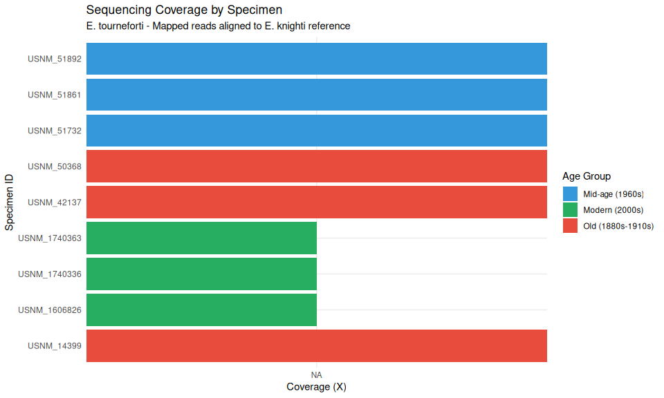
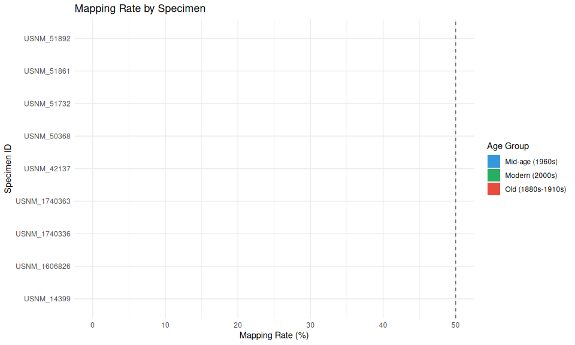

05-specimen-coverage
================
Kathleen Durkin
2025-12-15

- [1 Create a Bash variables file](#1-create-a-bash-variables-file)
- [2 Setup directories](#2-setup-directories)
- [3 View metadata](#3-view-metadata)
- [4 Calculate Coverage Statistics](#4-calculate-coverage-statistics)
  - [4.1 List available merged BAMs](#41-list-available-merged-bams)
  - [4.2 Generate flagstat summaries for each
    specimen](#42-generate-flagstat-summaries-for-each-specimen)
  - [4.3 Generate detailed stats with samtools
    stats](#43-generate-detailed-stats-with-samtools-stats)
  - [4.4 Calculate coverage per
    specimen](#44-calculate-coverage-per-specimen)
  - [4.5 Generate per-chromosome coverage
    (optional)](#45-generate-per-chromosome-coverage-optional)
  - [4.6 Generate depth histogram
    (optional)](#46-generate-depth-histogram-optional)
- [5 Combine with Metadata](#5-combine-with-metadata)
- [6 Summary Visualizations](#6-summary-visualizations)
- [7 Save Final Outputs](#7-save-final-outputs)
- [8 Session Info](#8-session-info)

# 1 Create a Bash variables file

This allows usage of Bash variables across R Markdown chunks.

``` bash
{
echo "#### Assign Variables ####"
echo ""
echo "# Data directories"
echo 'export nanopore_dir=/gscratch/srlab/kdurkin1/SIFP-nanopore'
echo 'export genome_dir=${nanopore_dir}/data/GCA_965233905.1_jaEunKnig1.1'
echo 'export reference=${genome_dir}/GCA_965233905.1_jaEunKnig1.1_genomic.fna'
echo 'export gff=${genome_dir}/GCA_965233905.1_jaEunKnig1.1_genomic.gff'
echo 'export output_dir_top=${nanopore_dir}/M-multi-group/output/05-specimen-coverage'
echo 'export merged_bam_dir=${nanopore_dir}/M-multi-group/output/04-specimen-pileup/merged_bams'
echo 'export coverage_dir=${output_dir_top}/coverage'
echo 'export metadata_csv=${nanopore_dir}/data/E_tourneforti_sequencing_composition.csv'
echo ""
echo "# Input BAM directories (one per sequencing run)"
echo 'export G1L4_bam_dir=${nanopore_dir}/A-Group1/output/06.01-G1-Library4-MinION-Dorado-recall-GPU'
echo 'export G2L2_bam_dir=${nanopore_dir}/B-Group2/output/04.01-G2-Library2-MinION-Dorado-recall-GPU'
echo 'export G2L3_bam_dir=${nanopore_dir}/B-Group2/output/05.01-G2-Library3-MinION-Dorado-recall-GPU'
echo 'export G4L1_bam_dir=${nanopore_dir}/D-Group4/output/03.01-G4-Library1-MinION-Dorado-recall-GPU'
echo 'export G4L2_bam_dir=${nanopore_dir}/D-Group4/output/04.01-G4-Library2-MinION-Dorado-recall-GPU'
echo ""
echo "# Programs"
echo 'export samtools=/srlab/programs/samtools-1.20/samtools'
echo 'export bedtools=/srlab/programs/bedtools'
echo ""
echo "# Reference genome size (E. knighti)"
echo 'export GENOME_SIZE=965233905'
echo ""
echo "# Set number of CPUs to use"
echo 'export threads=20'
echo ""
} > .bashvars
cat .bashvars
```

    #### Assign Variables ####

    # Data directories
    export nanopore_dir=/gscratch/srlab/kdurkin1/SIFP-nanopore
    export genome_dir=${nanopore_dir}/data/GCA_965233905.1_jaEunKnig1.1
    export reference=${genome_dir}/GCA_965233905.1_jaEunKnig1.1_genomic.fna
    export gff=${genome_dir}/GCA_965233905.1_jaEunKnig1.1_genomic.gff
    export output_dir_top=${nanopore_dir}/M-multi-group/output/05-specimen-coverage
    export merged_bam_dir=${nanopore_dir}/M-multi-group/output/04-specimen-pileup/merged_bams
    export coverage_dir=${output_dir_top}/coverage
    export metadata_csv=${nanopore_dir}/data/E_tourneforti_sequencing_composition.csv

    # Input BAM directories (one per sequencing run)
    export G1L4_bam_dir=${nanopore_dir}/A-Group1/output/06.01-G1-Library4-MinION-Dorado-recall-GPU
    export G2L2_bam_dir=${nanopore_dir}/B-Group2/output/04.01-G2-Library2-MinION-Dorado-recall-GPU
    export G2L3_bam_dir=${nanopore_dir}/B-Group2/output/05.01-G2-Library3-MinION-Dorado-recall-GPU
    export G4L1_bam_dir=${nanopore_dir}/D-Group4/output/03.01-G4-Library1-MinION-Dorado-recall-GPU
    export G4L2_bam_dir=${nanopore_dir}/D-Group4/output/04.01-G4-Library2-MinION-Dorado-recall-GPU

    # Programs
    export samtools=/srlab/programs/samtools-1.20/samtools
    export bedtools=/srlab/programs/bedtools

    # Reference genome size (E. knighti)
    export GENOME_SIZE=965233905

    # Set number of CPUs to use
    export threads=20

# 2 Setup directories

``` bash
source .bashvars

mkdir -p ${output_dir_top}
mkdir -p ${coverage_dir}
```

# 3 View metadata

Load and display the specimen-barcode mapping metadata.

``` bash
source .bashvars

echo "=== Metadata file contents ==="
cat ${metadata_csv}
```

    === Metadata file contents ===
    Group,Library,Barcode,Catalog.Number,Year.Collected,Precise.Locality
    Group_1,Library_4,12,1606826,2019,"Stag Party East, east of Tennessee Reef, outer Hawk's Channel patch reefs, Middle Keys, Florida Keys"
    Group_1,Library_4,13,1740336,2019,"Stag Party East, east of Tennessee Reef, outer Hawk's Channel patch reefs, Middle Keys, Florida Keys"
    Group_1,Library_4,14,1740363,2019,"Eleven-Foot Mound, west of Tennessee Reef, outer Hawk's Channel patch reefs, Middle Keys, Florida Keys"
    Group_2,Library_2,18,51861,1960,"Miami, Biscayne Bay, Soldier Key"
    Group_2,Library_2,19,51892,1960,"Miami, Biscayne Bay, Soldier Key"
    Group_2,Library_2,20,51732,1960,"St. George's Island, Fort St. Catherine"
    Group_2,Library_3,24,51861,1960,"Miami, Biscayne Bay, Soldier Key"
    Group_2,Library_3,25,51892,1960,"Miami, Biscayne Bay, Soldier Key"
    Group_2,Library_3,26,51732,1960,"St. George's Island, Fort St. Catherine"
    Group_4,Library_1,27,50368,1880,Curacao
    Group_4,Library_1,28,42137,1898,Playa De Ponce Reef
    Group_4,Library_1,29,14399,1886,"Little Bahama Bank, Grand Cay, North of"
    Group_4,Library_2,30,50368,1880,Curacao
    Group_4,Library_2,31,42137,1898,Playa De Ponce Reef
    Group_4,Library_2,32,14399,1886,"Little Bahama Bank, Grand Cay, North of"

# 4 Calculate Coverage Statistics

Using the pre-merged specimen BAMs from
`04-specimen-pileup/merged_bams/`.

## 4.1 List available merged BAMs

``` bash
source .bashvars

echo "=== Available merged BAM files ==="
ls -lh ${merged_bam_dir}/*.bam 2>/dev/null || echo "No BAM files found in ${merged_bam_dir}"

echo ""
echo "=== Index files ==="
ls -lh ${merged_bam_dir}/*.bai 2>/dev/null || echo "No index files found"
```

    === Available merged BAM files ===
    -rw-r--r-- 1 kdurkin1 nogroup 475M Dec 15 19:22 /gscratch/srlab/kdurkin1/SIFP-nanopore/M-multi-group/output/04-specimen-pileup/merged_bams/USNM_14399_merged.bam
    lrwxrwxrwx 1 kdurkin1 nogroup  141 Dec 15 18:53 /gscratch/srlab/kdurkin1/SIFP-nanopore/M-multi-group/output/04-specimen-pileup/merged_bams/USNM_1606826_merged.bam -> /gscratch/srlab/kdurkin1/SIFP-nanopore/A-Group1/output/06.01-G1-Library4-MinION-Dorado-recall-GPU/FBD09922_pass_recalled_mapped_barcode12.bam
    lrwxrwxrwx 1 kdurkin1 nogroup  141 Dec 15 18:56 /gscratch/srlab/kdurkin1/SIFP-nanopore/M-multi-group/output/04-specimen-pileup/merged_bams/USNM_1740336_merged.bam -> /gscratch/srlab/kdurkin1/SIFP-nanopore/A-Group1/output/06.01-G1-Library4-MinION-Dorado-recall-GPU/FBD09922_pass_recalled_mapped_barcode13.bam
    lrwxrwxrwx 1 kdurkin1 nogroup  141 Dec 15 18:59 /gscratch/srlab/kdurkin1/SIFP-nanopore/M-multi-group/output/04-specimen-pileup/merged_bams/USNM_1740363_merged.bam -> /gscratch/srlab/kdurkin1/SIFP-nanopore/A-Group1/output/06.01-G1-Library4-MinION-Dorado-recall-GPU/FBD09922_pass_recalled_mapped_barcode14.bam
    -rw-r--r-- 1 kdurkin1 nogroup 156M Dec 15 19:16 /gscratch/srlab/kdurkin1/SIFP-nanopore/M-multi-group/output/04-specimen-pileup/merged_bams/USNM_42137_merged.bam
    -rw-r--r-- 1 kdurkin1 nogroup 141M Dec 15 19:14 /gscratch/srlab/kdurkin1/SIFP-nanopore/M-multi-group/output/04-specimen-pileup/merged_bams/USNM_50368_merged.bam
    -rw-r--r-- 1 kdurkin1 nogroup 754M Dec 15 19:12 /gscratch/srlab/kdurkin1/SIFP-nanopore/M-multi-group/output/04-specimen-pileup/merged_bams/USNM_51732_merged.bam
    -rw-r--r-- 1 kdurkin1 nogroup 672M Dec 15 19:04 /gscratch/srlab/kdurkin1/SIFP-nanopore/M-multi-group/output/04-specimen-pileup/merged_bams/USNM_51861_merged.bam
    -rw-r--r-- 1 kdurkin1 nogroup 871M Dec 15 19:08 /gscratch/srlab/kdurkin1/SIFP-nanopore/M-multi-group/output/04-specimen-pileup/merged_bams/USNM_51892_merged.bam

    === Index files ===
    -rw-r--r-- 1 kdurkin1 nogroup 956K Dec 15 19:22 /gscratch/srlab/kdurkin1/SIFP-nanopore/M-multi-group/output/04-specimen-pileup/merged_bams/USNM_14399_merged.bam.bai
    -rw-r--r-- 1 kdurkin1 nogroup 947K Dec 15 18:53 /gscratch/srlab/kdurkin1/SIFP-nanopore/M-multi-group/output/04-specimen-pileup/merged_bams/USNM_1606826_merged.bam.bai
    -rw-r--r-- 1 kdurkin1 nogroup 962K Dec 15 18:57 /gscratch/srlab/kdurkin1/SIFP-nanopore/M-multi-group/output/04-specimen-pileup/merged_bams/USNM_1740336_merged.bam.bai
    -rw-r--r-- 1 kdurkin1 nogroup 1.5M Dec 15 19:00 /gscratch/srlab/kdurkin1/SIFP-nanopore/M-multi-group/output/04-specimen-pileup/merged_bams/USNM_1740363_merged.bam.bai
    -rw-r--r-- 1 kdurkin1 nogroup 1.1M Dec 15 19:16 /gscratch/srlab/kdurkin1/SIFP-nanopore/M-multi-group/output/04-specimen-pileup/merged_bams/USNM_42137_merged.bam.bai
    -rw-r--r-- 1 kdurkin1 nogroup 1.1M Dec 15 19:14 /gscratch/srlab/kdurkin1/SIFP-nanopore/M-multi-group/output/04-specimen-pileup/merged_bams/USNM_50368_merged.bam.bai
    -rw-r--r-- 1 kdurkin1 nogroup 904K Dec 15 19:12 /gscratch/srlab/kdurkin1/SIFP-nanopore/M-multi-group/output/04-specimen-pileup/merged_bams/USNM_51732_merged.bam.bai
    -rw-r--r-- 1 kdurkin1 nogroup 916K Dec 15 19:05 /gscratch/srlab/kdurkin1/SIFP-nanopore/M-multi-group/output/04-specimen-pileup/merged_bams/USNM_51861_merged.bam.bai
    -rw-r--r-- 1 kdurkin1 nogroup 921K Dec 15 19:08 /gscratch/srlab/kdurkin1/SIFP-nanopore/M-multi-group/output/04-specimen-pileup/merged_bams/USNM_51892_merged.bam.bai

## 4.2 Generate flagstat summaries for each specimen

`samtools flagstat` provides basic alignment statistics including total
reads, mapped reads, etc.

``` bash
source .bashvars

echo "=== Generating flagstat summaries for all specimen BAMs ==="

# Create output file with header
flagstat_output="${coverage_dir}/specimen_flagstat_summary.tsv"
echo -e "specimen_id\ttotal_reads\tmapped_reads\tmapped_percent\tproperly_paired\tsingletons" > ${flagstat_output}

# Process each merged BAM
for bam in ${merged_bam_dir}/*.bam; do
    if [ -f "$bam" ]; then
        # Extract specimen ID from filename (assumes format: specimen_XXXXX_merged.bam or similar)
        specimen_id=$(basename "$bam" | sed 's/_merged.bam//' | sed 's/.bam//')
        
        echo "Processing: ${specimen_id}"
        
        # Run flagstat and parse output
        flagstat_result=$($samtools flagstat -@ ${threads} "$bam")
        
        # Parse key metrics
        total=$(echo "$flagstat_result" | grep "in total" | awk '{print $1}')
        mapped=$(echo "$flagstat_result" | grep "mapped (" | head -1 | awk '{print $1}')
        mapped_pct=$(echo "$flagstat_result" | grep "mapped (" | head -1 | grep -oP '\(\K[0-9.]+')
        paired=$(echo "$flagstat_result" | grep "properly paired" | awk '{print $1}')
        singletons=$(echo "$flagstat_result" | grep "singletons" | awk '{print $1}')
        
        # Handle missing values
        paired=${paired:-0}
        singletons=${singletons:-0}
        
        # Append to output
        echo -e "${specimen_id}\t${total}\t${mapped}\t${mapped_pct}\t${paired}\t${singletons}" >> ${flagstat_output}
    fi
done

echo ""
echo "=== Flagstat Summary ==="
column -t -s$'\t' ${flagstat_output}
```

    === Generating flagstat summaries for all specimen BAMs ===
    Processing: USNM_14399
    Processing: USNM_1606826
    Processing: USNM_1740336
    Processing: USNM_1740363
    Processing: USNM_42137
    Processing: USNM_50368
    Processing: USNM_51732
    Processing: USNM_51861
    Processing: USNM_51892

    === Flagstat Summary ===
    specimen_id   total_reads  mapped_reads  mapped_percent  properly_paired  singletons
    USNM_14399    980586       980586        100.00          0                0
    USNM_1606826  1579542      1579542       100.00          0                0
    USNM_1740336  1856788      1856788       100.00          0                0
    USNM_1740363  3244592      3244592       100.00          0                0
    USNM_42137    345250       345250        100.00          0                0
    USNM_50368    312720       312720        100.00          0                0
    USNM_51732    1311434      1311434       100.00          0                0
    USNM_51861    1267539      1267539       100.00          0                0
    USNM_51892    1687554      1687554       100.00          0                0

Keep in mind, these BAM files have already been filtered for mapped
reads

## 4.3 Generate detailed stats with samtools stats

`samtools stats` provides more detailed statistics including bases, read
lengths, etc.

``` bash
source .bashvars

echo "=== Generating detailed stats for all specimen BAMs ==="

# Create output file with header
stats_output="${coverage_dir}/specimen_stats_summary.tsv"
echo -e "specimen_id\ttotal_reads\ttotal_bases\tmapped_reads\tmapped_bases\tavg_read_length\tmax_read_length\tavg_quality" > ${stats_output}

# Process each merged BAM
for bam in ${merged_bam_dir}/*.bam; do
    if [ -f "$bam" ]; then
        specimen_id=$(basename "$bam" | sed 's/_merged.bam//' | sed 's/.bam//')
        
        echo "Processing: ${specimen_id}"
        
        # Run samtools stats and extract key metrics
        stats_result=$($samtools stats -@ ${threads} "$bam" | grep "^SN")
        
        # Parse metrics (field 3 contains the value)
        total_reads=$(echo "$stats_result" | grep "raw total sequences:" | awk '{print $4}')
        total_bases=$(echo "$stats_result" | grep "total length:" | awk '{print $4}')
        mapped_reads=$(echo "$stats_result" | grep "reads mapped:" | awk '{print $4}')
        mapped_bases=$(echo "$stats_result" | grep "bases mapped:" | awk '{print $4}')
        avg_length=$(echo "$stats_result" | grep "average length:" | awk '{print $4}')
        max_length=$(echo "$stats_result" | grep "maximum length:" | awk '{print $4}')
        avg_qual=$(echo "$stats_result" | grep "average quality:" | awk '{print $4}')
        
        # Append to output
        echo -e "${specimen_id}\t${total_reads}\t${total_bases}\t${mapped_reads}\t${mapped_bases}\t${avg_length}\t${max_length}\t${avg_qual}" >> ${stats_output}
    fi
done

echo ""
echo "=== Detailed Stats Summary ==="
column -t -s$'\t' ${stats_output}
```

    === Detailed Stats Summary ===
    specimen_id   total_reads  total_bases  mapped_reads  mapped_bases  avg_read_length  max_read_length  avg_quality
    USNM_14399    sequences:   253380552    980586        253380552     258              292176           27.9
    USNM_1606826  sequences:   816444871    1579542       816444871     517              405812           30.2
    USNM_1740336  sequences:   835964905    1856788       835964905     450              635194           29.9
    USNM_1740363  sequences:   1806427349   3244592       1806427349    557              1350671          30.3
    USNM_42137    sequences:   81899916     345250        81899916      237              501909           26.3
    USNM_50368    sequences:   75603529     312720        75603529      242              351578           26.3
    USNM_51732    sequences:   437353191    1311434       437353191     333              781018           32.0
    USNM_51861    sequences:   373493752    1267539       373493752     295              604368           29.1
    USNM_51892    sequences:   485476690    1687554       485476690     288              772559           29.4

## 4.4 Calculate coverage per specimen

Calculate genome-wide coverage using the mapped bases and genome size.

``` bash
source .bashvars

echo "=== Calculating coverage statistics ==="

# Create comprehensive coverage output
coverage_output="${coverage_dir}/specimen_coverage_summary.tsv"
echo -e "specimen_id\ttotal_reads\tmapped_reads\tmapping_rate\ttotal_bases\tmapped_bases\tmean_read_length\testimated_coverage_X" > ${coverage_output}

# Process each merged BAM
for bam in ${merged_bam_dir}/*.bam; do
    if [ -f "$bam" ]; then
        specimen_id=$(basename "$bam" | sed 's/_merged.bam//' | sed 's/.bam//')
        
        echo "Processing: ${specimen_id}"
        
        # Get stats
        stats_result=$($samtools stats -@ ${threads} "$bam" | grep "^SN")
        
        total_reads=$(echo "$stats_result" | grep "raw total sequences:" | awk '{print $4}')
        mapped_bases=$(echo "$stats_result" | grep "bases mapped (cigar):" | awk '{print $5}')
        total_bases=$(echo "$stats_result" | grep "total length:" | awk '{print $4}')
        mapped_bases=$(echo "$stats_result" | grep "bases mapped:" | awk '{print $4}')
        avg_length=$(echo "$stats_result" | grep "average length:" | awk '{print $4}')
        
        # Calculate mapping rate
        if [ "$total_reads" -gt 0 ]; then
            mapping_rate=$(echo "scale=4; $mapped_reads / $total_reads * 100" | bc)
        else
            mapping_rate=0
        fi
        
        # Calculate coverage (mapped bases / genome size)
        if [ "$GENOME_SIZE" -gt 0 ]; then
            coverage=$(echo "scale=4; $mapped_bases / $GENOME_SIZE" | bc)
        else
            coverage=0
        fi
        
        # Append to output
        echo -e "${specimen_id}\t${total_reads}\t${mapped_reads}\t${mapping_rate}\t${total_bases}\t${mapped_bases}\t${avg_length}\t${coverage}" >> ${coverage_output}
    fi
done

echo ""
echo "=== Coverage Summary (Reference genome: ${GENOME_SIZE} bp) ==="
column -t -s$'\t' ${coverage_output}
```

    === Coverage Summary (Reference genome: 965233905 bp) ===
    specimen_id   total_reads  mapped_reads  mapping_rate  total_bases  mapped_bases  mean_read_length  estimated_coverage_X
    USNM_14399    sequences:   980586        0             253380552    253380552     258               
    USNM_1606826  sequences:   1579542       0             816444871    816444871     517               
    USNM_1740336  sequences:   1856788       0             835964905    835964905     450               
    USNM_1740363  sequences:   3244592       0             1806427349   1806427349    557

## 4.5 Generate per-chromosome coverage (optional)

Use `samtools coverage` for per-chromosome/contig coverage statistics.

``` bash
source .bashvars

echo "=== Generating per-chromosome coverage ==="

# Create output directory for per-specimen coverage files
mkdir -p ${coverage_dir}/per_chromosome

for bam in ${merged_bam_dir}/*.bam; do
    if [ -f "$bam" ]; then
        specimen_id=$(basename "$bam" | sed 's/_merged.bam//' | sed 's/.bam//')
        
        echo "Processing: ${specimen_id}"
        
        # Generate coverage per chromosome/contig
        $samtools coverage "$bam" > "${coverage_dir}/per_chromosome/${specimen_id}_coverage.tsv"
        
        # Show summary (top 10 contigs by coverage)
        echo "Top 10 contigs by coverage for ${specimen_id}:"
        head -1 "${coverage_dir}/per_chromosome/${specimen_id}_coverage.tsv"
        tail -n +2 "${coverage_dir}/per_chromosome/${specimen_id}_coverage.tsv" | sort -t$'\t' -k6 -rn | head -10
        echo ""
    fi
done
```

    === Generating per-chromosome coverage ===
    Processing: USNM_14399
    Top 10 contigs by coverage for USNM_14399:
    #rname  startpos    endpos  numreads    covbases    coverage    meandepth   meanbaseq   meanmapq
    OZ247669.1  1   18777   1882    18776   99.9947 17.5299 29.1    48.8
    CBDDTY010004786.1   1   1000    40  989 98.9    7.537   31.3    13.8
    CBDDTY010005318.1   1   1000    30  987 98.7    4.52    28.5    35.8
    CBDDTY010005488.1   1   1000    8   962 96.2    1.479   28.8    36.5
    CBDDTY010004002.1   1   3000    54  2838    94.6    3.37533 30.3    38.5
    CBDDTY010004064.1   1   3000    55  2818    93.9333 3.005   28.6    37.9
    CBDDTY010005385.1   1   1000    20  938 93.8    4.177   31.2    34.3
    CBDDTY010004794.1   1   1000    7   924 92.4    1.518   31.7    55
    CBDDTY010000990.1   1   31579   452 28861   91.393  2.59568 29.9    42
    CBDDTY010004866.1   1   1000    20  910 91  3.76    28.8    36

    Processing: USNM_1606826
    sort: write failed: 'standard output': Broken pipe
    sort: write error
    Top 10 contigs by coverage for USNM_1606826:
    #rname  startpos    endpos  numreads    covbases    coverage    meandepth   meanbaseq   meanmapq
    OZ247669.1  1   18777   3132    18777   100 73.2275 28.8    57.5
    CBDDTY010005476.1   1   1000    13  1000    100 4.194   30.2    57.6
    CBDDTY010005385.1   1   1000    35  1000    100 13.858  33.2    40.7
    CBDDTY010005382.1   1   1000    6   1000    100 2.157   31.2    50
    CBDDTY010005318.1   1   1000    37  1000    100 13.83   27.7    55.8
    CBDDTY010004903.1   1   1000    21  1000    100 6.607   29.6    45.4
    CBDDTY010004886.1   1   1000    9   1000    100 4.549   31  60
    CBDDTY010004376.1   1   2000    23  2000    100 3.4845  28.1    50.3
    CBDDTY010004064.1   1   3000    85  3000    100 11.3437 31.7    56.1
    CBDDTY010004002.1   1   3000    57  2999    99.9667 7.85367 29.1    53.7

    Processing: USNM_1740336
    sort: write failed: 'standard output': Broken pipe
    sort: write error
    Top 10 contigs by coverage for USNM_1740336:
    #rname  startpos    endpos  numreads    covbases    coverage    meandepth   meanbaseq   meanmapq
    OZ247669.1  1   18777   3710    18777   100 79.7232 28.5    57.5
    CBDDTY010005543.1   1   1000    23  1000    100 8.127   28.5    52.2
    CBDDTY010005476.1   1   1000    10  1000    100 3.861   28.5    52.4
    CBDDTY010005385.1   1   1000    39  1000    100 15.033  31.9    39.8
    CBDDTY010005329.1   1   1000    15  1000    100 4.628   29  49.7
    CBDDTY010005318.1   1   1000    31  1000    100 8.916   28.7    46.5
    CBDDTY010005193.1   1   1000    28  1000    100 8.153   30.4    52.8
    CBDDTY010004952.1   1   1000    7   1000    100 3.089   31.4    60
    CBDDTY010004903.1   1   1000    37  1000    100 13.74   31.3    53
    CBDDTY010004071.1   1   3000    32  2999    99.9667 4.29633 29.3    44.4

    Processing: USNM_1740363
    sort: write failed: 'standard output': Broken pipe
    sort: write error
    Top 10 contigs by coverage for USNM_1740363:
    #rname  startpos    endpos  numreads    covbases    coverage    meandepth   meanbaseq   meanmapq
    OZ247669.1  1   18777   6046    18777   100 150.743 28.6    57.7
    CBDDTY010005546.1   1   1000    20  1000    100 9.165   29.7    47.6
    CBDDTY010005543.1   1   1000    21  1000    100 5.293   29.9    48.8
    CBDDTY010005479.1   1   1000    25  1000    100 9.663   32.7    57.7
    CBDDTY010005476.1   1   1000    19  1000    100 7.769   29.9    45.7
    CBDDTY010005475.1   1   1000    14  1000    100 6.908   31.4    55.2
    CBDDTY010005422.1   1   1000    11  1000    100 5.407   31.1    46.5
    CBDDTY010005385.1   1   1000    66  1000    100 27.554  32.3    41.4
    CBDDTY010005342.1   1   1000    8   1000    100 3.216   31.9    51.1
    CBDDTY010005318.1   1   1000    85  1000    100 33.566  27.9    48.6

    Processing: USNM_42137
    sort: write failed: 'standard output': Broken pipe
    sort: write error
    Top 10 contigs by coverage for USNM_42137:
    #rname  startpos    endpos  numreads    covbases    coverage    meandepth   meanbaseq   meanmapq
    OZ247669.1  1   18777   1297    18776   99.9947 11.3749 28.5    46.6
    CBDDTY010005318.1   1   1000    15  977 97.7    2.66    28.9    43.1
    CBDDTY010005385.1   1   1000    8   834 83.4    1.356   29.7    26.6
    CBDDTY010001809.1   1   25000   442 18642   74.568  2.65616 24.4    0.486
    CBDDTY010004903.1   1   1000    8   743 74.3    1.372   31.3    24.8
    CBDDTY010004745.1   1   1000    10  728 72.8    1.678   32.2    39.1
    CBDDTY010004227.1   1   2000    38  1412    70.6    2.7025  30.2    38.6
    CBDDTY010005488.1   1   1000    4   682 68.2    0.691   29.9    37.2
    CBDDTY010005426.1   1   1000    6   677 67.7    1.163   29.5    44.8
    CBDDTY010005172.1   1   1000    3   676 67.6    0.742   33.8    60

    Processing: USNM_50368
    sort: write failed: 'standard output': Broken pipe
    sort: write error
    Top 10 contigs by coverage for USNM_50368:
    #rname  startpos    endpos  numreads    covbases    coverage    meandepth   meanbaseq   meanmapq
    OZ247669.1  1   18777   775 18632   99.2278 6.6615  29.9    48
    CBDDTY010004903.1   1   1000    8   839 83.9    1.233   30.1    25.9
    CBDDTY010001809.1   1   25000   621 19946   79.784  3.7164  26.4    0.892
    CBDDTY010004227.1   1   2000    53  1578    78.9    3.8765  31.4    41.1
    CBDDTY010004629.1   1   1000    7   685 68.5    1.069   28  21
    CBDDTY010004734.1   1   1000    7   658 65.8    0.879   27  27.9
    CBDDTY010004593.1   1   2000    6   1311    65.55   0.702   30.2    49
    CBDDTY010005426.1   1   1000    5   634 63.4    1.024   31  46.2
    CBDDTY010004179.1   1   2000    10  1264    63.2    0.7695  31.4    10.6
    CBDDTY010004002.1   1   3000    17  1832    61.0667 0.880333    29  38

    Processing: USNM_51732
    sort: write failed: 'standard output': Broken pipe
    sort: write error
    Top 10 contigs by coverage for USNM_51732:
    #rname  startpos    endpos  numreads    covbases    coverage    meandepth   meanbaseq   meanmapq
    OZ247669.1  1   18777   5542    18777   100 93.9034 31.9    56.5
    CBDDTY010005318.1   1   1000    29  1000    100 6.948   32.4    49.6
    CBDDTY010005060.1   1   1000    5   1000    100 1.559   34.9    50.8
    CBDDTY010004585.1   1   2000    19  1988    99.4    2.8335  33.9    52.4
    CBDDTY010004934.1   1   1000    12  990 99  3.473   32.1    15.5
    CBDDTY010004903.1   1   1000    35  990 99  8.325   32.6    43.7
    CBDDTY010004002.1   1   3000    39  2967    98.9    3.48067 32.8    43.6
    CBDDTY010004762.1   1   1000    3   988 98.8    1.645   37.6    40.3
    CBDDTY010004064.1   1   3000    50  2953    98.4333 4.80067 32.2    49.4
    CBDDTY010005219.1   1   1000    21  982 98.2    5.694   33.2    52.7

    Processing: USNM_51861
    sort: write failed: 'standard output': Broken pipe
    sort: write error
    Top 10 contigs by coverage for USNM_51861:
    #rname  startpos    endpos  numreads    covbases    coverage    meandepth   meanbaseq   meanmapq
    OZ247669.1  1   18777   3760    18777   100 50.9761 29.8    54.5
    CBDDTY010005385.1   1   1000    20  1000    100 4.926   30.3    36.2
    CBDDTY010005318.1   1   1000    38  1000    100 7.917   29.9    43
    CBDDTY010004709.1   1   1000    6   999 99.9    1.778   30  32.2
    CBDDTY010004002.1   1   3000    44  2989    99.6333 3.16867 29.6    44.3
    CBDDTY010004957.1   1   1000    8   994 99.4    2.265   29.1    49.9
    CBDDTY010004650.1   1   1000    8   984 98.4    1.796   30.4    37.5
    CBDDTY010004531.1   1   2000    20  1967    98.35   3.1505  29.3    29.4
    CBDDTY010005382.1   1   1000    6   974 97.4    1.6 27.7    44.8
    CBDDTY010004903.1   1   1000    30  973 97.3    6.59    31.1    35.8

    Processing: USNM_51892
    sort: write failed: 'standard output': Broken pipe
    sort: write error
    Top 10 contigs by coverage for USNM_51892:
    #rname  startpos    endpos  numreads    covbases    coverage    meandepth   meanbaseq   meanmapq
    OZ247669.1  1   18777   4465    18777   100 59.2005 30.2    54.4
    CBDDTY010005476.1   1   1000    23  1000    100 4.339   31.2    47.5
    CBDDTY010005329.1   1   1000    24  1000    100 5.979   29.5    51
    CBDDTY010004002.1   1   3000    90  3000    100 6.43267 29.5    41.9
    CBDDTY010004903.1   1   1000    23  999 99.9    5.423   32.1    40.8
    CBDDTY010004227.1   1   2000    184 1995    99.75   18.826  30.5    47.3
    CBDDTY010004643.1   1   1000    12  997 99.7    3.219   29  41.2
    CBDDTY010004794.1   1   1000    10  992 99.2    2.196   28  48.5
    CBDDTY010004685.1   1   1000    17  990 99  4.165   30.1    17.7
    CBDDTY010005544.1   1   1000    5   988 98.8    1.277   28.3    44.2

    sort: write failed: 'standard output': Broken pipe
    sort: write error

## 4.6 Generate depth histogram (optional)

Calculate depth distribution across the genome.

``` bash
source .bashvars

echo "=== Generating depth histograms ==="

mkdir -p ${coverage_dir}/depth_histograms

for bam in ${merged_bam_dir}/*.bam; do
    if [ -f "$bam" ]; then
        specimen_id=$(basename "$bam" | sed 's/_merged.bam//' | sed 's/.bam//')
        
        echo "Processing: ${specimen_id}"
        
        # Generate depth histogram using samtools depth
        # This can be slow for large files, so we'll sample
        $samtools depth -a "$bam" | \
            awk '{depth[$3]++} END {for (d in depth) print d, depth[d]}' | \
            sort -n > "${coverage_dir}/depth_histograms/${specimen_id}_depth_hist.tsv"
        
        # Summary statistics
        echo "Depth distribution summary for ${specimen_id}:"
        $samtools depth "$bam" | \
            awk '{sum+=$3; if($3>0) covered++; total++} 
                 END {
                     print "Total positions:", total; 
                     print "Covered positions:", covered; 
                     print "Mean depth:", sum/total;
                     print "Breadth of coverage:", covered/total*100, "%"
                 }'
        echo ""
    fi
done
```

    === Generating depth histograms ===
    Processing: USNM_14399
    Depth distribution summary for USNM_14399:
    Total positions: 120633469
    Covered positions: 118267515
    Mean depth: 1.49006
    Breadth of coverage: 98.0387 %

    Processing: USNM_1606826
    Depth distribution summary for USNM_1606826:
    Total positions: 265040785
    Covered positions: 258488461
    Mean depth: 2.39429
    Breadth of coverage: 97.5278 %

    Processing: USNM_1740336
    Depth distribution summary for USNM_1740336:
    Total positions: 272241091
    Covered positions: 266048898
    Mean depth: 2.44964
    Breadth of coverage: 97.7255 %

    Processing: USNM_1740363
    Depth distribution summary for USNM_1740363:
    Total positions: 354877451
    Covered positions: 346630140
    Mean depth: 3.95357
    Breadth of coverage: 97.676 %

    Processing: USNM_42137
    Depth distribution summary for USNM_42137:
    Total positions: 46719664
    Covered positions: 45722668
    Mean depth: 1.17663
    Breadth of coverage: 97.866 %

    Processing: USNM_50368
    Depth distribution summary for USNM_50368:
    Total positions: 43075741
    Covered positions: 42181265
    Mean depth: 1.15905
    Breadth of coverage: 97.9235 %

    Processing: USNM_51732
    Depth distribution summary for USNM_51732:
    Total positions: 189801761
    Covered positions: 186004542
    Mean depth: 1.84855
    Breadth of coverage: 97.9994 %

    Processing: USNM_51861
    Depth distribution summary for USNM_51861:
    Total positions: 172031946
    Covered positions: 168451705
    Mean depth: 1.69004
    Breadth of coverage: 97.9189 %

    Processing: USNM_51892
    Depth distribution summary for USNM_51892:
    Total positions: 198433457
    Covered positions: 194618619
    Mean depth: 1.86695
    Breadth of coverage: 98.0775 %

# 5 Combine with Metadata

Merge coverage statistics with specimen metadata for downstream
analysis.

``` r
library(tidyverse)

# Read metadata
metadata <- read_csv("../../data/E_tourneforti_sequencing_composition.csv")

# Read coverage summary (adjust path as needed)
coverage <- read_tsv("../output/05-specimen-coverage/coverage/specimen_coverage_summary.tsv")

# Extract catalog number from specimen_id (assuming format includes catalog number)
coverage <- coverage %>%
  mutate(
    # Adjust this regex based on your actual specimen_id format
    Catalog.Number = as.numeric(str_extract(specimen_id, "\\d+"))
  )

# Join with metadata
coverage_with_metadata <- coverage %>%
  left_join(
    metadata %>% 
      select(Catalog.Number, Year.Collected, Precise.Locality, Group, Library) %>%
      distinct(),
    by = "Catalog.Number"
  ) %>%
  # Add age group classification

  mutate(
    age_group = case_when(
      Year.Collected >= 2000 ~ "Modern (2000s)",
      Year.Collected >= 1950 ~ "Mid-age (1960s)",
      TRUE ~ "Old (1880s-1910s)"
    )
  )

# Display summary
coverage_with_metadata %>%
  select(specimen_id, Catalog.Number, Year.Collected, age_group, 
         mapped_reads, mapping_rate, estimated_coverage_X) %>%
  arrange(desc(estimated_coverage_X)) %>%
  knitr::kable(caption = "Coverage Summary by Specimen")
```

| specimen_id | Catalog.Number | Year.Collected | age_group | mapped_reads | mapping_rate | estimated_coverage_X |
|:---|---:|---:|:---|---:|---:|:---|
| USNM_14399 | 14399 | 1886 | Old (1880s-1910s) | 1687554 | 0 | NA |
| USNM_14399 | 14399 | 1886 | Old (1880s-1910s) | 1687554 | 0 | NA |
| USNM_1606826 | 1606826 | 2019 | Modern (2000s) | 1687554 | 0 | NA |
| USNM_1740336 | 1740336 | 2019 | Modern (2000s) | 1687554 | 0 | NA |
| USNM_1740363 | 1740363 | 2019 | Modern (2000s) | 1687554 | 0 | NA |
| USNM_42137 | 42137 | 1898 | Old (1880s-1910s) | 1687554 | 0 | NA |
| USNM_42137 | 42137 | 1898 | Old (1880s-1910s) | 1687554 | 0 | NA |
| USNM_50368 | 50368 | 1880 | Old (1880s-1910s) | 1687554 | 0 | NA |
| USNM_50368 | 50368 | 1880 | Old (1880s-1910s) | 1687554 | 0 | NA |
| USNM_51732 | 51732 | 1960 | Mid-age (1960s) | 1687554 | 0 | NA |
| USNM_51732 | 51732 | 1960 | Mid-age (1960s) | 1687554 | 0 | NA |
| USNM_51861 | 51861 | 1960 | Mid-age (1960s) | 1687554 | 0 | NA |
| USNM_51861 | 51861 | 1960 | Mid-age (1960s) | 1687554 | 0 | NA |
| USNM_51892 | 51892 | 1960 | Mid-age (1960s) | 1687554 | 0 | NA |
| USNM_51892 | 51892 | 1960 | Mid-age (1960s) | 1687554 | 0 | NA |

Coverage Summary by Specimen

# 6 Summary Visualizations

``` r
library(ggplot2)

# Coverage by specimen
p1 <- ggplot(coverage_with_metadata, 
             aes(x = reorder(specimen_id, estimated_coverage_X), 
                 y = estimated_coverage_X,
                 fill = age_group)) +
  geom_col() +
  coord_flip() +
  labs(
    title = "Sequencing Coverage by Specimen",
    subtitle = "E. tourneforti - Mapped reads aligned to E. knighti reference",
    x = "Specimen ID",
    y = "Coverage (X)",
    fill = "Age Group"
  ) +
  scale_fill_manual(values = c(
    "Modern (2000s)" = "#27ae60",
    "Mid-age (1960s)" = "#3498db",
    "Old (1880s-1910s)" = "#e74c3c"
  )) +
  theme_minimal() +
  theme(axis.text.y = element_text(size = 9))

print(p1)
```

<!-- -->

``` r
# Save plot
ggsave("../output/05-specimen-coverage/coverage_by_specimen.png", 
       p1, width = 10, height = 8, dpi = 150)
```

``` r
# Mapping rate by specimen
p2 <- ggplot(coverage_with_metadata, 
             aes(x = reorder(specimen_id, mapping_rate), 
                 y = mapping_rate,
                 fill = age_group)) +
  geom_col() +
  coord_flip() +
  geom_hline(yintercept = 50, linetype = "dashed", color = "gray40") +
  labs(
    title = "Mapping Rate by Specimen",
    x = "Specimen ID",
    y = "Mapping Rate (%)",
    fill = "Age Group"
  ) +
  scale_fill_manual(values = c(
    "Modern (2000s)" = "#27ae60",
    "Mid-age (1960s)" = "#3498db",
    "Old (1880s-1910s)" = "#e74c3c"
  )) +
  theme_minimal() +
  theme(axis.text.y = element_text(size = 9))

print(p2)
```

<!-- -->

``` r
ggsave("../output/05-specimen-coverage/mapping_rate_by_specimen.png", 
       p2, width = 10, height = 6, dpi = 150)
```

``` r
# Summary statistics by age group
age_summary <- coverage_with_metadata %>%
  group_by(age_group) %>%
  summarise(
    n_specimens = n(),
    mean_coverage = mean(estimated_coverage_X, na.rm = TRUE),
    sd_coverage = sd(estimated_coverage_X, na.rm = TRUE),
    median_coverage = median(estimated_coverage_X, na.rm = TRUE),
    mean_mapping_rate = mean(mapping_rate, na.rm = TRUE),
    total_mapped_reads = sum(mapped_reads, na.rm = TRUE),
    .groups = "drop"
  )

age_summary %>%
  knitr::kable(caption = "Coverage Summary by Age Group", digits = 2)
```

| age_group | n_specimens | mean_coverage | sd_coverage | median_coverage | mean_mapping_rate | total_mapped_reads |
|:---|---:|---:|---:|:---|---:|---:|
| Mid-age (1960s) | 6 | NaN | NA | NA | 0 | 10125324 |
| Modern (2000s) | 3 | NaN | NA | NA | 0 | 5062662 |
| Old (1880s-1910s) | 6 | NaN | NA | NA | 0 | 10125324 |

Coverage Summary by Age Group

# 7 Save Final Outputs

``` bash
source .bashvars

echo "=== Output files ==="
ls -lh ${coverage_dir}/

echo ""
echo "=== Coverage summary file ==="
cat ${coverage_dir}/specimen_coverage_summary.tsv
```

    === Output files ===
    total 416K
    drwxr-sr-x 2 kdurkin1 nogroup 8.0K Jan  1 21:19 depth_histograms
    drwxr-sr-x 2 kdurkin1 nogroup 8.0K Jan  1 21:01 per_chromosome
    -rw-r--r-- 1 kdurkin1 nogroup  630 Dec 15 23:49 specimen_coverage_summary.tsv
    -rw-r--r-- 1 kdurkin1 nogroup  421 Jan  1 21:32 specimen_flagstat_summary.tsv
    -rw-r--r-- 1 kdurkin1 nogroup  702 Dec 15 23:12 specimen_stats_summary.tsv

    === Coverage summary file ===
    specimen_id total_reads mapped_reads    mapping_rate    total_bases mapped_bases    mean_read_length    estimated_coverage_X
    USNM_14399  sequences:  1687554 0   253380552   253380552   258 
    USNM_1606826    sequences:  1687554 0   816444871   816444871   517 
    USNM_1740336    sequences:  1687554 0   835964905   835964905   450 
    USNM_1740363    sequences:  1687554 0   1806427349  1806427349  557 
    USNM_42137  sequences:  1687554 0   81899916    81899916    237 
    USNM_50368  sequences:  1687554 0   75603529    75603529    242 
    USNM_51732  sequences:  1687554 0   437353191   437353191   333 
    USNM_51861  sequences:  1687554 0   373493752   373493752   295 
    USNM_51892  sequences:  1687554 0   485476690   485476690   288 

# 8 Session Info

``` r
sessionInfo()
```

    R version 4.4.2 (2024-10-31)
    Platform: x86_64-pc-linux-gnu
    Running under: Ubuntu 24.04.1 LTS

    Matrix products: default
    BLAS:   /usr/lib/x86_64-linux-gnu/openblas-pthread/libblas.so.3 
    LAPACK: /usr/lib/x86_64-linux-gnu/openblas-pthread/libopenblasp-r0.3.26.so;  LAPACK version 3.12.0

    locale:
     [1] LC_CTYPE=en_US.UTF-8       LC_NUMERIC=C              
     [3] LC_TIME=en_US.UTF-8        LC_COLLATE=en_US.UTF-8    
     [5] LC_MONETARY=en_US.UTF-8    LC_MESSAGES=en_US.UTF-8   
     [7] LC_PAPER=en_US.UTF-8       LC_NAME=C                 
     [9] LC_ADDRESS=C               LC_TELEPHONE=C            
    [11] LC_MEASUREMENT=en_US.UTF-8 LC_IDENTIFICATION=C       

    time zone: Etc/UTC
    tzcode source: system (glibc)

    attached base packages:
    [1] stats     graphics  grDevices utils     datasets  methods   base     

    other attached packages:
     [1] lubridate_1.9.4 forcats_1.0.0   stringr_1.5.1   dplyr_1.1.4    
     [5] purrr_1.0.2     readr_2.1.5     tidyr_1.3.1     tibble_3.2.1   
     [9] ggplot2_3.5.1   tidyverse_2.0.0 knitr_1.49     

    loaded via a namespace (and not attached):
     [1] bit_4.5.0.1       gtable_0.3.6      crayon_1.5.3      compiler_4.4.2   
     [5] tidyselect_1.2.1  parallel_4.4.2    textshaping_0.4.1 systemfonts_1.1.0
     [9] scales_1.3.0      yaml_2.3.10       fastmap_1.2.0     R6_2.5.1         
    [13] labeling_0.4.3    generics_0.1.3    munsell_0.5.1     pillar_1.10.0    
    [17] tzdb_0.5.0        rlang_1.1.6       stringi_1.8.4     xfun_0.49        
    [21] bit64_4.5.2       timechange_0.3.0  cli_3.6.5         withr_3.0.2      
    [25] magrittr_2.0.3    digest_0.6.37     grid_4.4.2        vroom_1.6.5      
    [29] rstudioapi_0.17.1 hms_1.1.3         lifecycle_1.0.4   vctrs_0.6.5      
    [33] evaluate_1.0.1    glue_1.8.0        farver_2.1.2      ragg_1.3.3       
    [37] colorspace_2.1-1  rmarkdown_2.29    tools_4.4.2       pkgconfig_2.0.3  
    [41] htmltools_0.5.8.1
